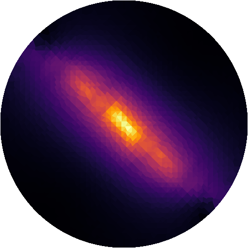

<div align="center">



# Temporal Interference Toolbox

[](https://hub.docker.com/r/idossha/simnibs)
[](https://github.com/idossha/TI-toolbox/releases)
[](https://github.com/idossha/TI-toolbox/blob/main/LICENSE)
[](https://codecov.io/gh/idossha/TI-toolbox)
[](https://discord.gg/KKdjJk8f)
[](https://doi.org/10.5281/zenodo.21627945)

[](https://github.com/idossha/TI-toolbox/blob/main/docs/installation/windows.md)
[](https://github.com/idossha/TI-toolbox/blob/main/docs/installation/macos.md)
[](https://github.com/idossha/TI-toolbox/blob/main/docs/installation/linux.md)

</div>

Releases, guides, and wiki please see: [https://idossha.github.io/TI-Toolbox/](https://idossha.github.io/TI-Toolbox/)

> **Note**: Latest macOS versions (26/Tahoe+) may have GUI compatibility issues with Gmsh and FreeView. See [installation docs](https://idossha.github.io/TI-Toolbox/installation/) for details.

## How to Cite

If you use TI-Toolbox in your research, please cite the journal article:

> Haber, I., Jackson, A., Thielscher, A., Hai, A., & Tononi, G. (2025). TI-Toolbox: An Open-Source Software for Temporal Interference Stimulation Research. _Brain Stimulation_. https://doi.org/10.1016/j.brs.2025.103016

If you additionally need to reference the exact software version used in your
analysis, cite the Zenodo archive alongside the article.

The concept DOI [10.5281/zenodo.21627945](https://doi.org/10.5281/zenodo.21627945)
always resolves to the latest release; each release also receives its own
version-specific DOI, listed on that page.

Machine-readable metadata is in [`CITATION.cff`](CITATION.cff); GitHub renders it
under "Cite this repository" in the sidebar.

## AI coding agents

An installable plugin under [`agent-plugin/`](agent-plugin/) teaches Claude Code, Codex and any MCP client the toolbox (wiki, Python API, project layout) and ships a read-only MCP server that can inspect your project directory. In Claude Code:

```text
/plugin marketplace add idossha/TI-Toolbox
/plugin install ti-toolbox@ti-toolbox
```

See [`agent-plugin/README.md`](agent-plugin/README.md) for Codex and other clients.

## Contact

The TI-Toolbox goes through rapid development and we appreciate any feedback from our users.

Please contact us via our [GitHub Issues](https://github.com/idossha/TI-toolbox/issues), [GitHub Discussions](https://github.com/idossha/TI-toolbox/discussions), [Discord](https://discord.gg/KKdjJk8f), or [email](mailto:ihaber@wisc.edu).
