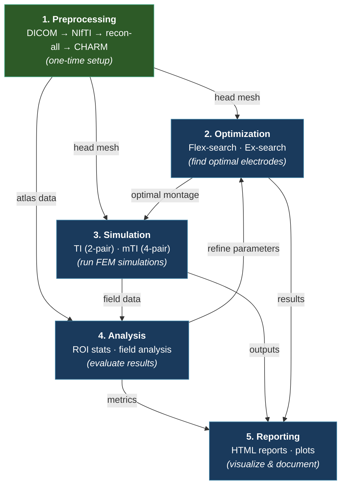

# TI-Toolbox API Reference

Welcome to the Python API reference for **TI-Toolbox** (`tit`) — a platform for temporal interference (TI) brain stimulation simulation, optimization, and analysis.

## The TI-Toolbox Pipeline

TI-Toolbox follows a structured pipeline with one-time preprocessing and an iterative research cycle:



!!! info "Iterative Workflow"
    **Preprocessing** is a one-time setup per subject. After that, steps 2-5 form an iterative cycle: optimize electrode placements, simulate fields, analyze results, generate reports, then refine and repeat.

## Quick Start

```python
from tit.sim import SimulationConfig, Montage
from tit.sim import run_simulation, load_montages
from tit.analyzer import Analyzer
from tit.opt import FlexConfig, run_flex_search

# Run a simulation
montages = load_montages(["my_montage"], "GSN-HydroCel-185")
config = SimulationConfig(
    subject_id="001",
    montages=montages,
    conductivity="scalar",
    intensities=[1.0, 1.0],
)
results = run_simulation(config)

# Analyze results
analyzer = Analyzer(subject_id="001", simulation="my_montage", space="mesh")
result = analyzer.analyze_sphere(center=(-42, -20, 55), radius=10)
print(f"ROI Mean: {result.roi_mean:.4f} V/m")
print(f"Focality: {result.roi_focality:.2f}")
```

For a full walkthrough, see the [Getting Started](getting-started.md) guide.

## Pipeline Modules

| Step | Module | Description | Guide |
|------|--------|-------------|-------|
| 1. Preprocessing | [`tit.pre`](reference/tit/pre/index.md) | DICOM conversion, FreeSurfer recon-all, CHARM head mesh | [Preprocessing](pipeline/preprocessing.md) |
| 2. Optimization | [`tit.opt`](reference/tit/opt/index.md) | Flex-search (differential evolution) and exhaustive search | [Optimization](pipeline/optimization.md) |
| 3. Simulation | [`tit.sim`](reference/tit/sim/index.md) | TI and multi-channel TI (mTI) simulation engine | [Simulation](pipeline/simulation.md) |
| 4. Analysis | [`tit.analyzer`](reference/tit/analyzer/index.md) | Field analysis with spherical and cortical ROIs | [Analysis](pipeline/analysis.md) |
| 5. Reporting | [`tit.reporting`](reference/tit/reporting/index.md) | HTML report generation and visualization | [Reporting](pipeline/reporting.md) |

## Supporting Modules

| Module | Description | Guide |
|--------|-------------|-------|
| [`tit`](reference/tit/index.md) | Path management, constants, logging, config IO, error handling | [Core Utilities](pipeline/core.md) |
| [`tit.stats`](reference/tit/stats/index.md) | Cluster-based permutation testing and group-level statistics | [Statistics](pipeline/statistics.md) |
| [`tit.atlas`](reference/tit/atlas/index.md) | Surface and volumetric atlas discovery, overlap analysis | [Atlas](pipeline/atlas.md) |
| [`tit.plotting`](reference/tit/plotting/index.md) | Visualization utilities (histograms, overlays, statistical plots) | [Plotting](pipeline/plotting.md) |
| [`tit.tools`](reference/tit/tools/index.md) | Standalone mesh/NIfTI conversion and electrode mapping utilities | [Utility Tools](pipeline/tools.md) |

## Build Locally

```bash
cd /path/to/TI-Toolbox
pip install -r docs/api_mkdocs/requirements.txt
mkdocs build -f docs/api_mkdocs/mkdocs.yml --clean
# Open docs/api/index.html
```
