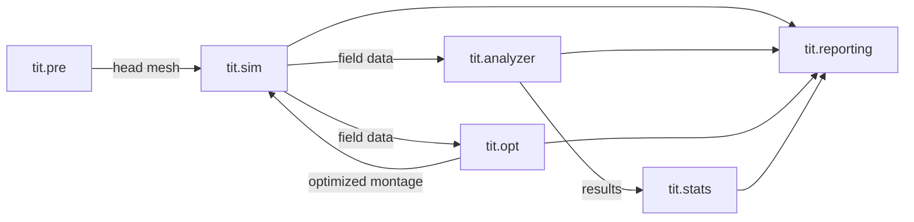

# TI-Toolbox API Reference

Welcome to the Python API reference for **TI-Toolbox** (`tit`) — a platform for temporal interference (TI) brain stimulation simulation, optimization, and analysis.

## Installation

TI-Toolbox runs inside Docker containers with SimNIBS and FreeSurfer pre-installed.
See the [installation guide](https://idossha.github.io/TI-Toolbox/installation/installation/) for setup instructions.

## Quick Start

```python
from tit import setup_logging, get_path_manager
from tit.sim import SimulationConfig, ElectrodeConfig, IntensityConfig
from tit.sim import ConductivityType, run_simulation, load_montages
from tit.analyzer import Analyzer
from tit.opt import FlexConfig, SphericalROI, run_flex_search

# Initialize
setup_logging("INFO")
pm = get_path_manager("/path/to/project", "001")

# Run a simulation
config = SimulationConfig(
    subject_id="001",
    project_dir="/path/to/project",
    conductivity_type=ConductivityType.SCALAR,
    intensities=IntensityConfig(values=[1.0, 1.0]),
    electrode=ElectrodeConfig(),
)
montages = load_montages(["my_montage"], "/path/to/project", "GSN-HydroCel-185")
results = run_simulation(config, montages)

# Analyze results
analyzer = Analyzer(subject_id="001", simulation="my_montage", space="mesh")
result = analyzer.analyze_sphere(center=(-42, -20, 55), radius=10)
print(f"ROI Mean: {result.roi_mean:.4f} V/m")
print(f"Focality: {result.roi_focality:.2f}")
```

## Package Modules

| Module | Description |
|--------|-------------|
| [`tit`](reference/tit/) | Core utilities — path management, constants, logging, field calculations |
| [`tit.sim`](reference/tit/sim/) | TI and multi-channel TI (mTI) simulation engine |
| [`tit.analyzer`](reference/tit/analyzer/) | Field analysis with spherical and cortical ROIs |
| [`tit.opt`](reference/tit/opt/) | Electrode placement optimization (flex-search and exhaustive search) |
| [`tit.stats`](reference/tit/stats/) | Cluster-based permutation testing and group-level statistics |
| [`tit.pre`](reference/tit/pre/) | Preprocessing pipeline (DICOM conversion, FreeSurfer, CHARM) |
| [`tit.reporting`](reference/tit/reporting/) | HTML report generation with BIDS-compliant outputs |
| [`tit.plotting`](reference/tit/plotting/) | Visualization utilities (histograms, overlays, statistical plots) |
| [`tit.tools`](reference/tit/tools/) | Standalone mesh/NIfTI conversion and electrode mapping utilities |

## Architecture



## Data Flow

1. **Preprocessing** (`tit.pre`): DICOM -> NIfTI -> FreeSurfer recon-all -> SimNIBS CHARM head mesh
2. **Simulation** (`tit.sim`): Head mesh + montage config -> SimNIBS FEM -> TI/mTI field meshes + NIfTIs
3. **Analysis** (`tit.analyzer`): Field data + ROI specification -> statistics, focality metrics, visualizations
4. **Optimization** (`tit.opt`): Head mesh + ROI -> differential evolution or exhaustive search -> optimal electrode placement
5. **Statistics** (`tit.stats`): Multi-subject NIfTIs -> cluster-based permutation testing -> significant clusters
6. **Reporting** (`tit.reporting`): Pipeline outputs -> interactive HTML reports

## Build Locally

```bash
cd /path/to/TI-Toolbox
pip install -r docs/api_mkdocs/requirements.txt
mkdocs build -f docs/api_mkdocs/mkdocs.yml --clean
# Open docs/api/index.html
```
