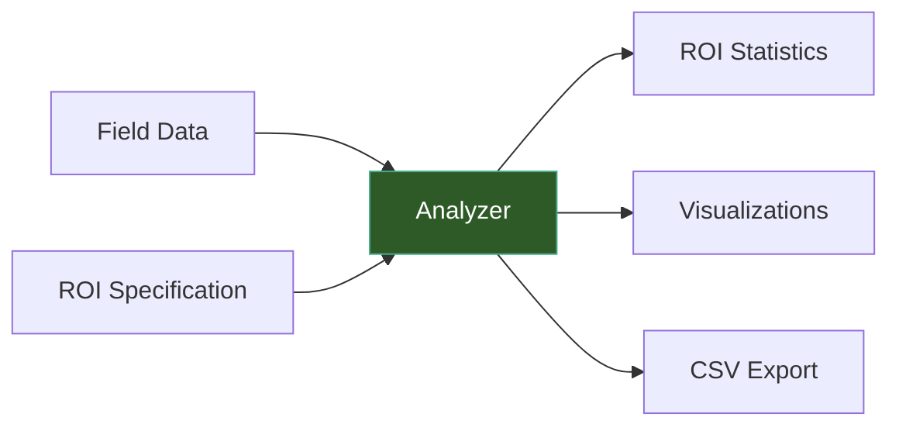

# Analysis

The analysis module evaluates simulation results by computing statistics within regions of interest (ROIs). It supports spherical, cortical atlas, and subcortical ROIs in both mesh and voxel space.



## Single-Subject Analysis

### Spherical ROI

```python
from tit.analyzer import Analyzer

analyzer = Analyzer(subject_id="001", simulation="motor_cortex", space="mesh")
result = analyzer.analyze_sphere(
    center=(-42, -20, 55),
    radius=10,
    coordinate_space="MNI",
    visualize=True,
)

# Access metrics
print(f"ROI Mean:     {result.roi_mean:.4f} V/m")
print(f"ROI Max:      {result.roi_max:.4f} V/m")
print(f"Focality:     {result.roi_focality:.2f}")
print(f"GM Mean:      {result.gm_mean:.4f} V/m")
print(f"N elements:   {result.n_elements}")
```

### Cortical Atlas ROI

```python
result = analyzer.analyze_cortex(atlas="DK40", region="precentral-lh")
```

### Subcortical ROI

```python
result = analyzer.analyze_subcortical(region="left_hippocampus")
```

## Analysis Spaces

| Space | Method | Description |
|-------|--------|-------------|
| `"mesh"` | Surface-based | Analysis on the cortical mesh, weighted by node areas |
| `"voxel"` | Volume-based | Analysis on NIfTI data, weighted by voxel volumes |

!!! tip "When to Use Each Space"
    Use **mesh** space for cortical targets where surface geometry matters (e.g., normal/tangential field components). Use **voxel** space for deep brain targets or when you need MNI-aligned volumetric analysis.

## ROI Types

=== "Spherical"

    Define a sphere by center coordinates and radius. Works in both MNI and subject coordinate spaces.

    ```python
    result = analyzer.analyze_sphere(
        center=(-42, -20, 55),
        radius=10,
        coordinate_space="MNI",  # or "subject"
    )
    ```

=== "Cortical Atlas"

    Use a predefined cortical atlas parcellation (e.g., Desikan-Killiany DK40).

    ```python
    result = analyzer.analyze_cortex(
        atlas="DK40",
        region="precentral-lh",
    )
    ```

=== "Subcortical"

    Analyze subcortical structures segmented during preprocessing.

    ```python
    result = analyzer.analyze_subcortical(
        region="left_hippocampus",
    )
    ```

## Result Metrics

Each analysis returns an `AnalysisResult` with these fields:

| Metric | Description |
|--------|-------------|
| `roi_mean` | Mean field intensity within the ROI |
| `roi_max` | Maximum field intensity within the ROI |
| `roi_focality` | Ratio of ROI intensity to whole-brain intensity |
| `gm_mean` | Mean field intensity across all gray matter |
| `n_elements` | Number of mesh elements or voxels in the ROI |

## Group Analysis

Compare results across multiple subjects:

```python
from tit.analyzer import run_group_analysis

group_result = run_group_analysis(
    subject_ids=["001", "002", "003"],
    simulation="motor_cortex",
    space="mesh",
    analysis_type="spherical",
    center=(-42, -20, 55),
    radius=10,
    coordinate_space="MNI",
    visualize=True,
)

# group_result.subject_results: dict of per-subject AnalysisResult
# group_result.summary_csv_path: path to group_summary.csv
# group_result.comparison_plot_path: path to comparison bar chart PDF
```

## Statistical Testing

For formal group comparisons (e.g., responders vs non-responders), use the `tit.stats` module:

```python
from tit.stats import GroupComparisonConfig, run_group_comparison

config = GroupComparisonConfig(
    project_dir="/data/my_project",
    analysis_name="responder_comparison",
    subjects=subjects,
    test_type="unpaired",
    n_permutations=5000,
    alpha=0.05,
    cluster_threshold=0.05,
)

result = run_group_comparison(config)
print(f"Significant clusters: {result.n_clusters}")
```

!!! note "See Also"
    For full details on statistical testing, see the [tit.stats API reference](../reference/tit/stats/).

## API Reference

::: tit.analyzer.analyzer.Analyzer
    options:
      show_root_heading: true
      members_order: source

::: tit.analyzer.group.run_group_analysis
    options:
      show_root_heading: true
