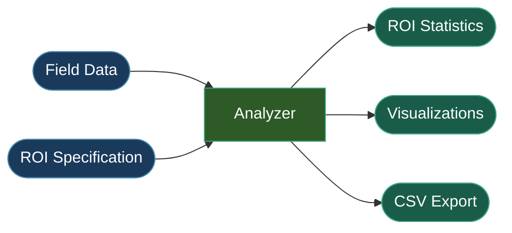

# Analysis

The analysis module evaluates simulation results by computing statistics within regions of interest (ROIs). It supports spherical and cortical atlas ROIs in both mesh and voxel space.



## Single-Subject Analysis

### Spherical ROI

```python
from tit.analyzer import Analyzer

analyzer = Analyzer(
    subject_id="001",
    simulation="motor_cortex",
    space="mesh",
    tissue_type="GM",  # "GM", "WM", or "both" (voxel only; mesh always uses GM)
)
result = analyzer.analyze_sphere(
    center=(-42, -20, 55),
    radius=10,
    coordinate_space="MNI",
    visualize=True,
)

# Access metrics
print(f"ROI Mean:     {result.roi_mean:.4f} V/m")
print(f"ROI Max:      {result.roi_max:.4f} V/m")
print(f"ROI Min:      {result.roi_min:.4f} V/m")
print(f"Focality:     {result.roi_focality:.2f}")
print(f"GM Mean:      {result.gm_mean:.4f} V/m")
print(f"GM Max:       {result.gm_max:.4f} V/m")
print(f"N elements:   {result.n_elements}")
```

### Cortical Atlas ROI

The `region` parameter accepts a single region name or a list of region names
whose masks are combined into one ROI.

```python
result = analyzer.analyze_cortex(atlas="DK40", region="precentral-lh")

# Multiple regions combined into a single ROI
result = analyzer.analyze_cortex(atlas="DK40", region=["precentral-lh", "postcentral-lh"])
```

## Analysis Spaces

| Space | Method | Description |
|-------|--------|-------------|
| `"mesh"` | Surface-based | Analysis on the cortical mesh, weighted by node areas |
| `"voxel"` | Volume-based | Analysis on NIfTI data, weighted by voxel volumes |

!!! tip "When to Use Each Space"
    Use **mesh** space for cortical targets where surface geometry matters (e.g., normal/tangential field components). Use **voxel** space for deep brain targets or when you need MNI-aligned volumetric analysis.

## ROI Types

=== "Spherical"

    Define a sphere by center coordinates and radius. Works in both MNI and subject coordinate spaces.

    ```python
    result = analyzer.analyze_sphere(
        center=(-42, -20, 55),
        radius=10,
        coordinate_space="MNI",  # or "subject" (default)
    )
    ```

=== "Cortical Atlas"

    Use a predefined cortical atlas parcellation (e.g., Desikan-Killiany DK40, HCP_MMP1). A single region or a list of regions can be provided.

    ```python
    result = analyzer.analyze_cortex(
        atlas="DK40",
        region="precentral-lh",
    )

    # Or combine multiple regions into one ROI
    result = analyzer.analyze_cortex(
        atlas="HCP_MMP1",
        region=["4-lh", "3a-lh", "3b-lh"],
    )
    ```

## Result Metrics

Each analysis returns an `AnalysisResult` dataclass with these fields:

| Field | Description |
|-------|-------------|
| `field_name` | SimNIBS field name (e.g., `"TI_max"`) |
| `region_name` | Human-readable ROI identifier |
| `space` | `"mesh"` or `"voxel"` |
| `analysis_type` | `"spherical"` or `"cortical"` |
| `roi_mean` | Weighted mean field intensity within the ROI |
| `roi_max` | Maximum field intensity within the ROI |
| `roi_min` | Minimum field intensity within the ROI |
| `roi_focality` | Ratio of ROI mean intensity to whole-tissue mean |
| `gm_mean` | Mean field intensity across all gray matter (or tissue) |
| `gm_max` | Maximum field intensity across all gray matter (or tissue) |
| `normal_mean` | Mean of the normal-component field in the ROI (mesh only, optional) |
| `normal_max` | Max of the normal-component field in the ROI (mesh only, optional) |
| `normal_focality` | Focality of the normal-component field (mesh only, optional) |
| `percentile_95` | 95th percentile of field intensity (area/volume-weighted) |
| `percentile_99` | 99th percentile of field intensity |
| `percentile_99_9` | 99.9th percentile of field intensity |
| `focality_50_area` | Area/volume (cm^2) above 50% of 99.9th percentile |
| `focality_75_area` | Area/volume (cm^2) above 75% of 99.9th percentile |
| `focality_90_area` | Area/volume (cm^2) above 90% of 99.9th percentile |
| `focality_95_area` | Area/volume (cm^2) above 95% of 99.9th percentile |
| `n_elements` | Number of mesh nodes or voxels in the ROI |
| `total_area_or_volume` | Total area (mm^2, mesh) or volume (mm^3, voxel) of the ROI |

## Group Analysis

Compare results across multiple subjects:

```python
from tit.analyzer import run_group_analysis

group_result = run_group_analysis(
    subject_ids=["001", "002", "003"],
    simulation="motor_cortex",
    space="mesh",
    tissue_type="GM",
    analysis_type="spherical",
    center=(-42, -20, 55),
    radius=10,
    coordinate_space="MNI",
    visualize=True,
)

# group_result.subject_results: dict of per-subject AnalysisResult
# group_result.summary_csv_path: path to group_summary.csv
# group_result.comparison_plot_path: path to comparison bar chart PDF
```

The `run_group_analysis` function also supports cortical atlas ROIs:

```python
group_result = run_group_analysis(
    subject_ids=["001", "002", "003"],
    simulation="motor_cortex",
    space="mesh",
    analysis_type="cortical",
    atlas="DK40",
    region="precentral-lh",
    visualize=True,
)
```

## Statistical Testing

For formal group comparisons (e.g., responders vs non-responders), use the `tit.stats` module:

```python
from tit.stats import GroupComparisonConfig, run_group_comparison

# Load subjects from CSV (columns: subject_id, simulation_name, response)
subjects = GroupComparisonConfig.load_subjects("/data/my_project/subjects.csv")

config = GroupComparisonConfig(
    analysis_name="responder_comparison",
    subjects=subjects,
    test_type=GroupComparisonConfig.TestType.UNPAIRED,
    n_permutations=5000,
    alpha=0.05,
    cluster_threshold=0.05,
)

result = run_group_comparison(config)
print(f"Significant clusters: {result.n_significant_clusters}")
print(f"Significant voxels:   {result.n_significant_voxels}")
```

The `tit.stats` module also supports voxel-wise correlation analysis via
`CorrelationConfig` and `run_correlation`.

## API Reference

::: tit.analyzer.analyzer.AnalysisResult
    options:
      show_root_heading: true

::: tit.analyzer.analyzer.Analyzer
    options:
      show_root_heading: true
      members_order: source

::: tit.analyzer.group.GroupResult
    options:
      show_root_heading: true

::: tit.analyzer.group.run_group_analysis
    options:
      show_root_heading: true
