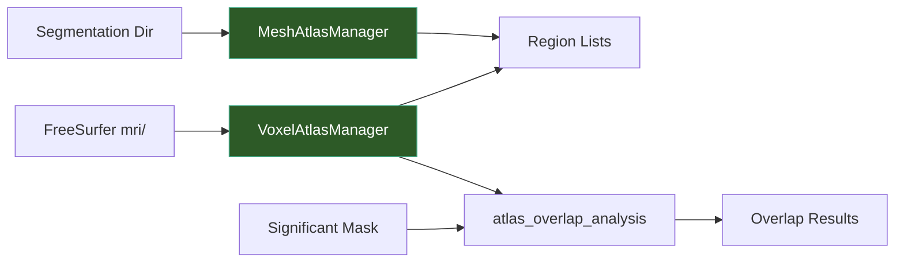

# Atlas

The atlas module provides unified atlas discovery, region listing, and overlap analysis for both surface (mesh) and volumetric (voxel) atlases. It is used internally by the analyzer, optimization, and statistics modules.



## Surface (Mesh) Atlases

`MeshAtlasManager` discovers and queries FreeSurfer `.annot` parcellation files in the `m2m_{subject}/segmentation/` directory. Built-in atlases (DK40, a2009s, HCP_MMP1) are always included in discovery results.

```python
from tit.atlas import MeshAtlasManager

manager = MeshAtlasManager(seg_dir="/data/my_project/derivatives/SimNIBS/sub-001/m2m_001/segmentation")

# List all available mesh atlases
atlases = manager.list_atlases()
# ['DK40', 'HCP_MMP1', 'a2009s']

# List regions for a specific atlas
regions = manager.list_regions("DK40")
# ['bankssts-lh', 'bankssts-rh', 'caudalanteriorcingulate-lh', ...]

# Find the .annot file for a specific atlas and hemisphere
annot_path = manager.find_atlas_file("DK40", "lh")

# Get all atlas files for a hemisphere
all_atlases = manager.find_all_atlases("lh")
# {'DK40': '/path/to/lh.aparc_DK40.annot', ...}
```

## Volumetric (Voxel) Atlases

`VoxelAtlasManager` discovers volumetric atlas files from FreeSurfer's `mri/` directory and the SimNIBS segmentation directory. It uses `mri_segstats` to extract region labels on first access, then caches the result.

```python
from tit.atlas import VoxelAtlasManager

manager = VoxelAtlasManager(
    freesurfer_mri_dir="/data/my_project/derivatives/freesurfer/sub-001/mri",
    seg_dir="/data/my_project/derivatives/SimNIBS/sub-001/m2m_001/segmentation",
)

# Discover available voxel atlases
atlases = manager.list_atlases()
# [('aparc.DKTatlas+aseg.mgz', '/path/to/aparc.DKTatlas+aseg.mgz'), ...]

# List regions in a specific atlas
regions = manager.list_regions(atlases[0][1])
# ['Left-Cerebellum-Cortex (ID: 8)', 'Right-Hippocampus (ID: 53)', ...]

# Detect MNI-space atlases from the resources directory
mni_atlases = VoxelAtlasManager.detect_mni_atlases("/ti-toolbox/resources/atlas")

# Find the SimNIBS labeling LUT
lut_path = manager.find_labeling_lut()
```

## Atlas Overlap Analysis

The `atlas_overlap_analysis` function identifies which atlas regions overlap with a binary mask of significant voxels. This is used by the statistics module to map cluster results back to anatomical regions. The companion `check_and_resample_atlas` function handles dimension mismatches by resampling the atlas to the reference image space.

```python
import nibabel as nib
import numpy as np
from tit.atlas import atlas_overlap_analysis, check_and_resample_atlas

# Load a significance mask and reference image
sig_mask = np.zeros((182, 218, 182), dtype=bool)
sig_mask[80:100, 100:120, 80:100] = True

reference_img = nib.load("/path/to/subject_field.nii.gz")

# Run overlap analysis against multiple atlases
results = atlas_overlap_analysis(
    sig_mask=sig_mask,
    atlas_files=["aparc.DKTatlas+aseg.mgz", "ThalamicNuclei.v13.T1.mgz"],
    data_dir="/data/my_project/derivatives/freesurfer/sub-001/mri",
    reference_img=reference_img,
)

# results is a dict: atlas_name -> list of overlap dicts
for atlas_name, overlaps in results.items():
    for region in overlaps[:5]:
        pct = 100 * region["overlap_voxels"] / region["region_size"]
        print(f"  Region {region['region_id']}: {region['overlap_voxels']} voxels ({pct:.1f}%)")
```

## Built-in Atlases

### Mesh (Surface) Atlases

These are always available after running `subject_atlas` during preprocessing (CHARM):

| Atlas | Description |
|-------|-------------|
| `DK40` | Desikan-Killiany atlas -- 68 cortical regions |
| `a2009s` | Destrieux atlas -- 148 cortical regions |
| `HCP_MMP1` | Human Connectome Project Multi-Modal Parcellation -- 360 cortical regions |

### Voxel (Volumetric) Atlases

Discovered from FreeSurfer's `mri/` directory:

| File | Hemisphere | Description |
|------|------------|-------------|
| `aparc.DKTatlas+aseg.mgz` | both | DKT cortical + subcortical segmentation |
| `aparc.a2009s+aseg.mgz` | both | Destrieux cortical + subcortical segmentation |
| `lh.hippoAmygLabels-T1.v22.mgz` | lh | Left hippocampal/amygdala subfields |
| `rh.hippoAmygLabels-T1.v22.mgz` | rh | Right hippocampal/amygdala subfields |
| `ThalamicNuclei.v13.T1.mgz` | both | Thalamic nuclei segmentation |

### MNI-Space Atlases

Available from the container resources directory (`/ti-toolbox/resources/atlas`):

| File | Description |
|------|-------------|
| `MNI_Glasser_HCP_v1.0.nii.gz` | Glasser HCP parcellation in MNI space (default) |
| `massp2021-parcellation_decade-18to40.nii.gz` | MASSP subcortical parcellation in MNI space |

## API Reference

::: tit.atlas.mesh.MeshAtlasManager
    options:
      show_root_heading: true
      members_order: source

::: tit.atlas.voxel.VoxelAtlasManager
    options:
      show_root_heading: true
      members_order: source

::: tit.atlas.overlap.atlas_overlap_analysis
    options:
      show_root_heading: true

::: tit.atlas.overlap.check_and_resample_atlas
    options:
      show_root_heading: true
