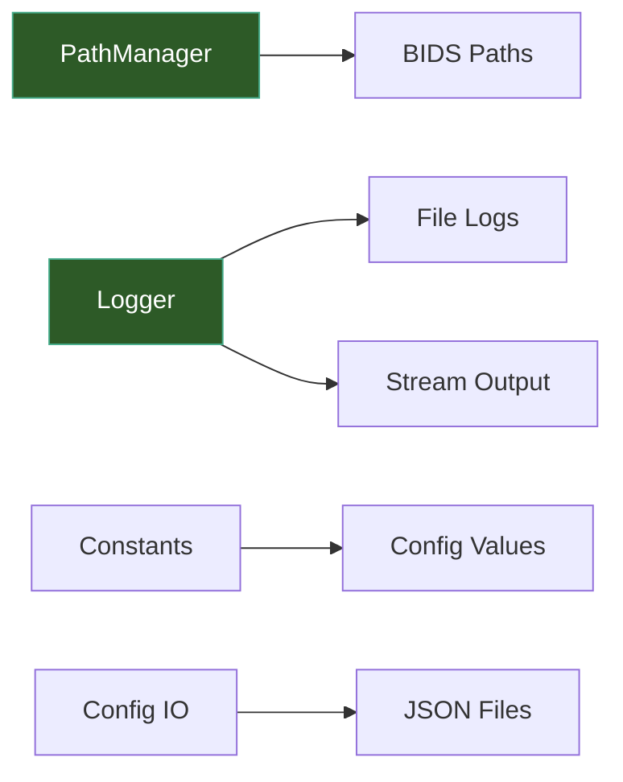

# Core Utilities

The core utilities provide foundational services used throughout TI-Toolbox: BIDS-compliant path resolution, logging configuration, project-wide constants, dataclass-to-JSON serialization, and custom exception classes.



## Quick Setup

The `init()` convenience function configures logging with terminal output in a single call:

```python
import tit

tit.init("INFO")  # sets up logging + attaches stdout handler
```

This is equivalent to:

```python
from tit import setup_logging, add_stream_handler

setup_logging("INFO")
add_stream_handler("tit", "INFO")
```

## PathManager

`PathManager` is a singleton that resolves all file and directory paths following BIDS conventions. Obtain the global instance via `get_path_manager()`.

### Initialization

```python
from tit import get_path_manager

pm = get_path_manager("/data/my_project")
```

If no `project_dir` is passed, PathManager auto-detects from the `PROJECT_DIR` or `PROJECT_DIR_NAME` environment variables.

### Project-Level Paths

Methods that take no arguments and return top-level directories:

| Method | Returns |
|--------|---------|
| `pm.derivatives()` | `<project>/derivatives` |
| `pm.sourcedata()` | `<project>/sourcedata` |
| `pm.simnibs()` | `<project>/derivatives/SimNIBS` |
| `pm.freesurfer()` | `<project>/derivatives/freesurfer` |
| `pm.ti_toolbox()` | `<project>/derivatives/ti-toolbox` |
| `pm.config_dir()` | `<project>/code/ti-toolbox/config` |
| `pm.montage_config()` | `<project>/code/ti-toolbox/config/montage_list.json` |
| `pm.project_status()` | `<project>/code/ti-toolbox/config/project_status.json` |
| `pm.reports()` | `<project>/derivatives/ti-toolbox/reports` |
| `pm.qsiprep()` | `<project>/derivatives/qsiprep` |
| `pm.qsirecon()` | `<project>/derivatives/qsirecon` |

### Subject-Level Paths

Methods that accept a subject ID (`sid`) string (without the `sub-` prefix):

```python
pm.m2m("001")          # <project>/derivatives/SimNIBS/sub-001/m2m_001
pm.t1("001")           # .../m2m_001/T1.nii.gz
pm.eeg_positions("001")  # .../m2m_001/eeg_positions
pm.rois("001")         # .../m2m_001/ROIs
pm.simulations("001")  # .../sub-001/Simulations
pm.leadfields("001")   # .../sub-001/leadfields
pm.logs("001")         # .../ti-toolbox/logs/sub-001
pm.bids_anat("001")    # <project>/sub-001/anat
pm.bids_dwi("001")     # <project>/sub-001/dwi
pm.freesurfer_subject("001")  # .../derivatives/freesurfer/sub-001
pm.ex_search("001")    # .../sub-001/ex-search
pm.flex_search("001")  # .../sub-001/flex-search
```

### Simulation-Level Paths

Methods that accept both a subject ID and a simulation name:

```python
pm.simulation("001", "motor_cortex")     # .../Simulations/motor_cortex
pm.ti_mesh("001", "motor_cortex")        # .../TI/mesh/motor_cortex_TI.msh
pm.ti_mesh_dir("001", "motor_cortex")    # .../TI/mesh
pm.mti_mesh_dir("001", "motor_cortex")   # .../mTI/mesh
pm.analysis_dir("001", "motor_cortex", "mesh")   # .../Analyses/Mesh
pm.analysis_dir("001", "motor_cortex", "voxel")  # .../Analyses/Voxel
```

### Listing Methods

```python
pm.list_simnibs_subjects()         # ["001", "002"] — subjects with m2m folders
pm.list_simulations("001")         # ["motor_cortex", "frontal"] — simulation folders
pm.list_eeg_caps("001")            # ["GSN-HydroCel-185.csv"] — EEG cap CSV files
pm.list_flex_search_runs("001")    # ["run_01"] — flex-search runs with metadata
```

### Analysis Naming Helpers

PathManager provides static/class methods for constructing standardized analysis directory names:

```python
PathManager.spherical_analysis_name(-42, -20, 55, 10.0, "MNI")
# "sphere_x-42.00_y-20.00_z55.00_r10.0_MNI"

PathManager.cortical_analysis_name(whole_head=False, region="precentral-lh", atlas_name="DK40")
# "region_precentral-lh_DK40"
```

The `analysis_output_dir()` method combines these with subject, simulation, and space to produce a full output path.

### Utility

```python
pm.ensure("/some/path")  # creates directory (with parents) and returns path
```

## Logging

TI-Toolbox logging is designed for file-first output. The `tit` logger hierarchy has `propagate=False`, so nothing reaches the terminal unless you explicitly attach a stream handler.

### Functions

| Function | Purpose |
|----------|---------|
| `setup_logging(level)` | Configure the `tit` logger level; adds NO handlers |
| `add_file_handler(log_file, level, logger_name)` | Attach a `FileHandler` (append mode) to a named logger; creates parent dirs |
| `add_stream_handler(logger_name, level)` | Attach a `StreamHandler` (stdout) to a named logger |
| `get_file_only_logger(name, log_file, level)` | Return a fresh logger that writes ONLY to the given file |

### Typical Usage

```python
from tit import setup_logging, add_file_handler

# 1. Configure the logger hierarchy (no output yet)
setup_logging("DEBUG")

# 2. Attach a file handler to capture everything
fh = add_file_handler("/data/logs/run.log", level="DEBUG")

# 3. In modules, use standard logging
import logging
log = logging.getLogger(__name__)  # e.g., "tit.sim.simulator"
log.info("Simulation started")
```

For standalone scripts that need terminal output:

```python
import tit
tit.init("INFO")  # setup_logging + add_stream_handler in one call
```

For isolated file-only loggers (e.g., per-ROI analysis logs):

```python
from tit.logger import get_file_only_logger

log = get_file_only_logger("roi_analysis", "/data/logs/roi.log")
log.info("Analyzing ROI...")
```

### Log Format

File handlers use the format:

```
2025-01-15 14:30:00 | INFO | tit.sim.simulator | Simulation started
```

Stream handlers use a minimal format: `%(message)s`.

## Constants

All hardcoded values live in `tit.constants`. The table below lists the major categories with representative examples.

| Category | Examples | Description |
|----------|----------|-------------|
| Directory names | `DIR_DERIVATIVES`, `DIR_SIMNIBS`, `DIR_FLEX_SEARCH` | BIDS-compliant directory structure names |
| File names | `FILE_MONTAGE_LIST`, `FILE_T1`, `FILE_EGI_TEMPLATE` | Standard file names used across the pipeline |
| File extensions | `EXT_NIFTI` (`.nii.gz`), `EXT_MESH` (`.msh`), `EXT_CSV` | Canonical file extension strings |
| Naming prefixes | `PREFIX_SUBJECT` (`sub-`), `PREFIX_SESSION` (`ses-`) | BIDS naming conventions |
| Environment variables | `ENV_PROJECT_DIR`, `ENV_SUBJECT_ID`, `ENV_DISPLAY` | Docker and project environment variable names |
| Field names | `FIELD_TI_MAX`, `FIELD_MTI_MAX`, `FIELD_TI_NORMAL` | SimNIBS field identifiers for TI/mTI simulations |
| Analysis defaults | `DEFAULT_PERCENTILES`, `DEFAULT_FOCALITY_CUTOFFS`, `DEFAULT_RADIUS_MM` | Default analysis parameters |
| Simulation constants | `SIM_TYPE_TI`, `SIM_TYPE_MTI`, `ELECTRODE_SHAPE_ELLIPSE`, `DEFAULT_INTENSITY` | Simulation type identifiers and electrode defaults |
| Tissue tags | `GM_TISSUE_TAG` (2), `WM_TISSUE_TAG` (1), `BRAIN_TISSUE_TAG_RANGES` | SimNIBS mesh element tag values |
| Atlas names | `ATLAS_DK40`, `ATLAS_A2009S`, `ATLAS_ASEG` | Cortical and subcortical atlas identifiers |
| Conductivities | `CONDUCTIVITY_GRAY_MATTER` (0.275 S/m), `CONDUCTIVITY_WHITE_MATTER` (0.126 S/m) | Physical tissue conductivity values |
| Tissue properties | `TISSUE_PROPERTIES` | List of dicts with tissue number, name, conductivity, and reference |
| EEG nets | `EEG_NETS` | List of supported EEG net definitions (value, label, electrode count) |
| Validation bounds | `VALIDATION_BOUNDS` | Min/max ranges for GUI and API input validation |
| Default parameters | `DEFAULT_ELECTRODE`, `DEFAULT_OPTIMIZATION`, `DEFAULT_STATISTICS` | Dicts with default values for electrode, optimization, and statistics configs |
| GUI constants | `GUI_MIN_WIDTH`, `TAB_SIMULATOR`, `CONSOLE_MAX_LINES` | Window sizes, tab names, buffer sizes |
| Visualization | `PLOT_DPI` (600), `PLOT_FIGSIZE_DEFAULT`, terminal color codes | Plot settings and ANSI color constants |
| Timestamp formats | `TIMESTAMP_FORMAT_DEFAULT`, `TIMESTAMP_FORMAT_READABLE` | Standard datetime format strings |
| QSI integration | `QSI_RECON_SPECS`, `QSI_ATLASES`, `QSI_DEFAULT_CPUS` | QSIPrep/QSIRecon pipeline constants |

```python
from tit import constants as const

print(const.FIELD_TI_MAX)         # "TI_max"
print(const.DEFAULT_RADIUS_MM)    # 5.0
print(const.GM_TISSUE_TAG)        # 2
print(const.PREFIX_SUBJECT)       # "sub-"
```

## Config IO

The `tit.config_io` module serializes typed config dataclasses to JSON and reads them back. It handles Enum fields, nested dataclasses, and union-typed ROI/electrode specs by adding a `_type` discriminator field.

### Writing a Config

```python
from tit.config_io import serialize_config, write_config_json, read_config_json

# serialize_config returns a JSON-serializable dict
data = serialize_config(my_flex_config)

# write_config_json writes to a temp file and returns the path
path = write_config_json(my_flex_config, prefix="flex")
# e.g., "/tmp/flex_abc123.json"
```

### Reading a Config

```python
data = read_config_json(path)
# Returns a plain dict parsed from the JSON file
```

### Type Discriminators

When serializing union-typed fields (e.g., different ROI specs within `FlexConfig`), the serializer adds a `_type` key to distinguish subtypes:

| Class | `_type` value |
|-------|---------------|
| `FlexConfig.SphericalROI` | `"SphericalROI"` |
| `FlexConfig.AtlasROI` | `"AtlasROI"` |
| `FlexConfig.SubcorticalROI` | `"SubcorticalROI"` |
| `ExConfig.PoolElectrodes` | `"PoolElectrodes"` |
| `ExConfig.BucketElectrodes` | `"BucketElectrodes"` |
| `Montage` | `"Montage"` |

Blender config types (`MontageConfig`, `VectorConfig`, `RegionConfig`) are matched by class name to avoid importing heavy dependencies.

## Error Handling

TI-Toolbox defines custom exception classes in domain-specific modules rather than a central `errors.py` file.

### Preprocessing Exceptions

Defined in `tit.pre.utils`:

| Exception | Base Class | Description |
|-----------|------------|-------------|
| `PreprocessError` | `RuntimeError` | Raised when a preprocessing step fails |
| `PreprocessCancelled` | `RuntimeError` | Raised when a preprocessing run is cancelled by the user |

### Docker Exceptions

Defined in `tit.pre.qsi.docker_builder`:

| Exception | Base Class | Description |
|-----------|------------|-------------|
| `DockerBuildError` | `Exception` | Raised when Docker command construction fails |

```python
from tit.pre.utils import PreprocessError, PreprocessCancelled

try:
    run_pipeline(config)
except PreprocessCancelled:
    print("Pipeline was cancelled")
except PreprocessError as e:
    print(f"Pipeline failed: {e}")
```

## API Reference

::: tit.paths.PathManager
    options:
      show_root_heading: true
      members_order: source

::: tit.paths.get_path_manager
    options:
      show_root_heading: true

::: tit.paths.reset_path_manager
    options:
      show_root_heading: true

::: tit.init
    options:
      show_root_heading: true

::: tit.logger.setup_logging
    options:
      show_root_heading: true

::: tit.logger.add_file_handler
    options:
      show_root_heading: true

::: tit.logger.add_stream_handler
    options:
      show_root_heading: true

::: tit.logger.get_file_only_logger
    options:
      show_root_heading: true

::: tit.config_io.serialize_config
    options:
      show_root_heading: true

::: tit.config_io.write_config_json
    options:
      show_root_heading: true

::: tit.config_io.read_config_json
    options:
      show_root_heading: true

::: tit.pre.utils.PreprocessError
    options:
      show_root_heading: true

::: tit.pre.utils.PreprocessCancelled
    options:
      show_root_heading: true

::: tit.pre.qsi.docker_builder.DockerBuildError
    options:
      show_root_heading: true
