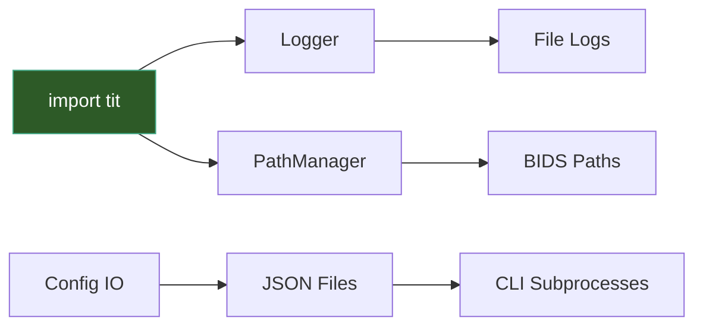

# Core Utilities

TI-Toolbox provides opinionated, BIDS-compliant infrastructure for path resolution, logging, constants, and config serialization. These modules enforce a strict project structure so that all pipeline stages produce consistent, discoverable outputs.



## Initialization

Logging auto-initializes on import — no explicit setup needed:

```python
from tit.sim import SimulationConfig, run_simulation
pm = tit.get_path_manager("/data/my_project")
```

Importing any `tit` module configures the `tit` logger hierarchy and attaches a stdout handler at INFO level. `get_path_manager()` returns a global singleton that resolves all paths for the project.

!!! note "Docker Environment"
    Inside Docker containers, `get_path_manager()` can auto-detect the project directory from the `PROJECT_DIR` or `PROJECT_DIR_NAME` environment variables. No argument is needed in that case.

## PathManager

`PathManager` is a singleton that enforces the BIDS directory layout. All modules use it instead of constructing paths manually.

### Project-Level Paths

These methods take no arguments and return top-level directories or files:

| Method | Returns |
|--------|---------|
| `pm.derivatives()` | `<project>/derivatives` |
| `pm.sourcedata()` | `<project>/sourcedata` |
| `pm.simnibs()` | `<project>/derivatives/SimNIBS` |
| `pm.freesurfer()` | `<project>/derivatives/freesurfer` |
| `pm.ti_toolbox()` | `<project>/derivatives/ti-toolbox` |
| `pm.config_dir()` | `<project>/code/ti-toolbox/config` |
| `pm.montage_config()` | `<project>/code/ti-toolbox/config/montage_list.json` |
| `pm.project_status()` | `<project>/code/ti-toolbox/config/project_status.json` |
| `pm.reports()` | `<project>/derivatives/ti-toolbox/reports` |
| `pm.stats_data()` | `<project>/derivatives/ti-toolbox/stats/data` |
| `pm.qsiprep()` | `<project>/derivatives/qsiprep` |
| `pm.qsirecon()` | `<project>/derivatives/qsirecon` |

### Subject-Level Paths

Methods that accept a subject ID (`sid`) string without the `sub-` prefix:

| Method | Returns |
|--------|---------|
| `pm.sub("001")` | `<simnibs>/sub-001` |
| `pm.m2m("001")` | `<simnibs>/sub-001/m2m_001` |
| `pm.t1("001")` | `.../m2m_001/T1.nii.gz` |
| `pm.segmentation("001")` | `.../m2m_001/segmentation` |
| `pm.tissue_labeling("001")` | `.../segmentation/labeling.nii.gz` |
| `pm.eeg_positions("001")` | `.../m2m_001/eeg_positions` |
| `pm.rois("001")` | `.../m2m_001/ROIs` |
| `pm.simulations("001")` | `<simnibs>/sub-001/Simulations` |
| `pm.leadfields("001")` | `<simnibs>/sub-001/leadfields` |
| `pm.ex_search("001")` | `<simnibs>/sub-001/ex-search` |
| `pm.flex_search("001")` | `<simnibs>/sub-001/flex-search` |
| `pm.logs("001")` | `<ti-toolbox>/logs/sub-001` |
| `pm.tissue_analysis_output("001")` | `<ti-toolbox>/tissue_analysis/sub-001` |
| `pm.bids_subject("001")` | `<project>/sub-001` |
| `pm.bids_anat("001")` | `<project>/sub-001/anat` |
| `pm.bids_dwi("001")` | `<project>/sub-001/dwi` |
| `pm.freesurfer_subject("001")` | `<freesurfer>/sub-001` |
| `pm.freesurfer_mri("001")` | `<freesurfer>/sub-001/mri` |
| `pm.sourcedata_subject("001")` | `<sourcedata>/sub-001` |
| `pm.qsiprep_subject("001")` | `<qsiprep>/sub-001` |
| `pm.qsirecon_subject("001")` | `<qsirecon>/sub-001` |

### Simulation-Level Paths

Methods that accept a subject ID and simulation name:

| Method | Returns |
|--------|---------|
| `pm.simulation("001", "motor")` | `.../Simulations/motor` |
| `pm.ti_mesh("001", "motor")` | `.../TI/mesh/motor_TI.msh` |
| `pm.ti_mesh_dir("001", "motor")` | `.../TI/mesh` |
| `pm.ti_central_surface("001", "motor")` | `.../TI/mesh/surfaces/motor_TI_central.msh` |
| `pm.mti_mesh_dir("001", "motor")` | `.../mTI/mesh` |
| `pm.analysis_dir("001", "motor", "mesh")` | `.../Analyses/Mesh` |
| `pm.analysis_dir("001", "motor", "voxel")` | `.../Analyses/Voxel` |

Additional paths for optimization runs and statistics:

| Method | Returns |
|--------|---------|
| `pm.flex_search_run("001", "run_01")` | `.../flex-search/run_01` |
| `pm.flex_manifest("001", "run_01")` | `.../flex-search/run_01/flex_meta.json` |
| `pm.flex_electrode_positions("001", "run_01")` | `.../flex-search/run_01/electrode_positions.json` |
| `pm.ex_search_run("001", "run_01")` | `.../ex-search/run_01` |
| `pm.sourcedata_dicom("001", "anat")` | `<sourcedata>/sub-001/anat/dicom` |
| `pm.stats_output("group_comparison", "motor_study")` | `<ti-toolbox>/stats/group_comparison/motor_study` |
| `pm.logs_group()` | `<ti-toolbox>/logs/group_analysis` |

### Listing Methods

```python
pm.list_simnibs_subjects()       # ["001", "002"] — subjects with m2m folders
pm.list_simulations("001")       # ["motor_cortex", "frontal"]
pm.list_eeg_caps("001")          # ["GSN-HydroCel-185.csv"]
pm.list_flex_search_runs("001")  # ["run_01"] — runs with metadata files
```

### Utility

```python
pm.ensure("/some/path")  # creates directory (with parents) and returns the path
```

## Logging

TI-Toolbox logging is file-first. The `tit` logger hierarchy has `propagate=False`, so nothing reaches the terminal unless you explicitly opt in.

| Function | Purpose |
|----------|---------|
| `setup_logging(level)` | Configure the `tit` logger level; adds NO handlers |
| `add_file_handler(log_file, level, logger_name)` | Attach a `FileHandler` (append mode); creates parent dirs |
| `add_stream_handler(logger_name, level)` | Attach a `StreamHandler` (stdout) |
| `get_file_only_logger(name, log_file, level)` | Return a logger that writes ONLY to the given file |

### Typical Patterns

**File logging** (used by pipeline modules):

```python
from tit import setup_logging, add_file_handler

setup_logging("DEBUG")
fh = add_file_handler("/data/logs/run.log", level="DEBUG")
```

**Terminal output** (automatic on import):

```python
import tit  # auto-initializes: setup_logging("INFO") + add_stream_handler("tit", "INFO")
```

**Isolated file logger** (used per-analysis):

```python
from tit.logger import get_file_only_logger

log = get_file_only_logger("roi_analysis", "/data/logs/roi.log")
log.info("Analyzing ROI...")
```

### Log Format

File handlers:
```
2025-01-15 14:30:00 | INFO | tit.sim.simulator | Simulation started
```

Stream handlers use minimal format: `%(message)s`.

## Constants

All hardcoded values live in `tit.constants`. Key categories:

| Category | Examples |
|----------|----------|
| **Directory names** | `DIR_DERIVATIVES`, `DIR_SIMNIBS`, `DIR_FLEX_SEARCH`, `DIR_ANALYSIS` |
| **File names** | `FILE_MONTAGE_LIST`, `FILE_T1`, `FILE_EGI_TEMPLATE` |
| **File extensions** | `EXT_NIFTI` (`.nii.gz`), `EXT_MESH` (`.msh`), `EXT_CSV` |
| **BIDS prefixes** | `PREFIX_SUBJECT` (`sub-`), `PREFIX_SESSION` (`ses-`) |
| **Field names** | `FIELD_TI_MAX` (`TI_max`), `FIELD_MTI_MAX` (`TI_Max`), `FIELD_TI_NORMAL` (`TI_normal`) |
| **Tissue tags** | `GM_TISSUE_TAG` (2), `WM_TISSUE_TAG` (1), `BRAIN_TISSUE_TAG_RANGES` |
| **Conductivities** | `CONDUCTIVITY_GRAY_MATTER` (0.275 S/m), `CONDUCTIVITY_WHITE_MATTER` (0.126 S/m), 12 tissues total |
| **Tissue properties** | `TISSUE_PROPERTIES` — list of dicts with number, name, conductivity, and reference |
| **Atlas names** | `ATLAS_DK40`, `ATLAS_A2009S`, `ATLAS_ASEG`, `ATLAS_APARC_ASEG` |
| **Analysis defaults** | `DEFAULT_PERCENTILES` ([95, 99, 99.9]), `DEFAULT_FOCALITY_CUTOFFS` ([50, 75, 90, 95]), `DEFAULT_RADIUS_MM` (5.0) |
| **Simulation** | `SIM_TYPE_TI`, `SIM_TYPE_MTI`, `ELECTRODE_SHAPE_ELLIPSE`, `DEFAULT_INTENSITY` (1.0) |
| **EEG nets** | `EEG_NETS` — list of dicts with value, label, electrode_count |
| **Validation bounds** | `VALIDATION_BOUNDS` — min/max for radius, current, iterations, etc. |
| **Plot settings** | `PLOT_DPI` (600), `PLOT_FIGSIZE_DEFAULT` ((10, 8)) |
| **Timestamps** | `TIMESTAMP_FORMAT_DEFAULT` (`%Y%m%d_%H%M%S`), `TIMESTAMP_FORMAT_READABLE` |
| **QSI integration** | `QSI_RECON_SPECS`, `QSI_ATLASES`, `QSI_DEFAULT_CPUS` (8) |

```python
from tit import constants as const

const.FIELD_TI_MAX         # "TI_max"
const.GM_TISSUE_TAG        # 2
const.DEFAULT_RADIUS_MM    # 5.0
const.TISSUE_PROPERTIES    # [{"number": 1, "name": "White Matter", ...}, ...]
```

## Config IO

The `tit.config_io` module serializes typed config dataclasses to JSON for CLI subprocesses. This is the mechanism the GUI uses to pass configurations to optimizer and analyzer processes.

```python
from tit.config_io import write_config_json, read_config_json

# Write: dataclass -> temp JSON file, returns path
path = write_config_json(my_flex_config, prefix="flex")

# Read: JSON file -> plain dict
data = read_config_json(path)
```

Union-typed fields (ROI specs, electrode specs) get a `_type` discriminator so the subprocess can reconstruct the correct type:

| Class | `_type` value |
|-------|---------------|
| `FlexConfig.SphericalROI` | `"SphericalROI"` |
| `FlexConfig.AtlasROI` | `"AtlasROI"` |
| `FlexConfig.SubcorticalROI` | `"SubcorticalROI"` |
| `ExConfig.PoolElectrodes` | `"PoolElectrodes"` |
| `ExConfig.BucketElectrodes` | `"BucketElectrodes"` |
| `Montage` | `"Montage"` |

## Error Handling

Custom exceptions are defined in domain-specific modules:

| Exception | Module | Base Class | When Raised |
|-----------|--------|------------|-------------|
| `PreprocessError` | `tit.pre.utils` | `RuntimeError` | A preprocessing step fails |
| `PreprocessCancelled` | `tit.pre.utils` | `RuntimeError` | User cancels a preprocessing run |
| `DockerBuildError` | `tit.pre.qsi.docker_builder` | `Exception` | Docker command construction fails |

```python
from tit.pre.utils import PreprocessError, PreprocessCancelled

try:
    run_pipeline(config)
except PreprocessCancelled:
    print("Pipeline was cancelled")
except PreprocessError as e:
    print(f"Pipeline failed: {e}")
```

## API Reference

### Path Management

::: tit.paths.PathManager
    options:
      show_root_heading: true
      members_order: source

::: tit.paths.get_path_manager
    options:
      show_root_heading: true

::: tit.paths.reset_path_manager
    options:
      show_root_heading: true

### Logging

::: tit.logger.setup_logging
    options:
      show_root_heading: true

::: tit.logger.add_file_handler
    options:
      show_root_heading: true

::: tit.logger.add_stream_handler
    options:
      show_root_heading: true

::: tit.logger.get_file_only_logger
    options:
      show_root_heading: true

### Config IO

::: tit.config_io.serialize_config
    options:
      show_root_heading: true

::: tit.config_io.write_config_json
    options:
      show_root_heading: true

::: tit.config_io.read_config_json
    options:
      show_root_heading: true

### Exceptions

::: tit.pre.utils.PreprocessError
    options:
      show_root_heading: true

::: tit.pre.utils.PreprocessCancelled
    options:
      show_root_heading: true

::: tit.pre.qsi.docker_builder.DockerBuildError
    options:
      show_root_heading: true
