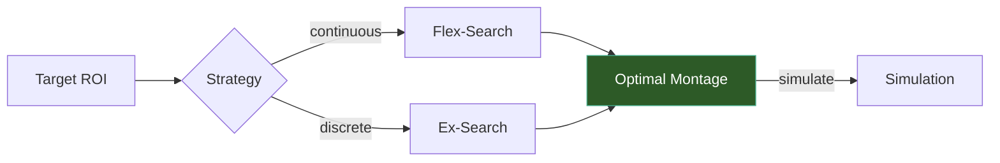

# Optimization

TI-Toolbox provides two optimization strategies for finding optimal electrode placements: **flex-search** (differential evolution) for continuous optimization and **exhaustive search** for discrete combinatorial search.



## Flex-Search (Differential Evolution)

Flex-search uses differential evolution to find optimal electrode positions on the EEG cap. It explores the continuous space of all possible electrode combinations.

```python
from tit.opt import FlexConfig, FlexElectrodeConfig, SphericalROI, run_flex_search

config = FlexConfig(
    subject_id="001",
    project_dir="/data/my_project",
    goal="mean",              # "mean", "max", or "focality"
    postproc="max_TI",        # "max_TI", "dir_TI_normal", "dir_TI_tangential"
    current_mA=1.0,
    electrode=FlexElectrodeConfig(shape="ellipse", dimensions=[8.0, 8.0]),
    roi=SphericalROI(center=(-42, -20, 55), radius=10, use_mni=True),
    eeg_net="GSN-HydroCel-185",
    n_multistart=3,
)

result = run_flex_search(config)
print(f"Best value: {result.best_value}")
print(f"Output: {result.output_folder}")
```

### Optimization Goals

| Goal | Description |
|------|-------------|
| `"mean"` | Maximize mean field intensity within the ROI |
| `"max"` | Maximize peak field intensity within the ROI |
| `"focality"` | Maximize the ratio of ROI intensity to whole-brain intensity |

### ROI Types

=== "Spherical ROI"

    ```python
    from tit.opt import SphericalROI

    roi = SphericalROI(
        center=(-42, -20, 55),  # MNI or subject coordinates
        radius=10,               # radius in mm
        use_mni=True,            # True for MNI, False for subject space
    )
    ```

=== "Atlas ROI"

    ```python
    from tit.opt import AtlasROI

    roi = AtlasROI(
        atlas="DK40",
        region="precentral-lh",
    )
    ```

!!! tip "Multi-start"
    Use `n_multistart` to run multiple optimization restarts with different initial conditions. This helps avoid local optima. A value of 3-5 is usually sufficient.

## Exhaustive Search

Exhaustive search tests all possible electrode combinations from a predefined pool. This is useful when you want to find the best combination from a specific set of electrodes.

```python
from tit.opt import ExConfig, PoolElectrodes, run_ex_search

config = ExConfig(
    subject_id="001",
    project_dir="/data/my_project",
    leadfield_hdf="/path/to/leadfield.hdf5",
    roi_name="motor_roi",
    electrodes=PoolElectrodes(pool=["C3", "C4", "F3", "F4", "P3", "P4"]),
    eeg_net="GSN-HydroCel-185",
)

result = run_ex_search(config)
print(f"Combinations tested: {result.n_combinations}")
print(f"Results CSV: {result.results_csv}")
```

!!! note "Leadfield Prerequisite"
    Exhaustive search requires a pre-computed leadfield matrix. Generate one using `tit.opt.leadfield` before running the search.

## Leadfield Generation

The leadfield matrix maps electrode currents to brain fields and is required for exhaustive search:

```python
from tit.opt import LeadfieldConfig, run_leadfield

config = LeadfieldConfig(
    subject_id="001",
    project_dir="/data/my_project",
    eeg_net="GSN-HydroCel-185",
)

leadfield_path = run_leadfield(config)
```

## API Reference

### Flex-Search

::: tit.opt.config.FlexConfig
    options:
      show_root_heading: true
      members_order: source

::: tit.opt.flex.flex.run_flex_search
    options:
      show_root_heading: true

::: tit.opt.config.SphericalROI
    options:
      show_root_heading: true

::: tit.opt.config.AtlasROI
    options:
      show_root_heading: true

### Exhaustive Search

::: tit.opt.config.ExConfig
    options:
      show_root_heading: true
      members_order: source

::: tit.opt.ex.ex.run_ex_search
    options:
      show_root_heading: true

::: tit.opt.config.PoolElectrodes
    options:
      show_root_heading: true
