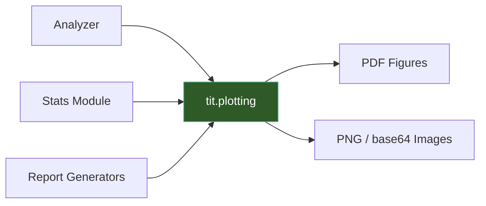

# Plotting & Visualization

The `tit.plotting` module provides matplotlib-based visualization functions used by the analysis, optimization, and reporting pipelines. All functions are headless-safe and work in Docker/CI environments without a display server.



## Focality Histograms

### plot_whole_head_roi_histogram

Generates a whole-head field distribution histogram with per-bin ROI contribution color coding. Includes focality cutoff lines, an optional mean ROI field marker, and a summary statistics box.

```python
from tit.plotting import plot_whole_head_roi_histogram

output_path = plot_whole_head_roi_histogram(
    output_dir="/data/project/derivatives/ti-toolbox/analysis/sub-001",
    whole_head_field_data=whole_head_values,   # np.ndarray
    roi_field_data=roi_values,                 # np.ndarray
    whole_head_element_sizes=wh_sizes,         # optional, np.ndarray
    roi_element_sizes=roi_sizes,               # optional, np.ndarray
    filename="TI_max.nii.gz",                  # optional, used for title and output name
    region_name="M1",                          # optional, ROI label
    roi_field_value=0.152,                     # optional, draws vertical marker
    data_type="element",                       # "element" or "voxel"
    voxel_dims=(1.0, 1.0, 1.0),               # optional, for voxel volume weighting
    n_bins=100,
    dpi=600,
)
```

Returns the path to the saved PDF, or `None` if input data is empty.

## TI Metric Distributions

### plot_montage_distributions

Creates three side-by-side histograms showing TImax, TImean, and Focality distributions across montages.

```python
from tit.plotting import plot_montage_distributions

output_path = plot_montage_distributions(
    timax_values=[0.21, 0.34, 0.18],
    timean_values=[0.12, 0.19, 0.09],
    focality_values=[0.85, 0.72, 0.91],
    output_file="/data/output/montage_distributions.png",
    dpi=300,
)
```

### plot_intensity_vs_focality

Scatter plot of intensity versus focality, optionally colored by a composite index.

```python
from tit.plotting import plot_intensity_vs_focality

output_path = plot_intensity_vs_focality(
    intensity=[0.12, 0.19, 0.09, 0.25],
    focality=[0.85, 0.72, 0.91, 0.68],
    composite=[0.48, 0.55, 0.41, 0.60],  # or None
    output_file="/data/output/intensity_vs_focality.png",
    dpi=300,
)
```

## Statistical Plots

### plot_permutation_null_distribution

Plots a permutation null distribution histogram with a significance threshold line and markers for observed clusters. Uses seaborn for styling.

```python
from tit.plotting import plot_permutation_null_distribution

output_path = plot_permutation_null_distribution(
    null_distribution=null_dist_array,       # np.ndarray
    threshold=42.0,                          # significance threshold
    observed_clusters=[                      # list of dicts
        {"stat_value": 55.0, "p_value": 0.01},
        {"stat_value": 30.0, "p_value": 0.12},
    ],
    output_file="/data/output/null_distribution.pdf",
    alpha=0.05,
    cluster_stat="size",                     # "size" or "mass"
    dpi=300,
)
```

### plot_cluster_size_mass_correlation

Scatter plot with regression line showing the correlation between cluster size and cluster mass from permutation testing. Annotates Pearson r and p-value.

```python
from tit.plotting import plot_cluster_size_mass_correlation

output_path = plot_cluster_size_mass_correlation(
    cluster_sizes=sizes_array,     # np.ndarray
    cluster_masses=masses_array,   # np.ndarray
    output_file="/data/output/size_mass_correlation.pdf",
    dpi=300,
)
```

Returns `None` if fewer than 2 non-zero data points are available.

## Static Overlay Images

### generate_static_overlay_images

Generates base64-encoded PNG slice images by overlaying a NIfTI field map on a T1 anatomical image. Produces 7 slices per orientation (axial, sagittal, coronal) with neurological convention labels.

```python
from tit.plotting import generate_static_overlay_images

images = generate_static_overlay_images(
    t1_file="/data/project/sub-001/anat/sub-001_T1w.nii.gz",
    overlay_file="/data/project/derivatives/SimNIBS/sub-001/Simulations/TI_max.nii.gz",
    subject_id="001",          # optional
    montage_name="motor",      # optional
    output_dir=None,           # optional, not used for file output
)

# images is a dict with keys: "axial", "sagittal", "coronal"
# Each value is a list of dicts with: "base64", "slice_num", "overlay_voxels"
for entry in images["axial"]:
    print(f"Slice {entry['slice_num']}: {entry['overlay_voxels']} overlay voxels")
```

## Helpers

The `tit.plotting._common` module provides shared utilities used by all plotting functions.

### SaveFigOptions

Frozen dataclass controlling figure save parameters.

```python
from tit.plotting import SaveFigOptions

opts = SaveFigOptions(
    dpi=600,                # default: 600
    bbox_inches="tight",    # default: "tight"
    facecolor="white",      # default: "white"
    edgecolor="none",       # default: "none"
)
```

### ensure_headless_matplotlib_backend

Sets the matplotlib backend to `"Agg"` (or a specified backend) for headless environments. Should be called before importing `matplotlib.pyplot`. No-ops if a backend is already active.

```python
from tit.plotting import ensure_headless_matplotlib_backend

ensure_headless_matplotlib_backend()          # defaults to "Agg"
ensure_headless_matplotlib_backend("Cairo")   # or specify another backend
```

### savefig_close

Saves a matplotlib `Figure` to disk and closes it. Uses `fig.savefig` (not `plt.savefig`) to avoid global pyplot state issues.

```python
from tit.plotting import savefig_close, SaveFigOptions

path = savefig_close(
    fig,
    "/data/output/figure.pdf",
    fmt="pdf",                           # optional explicit format
    opts=SaveFigOptions(dpi=300),        # optional overrides
)
```

!!! note "Lazy Imports"
    The `tit.plotting` package uses lazy imports throughout. Importing `tit.plotting` does not pull in matplotlib, nibabel, seaborn, or scipy. These dependencies are only loaded when a plot function is actually called.

## API Reference

### Focality

::: tit.plotting.focality.plot_whole_head_roi_histogram
    options:
      show_root_heading: true

### TI Metrics

::: tit.plotting.ti_metrics.plot_montage_distributions
    options:
      show_root_heading: true

::: tit.plotting.ti_metrics.plot_intensity_vs_focality
    options:
      show_root_heading: true

### Statistical Plots

::: tit.plotting.stats.plot_permutation_null_distribution
    options:
      show_root_heading: true

::: tit.plotting.stats.plot_cluster_size_mass_correlation
    options:
      show_root_heading: true

### Static Overlays

::: tit.plotting.static_overlay.generate_static_overlay_images
    options:
      show_root_heading: true

### Common Utilities

::: tit.plotting._common.SaveFigOptions
    options:
      show_root_heading: true

::: tit.plotting._common.ensure_headless_matplotlib_backend
    options:
      show_root_heading: true

::: tit.plotting._common.savefig_close
    options:
      show_root_heading: true
