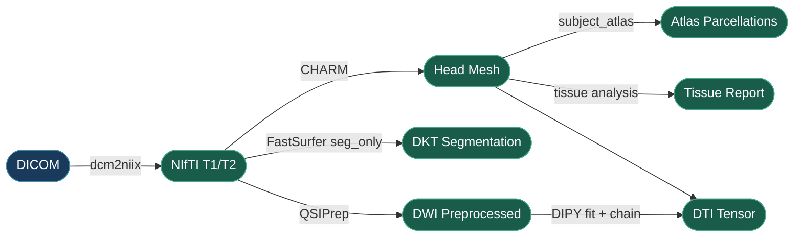

# Preprocessing

The preprocessing pipeline converts raw imaging data into simulation-ready head meshes. This is a **one-time setup** per subject — once complete, you can run unlimited simulations without repeating these steps.


```mermaid
graph LR
    A([DICOM]) -->|dcm2niix| B([NIfTI T1/T2])
    B -->|CHARM| C([Head Mesh])
    C -->|subject_atlas| D([Atlas Parcellations])
    B -->|FastSurfer seg_only| E([DKT Segmentation])
    C -->|tissue analysis| F([Tissue Report])
    B -->|QSIPrep| G([DWI Preprocessed])
    G -->|DIPY fit + chain| H([DTI Tensor])
    C --> H
    style A fill:#1a3a5c,stroke:#48a,color:#fff
    style B fill:#1a5c4a,stroke:#4a8,color:#fff
    style C fill:#1a5c4a,stroke:#4a8,color:#fff
    style D fill:#1a5c4a,stroke:#4a8,color:#fff
    style E fill:#1a5c4a,stroke:#4a8,color:#fff
    style F fill:#1a5c4a,stroke:#4a8,color:#fff
    style G fill:#1a5c4a,stroke:#4a8,color:#fff
    style H fill:#1a5c4a,stroke:#4a8,color:#fff
```

## Full Pipeline

Run all preprocessing steps with a single call:

```python
from tit import get_path_manager
from tit.pre import run_pipeline

get_path_manager("/path/to/bids_project")
exit_code = run_pipeline(
    subject_ids=["001", "002"],
    convert_dicom=True,
    run_fastsurfer=True,
    fastsurfer_threads=4,
    create_m2m=True,
    run_tissue_analysis=True,
    run_qsiprep=False,
    run_qsirecon=False,
    extract_dti=False,
)
```

!!! tip "Selective Steps"
    Each boolean flag controls a specific step. For example, enable only `create_m2m=True`
    for CHARM and its automatic `subject_atlas` step, or only `run_fastsurfer=True` for
    DKT deep segmentation. FastSurfer uses `--seg_only`. Enable `run_freesurfer=True` for
    optional recon-all and `freesurfer_subregions=["thalamus", "hippo-amygdala"]` for T1
    subregions. Subregions alone require a completed FreeSurfer reconstruction.

## Individual Steps

Each preprocessing step can be called independently for finer control:

```python
from tit.pre import (
    run_dicom_to_nifti,
    run_fastsurfer,
    run_charm,
    run_tissue_analysis,
    run_qsiprep,
    run_qsirecon,
    extract_dti_tensor,
    discover_subjects,
    check_m2m_exists,
)

# Discover subjects from a BIDS project
import logging

project = "/path/to/bids_project"
logger = logging.getLogger("preprocessing")
subjects = discover_subjects(project)

# Check if head mesh already exists
if not check_m2m_exists(project, "001"):
    run_charm(project, "001", logger=logger)
```

### Step Details

| Step | Function | What It Does |
|------|----------|--------------|
| DICOM to NIfTI | `run_dicom_to_nifti()` | Converts DICOM files to NIfTI format using `dcm2niix` |
| CHARM head mesh | `run_charm()` | Creates SimNIBS-compatible head mesh from T1/T2 images |
| Subject atlas | `run_subject_atlas()` | Creates atlas-based parcellations (a2009s, DK40, HCP_MMP1); runs automatically after CHARM in the pipeline |
| FastSurfer segmentation | `run_fastsurfer()` | Optional DKT deep segmentation from the raw BIDS T1w image (`--seg_only`) |
| FreeSurfer reconstruction / subregions | `run_freesurfer()` | Optional recon-all, thalamic nuclei and hippocampal/amygdala subregions; requires a license and at least 16 GiB available container memory |
| Tissue analysis | `run_tissue_analysis()` | Analyzes tissue thickness and volume (bone, CSF, skin) from the head mesh |


!!! note "Resources"
    `fastsurfer_threads` controls the FastSurfer CPU thread count. The preprocessing
    pipeline processes subjects sequentially; the removed `parallel_recon` and
    `parallel_cores` arguments are not accepted. Runtime depends on the host and input.

## DTI / Diffusion Pipeline

For anisotropic conductivity simulations, QSIPrep (a sibling Docker container) preprocesses the DWI and `extract_dti_tensor` fits the tensor with DIPY (WLS, b ≤ 1500), maps it onto the m2m T1 grid with QSIPrep's exact ACPC → T1 transforms, and writes `DTI_coregT1_tensor.nii.gz` plus `DTI_coregT1_qc.json` only if the QC gate passes. QSIRecon is optional (tractography, scalar maps, connectivity) and not needed for the tensor.

```python
from tit.pre import run_qsiprep, extract_dti_tensor
import logging

logger = logging.getLogger("my_pipeline")
project = "/path/to/bids_project"

# QSIPrep: distortion correction, unringing and output resolution are chosen from the data
run_qsiprep(project, "001", logger=logger)

# DTI tensor for SimNIBS anisotropic conductivity (needs QSIPrep output and charm)
extract_dti_tensor(project, "001", logger=logger)
```

In the full pipeline set `run_qsiprep=True` and `extract_dti=True` (`run_qsirecon=True` only for QSIRecon's own outputs). `qsiprep_config` defaults: `output_resolution=None` (native DWI voxel size), `unringing_method="auto"` (rpg for partial-Fourier data, else mrdegibbs), `mni_normalization=False` (enable only for QSIRecon atlases).

!!! note "Platform"
    QSIPrep needs an x86-64 (Linux or Windows) Docker host. On Apple Silicon it fails at SynthSeg (TensorFlow needs AVX, which emulation lacks) and `run_qsiprep` refuses to start. Run QSIPrep elsewhere and copy `derivatives/qsiprep/sub-<id>/` into the project; `extract_dti_tensor` runs on any host.

## BIDS Directory Structure

After preprocessing, your project follows this layout:

```
project_root/
├── sourcedata/              # Raw DICOM
├── sub-001/
│   └── anat/               # NIfTI files (T1w, T2w)
└── derivatives/
    ├── SimNIBS/sub-001/
    │   └── m2m_001/         # Head mesh (simulation-ready)
    │       └── segmentation/ # Atlas parcellations
    ├── fastsurfer/sub-001/  # optional DKT deep segmentation
    ├── qsiprep/sub-001/     # QSIPrep DWI outputs (if run)
    └── qsirecon/sub-001/    # optional QSIRecon outputs (if run)
```

## API Reference

::: tit.pre.structural.run_pipeline
    options:
      show_root_heading: true
      members_order: source

::: tit.pre.utils.discover_subjects
    options:
      show_root_heading: true

::: tit.pre.utils.check_m2m_exists
    options:
      show_root_heading: true

::: tit.pre.dicom2nifti.run_dicom_to_nifti
    options:
      show_root_heading: true

::: tit.pre.fastsurfer.run_fastsurfer
    options:
      show_root_heading: true

::: tit.pre.fastsurfer.fastsurfer_available
    options:
      show_root_heading: true

::: tit.pre.charm.run_charm
    options:
      show_root_heading: true

::: tit.pre.charm.run_subject_atlas
    options:
      show_root_heading: true

::: tit.pre.tissue_analyzer.run_tissue_analysis
    options:
      show_root_heading: true

::: tit.pre.qsi.qsiprep.run_qsiprep
    options:
      show_root_heading: true

::: tit.pre.qsi.qsirecon.run_qsirecon
    options:
      show_root_heading: true

::: tit.pre.qsi.dti_extractor.extract_dti_tensor
    options:
      show_root_heading: true
