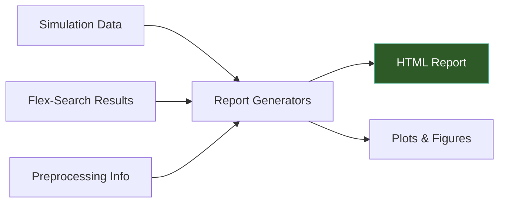

# Reporting & Visualization

TI-Toolbox generates interactive HTML reports for every stage of the pipeline. Reports are assembled from reusable building blocks called **reportlets** and saved to BIDS-compliant paths.



## Report Generators

### Simulation Reports

```python
from tit.reporting import SimulationReportGenerator

report = SimulationReportGenerator(
    project_dir="/data/my_project",
    simulation_session_id="motor_cortex",
    subject_id="001",
)
report.add_simulation_parameters(
    conductivity_type="scalar",
    simulation_mode="TI",
    eeg_net="GSN-HydroCel-185",
    intensity_ch1=1.0,
    intensity_ch2=1.0,
)
report.add_montage(
    montage_name="motor_cortex",
    electrode_pairs=[("C3", "C4"), ("F3", "F4")],
    montage_type="TI",
)
output_path = report.generate()
```

### Flex-Search Reports

```python
from tit.reporting import create_flex_search_report

output_path = create_flex_search_report(
    project_dir="/data/my_project",
    subject_id="001",
    data=None,  # auto-loads from output directory
    output_path="/data/my_project/derivatives/ti-toolbox/reports/flex_report.html",
)
```

### Preprocessing Reports

```python
from tit.reporting import create_preprocessing_report

output_path = create_preprocessing_report(
    project_dir="/data/my_project",
    subject_id="001",
    processing_steps=[],  # auto-populated if auto_scan=True
    output_path=None,     # auto-generates BIDS-compliant path
    auto_scan=True,
)
```

## Custom Reports with Reportlets

Reports are assembled from reusable components called reportlets. Use this approach to build custom reports:

```python
from tit.reporting import (
    ReportAssembler,
    ReportMetadata,
    MetadataReportlet,
    ImageReportlet,
    TableReportlet,
    SummaryCardsReportlet,
    MethodsBoilerplateReportlet,
)

# Create the assembler
metadata = ReportMetadata(title="My Analysis", subject_id="001")
assembler = ReportAssembler(metadata=metadata, title="Custom Report")

# Add sections with reportlets
section = assembler.add_section("results", "Results", description="Analysis output")
section.add_reportlet(
    SummaryCardsReportlet(title="Key Metrics", cards=[])
    .add_card(label="ROI Mean", value="0.152 V/m", color="#4CAF50")
    .add_card(label="Focality", value="0.83", color="#2196F3")
)

assembler.save("/data/output/report.html")
```

### Available Reportlets

| Reportlet | Description |
|-----------|-------------|
| `MetadataReportlet` | Subject info, timestamps, software versions |
| `ImageReportlet` | Embedded images with captions |
| `TableReportlet` | Data tables from lists or DataFrames |
| `SummaryCardsReportlet` | Colored metric cards (mean, max, focality) |
| `ConductivityTableReportlet` | Tissue conductivity values used in simulation |
| `MethodsBoilerplateReportlet` | Standard methods section text for publications |
| `TIToolboxReferencesReportlet` | Citation list for TI-Toolbox dependencies |

## Plotting Utilities

The `tit.plotting` module provides visualization functions used by the analysis and reporting pipelines:

```python
from tit.plotting import (
    plot_histogram,
    plot_group_comparison,
    create_overlay,
)
```

!!! note "Plotting Context"
    Most plotting functions are called internally by the `Analyzer` and report generators. You typically do not need to call them directly unless building custom visualizations.

## Output Location

Reports are saved under the BIDS derivatives tree:

```
derivatives/ti-toolbox/
├── reports/
│   ├── sub-001_sim-motor_cortex_report.html
│   ├── sub-001_flex-search_report.html
│   └── sub-001_preprocessing_report.html
└── analysis/
    └── ...
```

## API Reference

### Report Generators

::: tit.reporting.generators.simulation.SimulationReportGenerator
    options:
      show_root_heading: true
      members_order: source

### Report Assembly

::: tit.reporting.core.assembler.ReportAssembler
    options:
      show_root_heading: true
      members_order: source

::: tit.reporting.core.protocols.ReportMetadata
    options:
      show_root_heading: true

### Reportlets

::: tit.reporting.core.base.MetadataReportlet
    options:
      show_root_heading: true

::: tit.reporting.reportlets.metadata.SummaryCardsReportlet
    options:
      show_root_heading: true

::: tit.reporting.core.base.TableReportlet
    options:
      show_root_heading: true

::: tit.reporting.core.base.ImageReportlet
    options:
      show_root_heading: true
