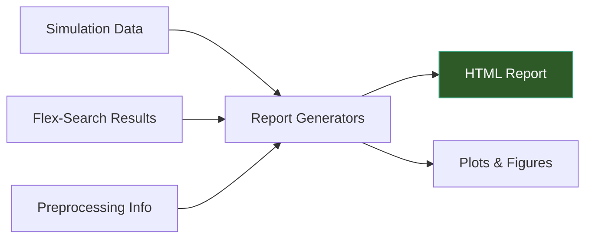

# Reporting & Visualization

TI-Toolbox generates interactive HTML reports for every stage of the pipeline. Reports are assembled from reusable building blocks called **reportlets** and saved to BIDS-compliant paths.



## Report Generators

### Simulation Reports

```python
from tit.reporting import SimulationReportGenerator

report = SimulationReportGenerator(
    simulation_session_id="motor_cortex",
    subject_id="001",
)
report.add_simulation_parameters(
    conductivity_type="scalar",
    simulation_mode="TI",
    eeg_net="GSN-HydroCel-185",
    intensity_ch1=1.0,
    intensity_ch2=1.0,
)
report.add_montage(
    montage_name="motor_cortex",
    electrode_pairs=[("C3", "C4"), ("F3", "F4")],
    montage_type="TI",
)
output_path = report.generate()
```

### Flex-Search Reports

```python
from tit.reporting import create_flex_search_report

output_path = create_flex_search_report(
    subject_id="001",
    data={"config": {...}, "results": [...], "best_solution": {...}},
    output_path="/data/my_project/derivatives/ti-toolbox/reports/flex_report.html",
)
```

For loading results from an output directory, use the class directly:

```python
from tit.reporting import FlexSearchReportGenerator

generator = FlexSearchReportGenerator(
    subject_id="001",
)
generator.load_from_output_dir("/data/my_project/derivatives/ti-toolbox/flex_output")
output_path = generator.generate()
```

### Preprocessing Reports

```python
from tit.reporting import create_preprocessing_report

output_path = create_preprocessing_report(
    subject_id="001",
    processing_steps=[],  # list of step dicts passed to add_processing_step()
    output_path=None,     # auto-generates BIDS-compliant path
    auto_scan=True,       # auto-scan directories for input/output data
)
```

## Custom Reports with Reportlets

Reports are assembled from reusable components called reportlets. Use this approach to build custom reports:

```python
from tit.reporting import (
    ReportAssembler,
    ReportMetadata,
    MetadataReportlet,
    ImageReportlet,
    TableReportlet,
    SummaryCardsReportlet,
    MethodsBoilerplateReportlet,
)

# Create the assembler
metadata = ReportMetadata(title="My Analysis", subject_id="001")
assembler = ReportAssembler(metadata=metadata, title="Custom Report")

# Add sections with reportlets
section = assembler.add_section("results", "Results", description="Analysis output")

cards = SummaryCardsReportlet(title="Key Metrics", columns=4)
cards.add_card(label="ROI Mean", value="0.152 V/m", color="#4CAF50")
cards.add_card(label="Focality", value="0.83", color="#2196F3")
section.add_reportlet(cards)

assembler.save("/data/output/report.html")
```

### Available Reportlets

**Base reportlets** (in `tit.reporting.core.base`):

| Reportlet | Description |
|-----------|-------------|
| `MetadataReportlet` | Key-value pairs displayed as a table or card grid |
| `ImageReportlet` | Embedded images (from path, bytes, or PIL) with captions |
| `TableReportlet` | Data tables from lists of dicts, lists of lists, or DataFrames |
| `TextReportlet` | Plain text, HTML, or code blocks with optional copy-to-clipboard |
| `ErrorReportlet` | Error and warning messages with severity levels |
| `ReferencesReportlet` | Formatted citation list with DOI/URL links |

**Specialized reportlets** (in `tit.reporting.reportlets`):

| Reportlet | Module | Description |
|-----------|--------|-------------|
| `SummaryCardsReportlet` | `metadata` | Colored metric cards (mean, max, focality) |
| `ConductivityTableReportlet` | `metadata` | Tissue conductivity values used in simulation |
| `ProcessingStepReportlet` | `metadata` | Collapsible pipeline steps with status and duration |
| `ParameterListReportlet` | `metadata` | Categorized parameter display |
| `MethodsBoilerplateReportlet` | `text` | Publication-ready methods text with copy button |
| `DescriptionReportlet` | `text` | Formatted text paragraphs |
| `CommandLogReportlet` | `text` | Terminal-style command execution log |
| `TIToolboxReferencesReportlet` | `references` | Citation list filtered by pipeline components |
| `SliceSeriesReportlet` | `images` | Multi-slice brain views (axial, sagittal, coronal) |
| `MontageImageReportlet` | `images` | Electrode montage visualization with pair table |
| `MultiViewBrainReportlet` | `images` | Side-by-side axial/sagittal/coronal brain views |

## Plotting Utilities

The `tit.plotting` module provides visualization functions used by the analysis and reporting pipelines:

```python
from tit.plotting import (
    plot_whole_head_roi_histogram,
    generate_static_overlay_images,
    plot_permutation_null_distribution,
    plot_cluster_size_mass_correlation,
    plot_montage_distributions,
    plot_intensity_vs_focality,
)
```

!!! note "Plotting Context"
    Most plotting functions are called internally by the `Analyzer` and report generators. You typically do not need to call them directly unless building custom visualizations.

## Output Location

Reports are saved under the BIDS derivatives tree:

```
derivatives/ti-toolbox/
├── reports/
│   ├── sub-001/
│   │   ├── simulation_report_20250101_120000.html
│   │   ├── flex_search_report_20250101_120000.html
│   │   └── pre_processing_report_20250101_120000.html
│   └── dataset_description.json
└── analysis/
    └── ...
```

## API Reference

### Report Generators

::: tit.reporting.generators.base_generator.BaseReportGenerator
    options:
      show_root_heading: true
      members_order: source

::: tit.reporting.generators.simulation.SimulationReportGenerator
    options:
      show_root_heading: true
      members_order: source

::: tit.reporting.generators.flex_search.FlexSearchReportGenerator
    options:
      show_root_heading: true
      members_order: source

::: tit.reporting.generators.flex_search.create_flex_search_report
    options:
      show_root_heading: true

::: tit.reporting.generators.preprocessing.PreprocessingReportGenerator
    options:
      show_root_heading: true
      members_order: source

::: tit.reporting.generators.preprocessing.create_preprocessing_report
    options:
      show_root_heading: true

### Report Assembly

::: tit.reporting.core.assembler.ReportAssembler
    options:
      show_root_heading: true
      members_order: source

::: tit.reporting.core.protocols.ReportMetadata
    options:
      show_root_heading: true

::: tit.reporting.core.protocols.ReportSection
    options:
      show_root_heading: true

### Base Reportlets

::: tit.reporting.core.base.MetadataReportlet
    options:
      show_root_heading: true

::: tit.reporting.core.base.ImageReportlet
    options:
      show_root_heading: true

::: tit.reporting.core.base.TableReportlet
    options:
      show_root_heading: true

::: tit.reporting.core.base.TextReportlet
    options:
      show_root_heading: true

::: tit.reporting.core.base.ErrorReportlet
    options:
      show_root_heading: true

::: tit.reporting.core.base.ReferencesReportlet
    options:
      show_root_heading: true

### Specialized Reportlets

::: tit.reporting.reportlets.metadata.SummaryCardsReportlet
    options:
      show_root_heading: true

::: tit.reporting.reportlets.metadata.ConductivityTableReportlet
    options:
      show_root_heading: true

::: tit.reporting.reportlets.metadata.ProcessingStepReportlet
    options:
      show_root_heading: true

::: tit.reporting.reportlets.metadata.ParameterListReportlet
    options:
      show_root_heading: true

::: tit.reporting.reportlets.text.MethodsBoilerplateReportlet
    options:
      show_root_heading: true

::: tit.reporting.reportlets.text.DescriptionReportlet
    options:
      show_root_heading: true

::: tit.reporting.reportlets.text.CommandLogReportlet
    options:
      show_root_heading: true

::: tit.reporting.reportlets.references.TIToolboxReferencesReportlet
    options:
      show_root_heading: true

::: tit.reporting.reportlets.images.SliceSeriesReportlet
    options:
      show_root_heading: true

::: tit.reporting.reportlets.images.MontageImageReportlet
    options:
      show_root_heading: true

::: tit.reporting.reportlets.images.MultiViewBrainReportlet
    options:
      show_root_heading: true
