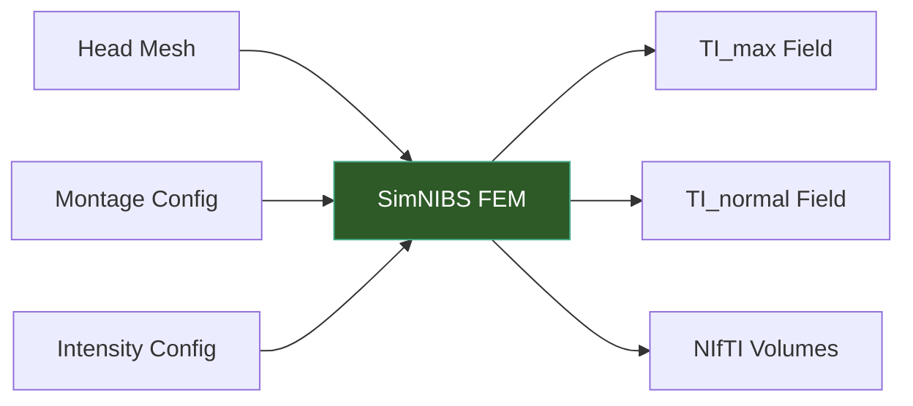

# Simulation

The simulation engine runs finite element method (FEM) calculations using SimNIBS to compute temporal interference electric fields in the brain. TI-Toolbox supports two simulation modes: **TI** (2-pair) and **mTI** (4+ pairs, even).



## Running a Simulation

```python
from tit.sim import (
    SimulationConfig, Montage,
    run_simulation, load_montages,
)

# Load montages from the project's montage_list.json
montages = load_montages(
    montage_names=["motor_cortex"],
    eeg_net="GSN-HydroCel-185",
)

# Configure the simulation (montages are part of the config)
config = SimulationConfig(
    subject_id="001",
    montages=montages,
    conductivity="scalar",
    intensities=[1.0, 1.0],
    electrode_shape="ellipse",
    electrode_dimensions=[8.0, 8.0],
    gel_thickness=4.0,
)

# Run (auto-detects TI vs mTI based on number of electrode pairs)
results = run_simulation(config)
```

## Simulation Modes

The simulation mode is auto-detected from the montage configuration:

| Mode | Electrode Pairs | Description |
|------|----------------|-------------|
| **TI** | 2 pairs | Standard temporal interference — two pairs of electrodes at slightly different frequencies |
| **mTI** | 4+ pairs (even) | Multi-channel TI — N electrode pairs combined via binary-tree algorithm |

!!! info "Auto-Detection"
    You do not need to specify the mode manually. TI-Toolbox inspects the montage: 2 pairs triggers TI mode, 4 or more pairs (even) triggers mTI mode.

## Montage Configuration

Montages define which electrodes form each pair. They are stored in `montage_list.json` within your project:

```json
{
  "nets": {
    "GSN-HydroCel-185": {
      "uni_polar_montages": {
        "motor_cortex": [["E36", "E224"], ["E104", "E148"]]
      }
    }
  }
}
```

Load montages programmatically:

```python
from tit.sim import load_montages

montages = load_montages(
    montage_names=["motor_cortex", "frontal_target"],
    eeg_net="GSN-HydroCel-185",
)
```

## Conductivity Types

The `conductivity` field on `SimulationConfig` accepts one of four string values:

| Value | Description |
|-------|-------------|
| `"scalar"` | Isotropic, piecewise-constant conductivity (default, faster) |
| `"vn"` | Volume-normalized anisotropic conductivity from DTI data |
| `"dir"` | Direct linear rescaling of diffusion tensor eigenvalues |
| `"mc"` | Mean-conductivity (isotropic but spatially varying, from DTI) |

## Electrode Configuration

Electrode parameters are flat fields on `SimulationConfig`:

```python
config = SimulationConfig(
    ...,
    electrode_shape="ellipse",         # "ellipse" or "rect"
    electrode_dimensions=[8.0, 8.0],   # [width, height] in mm
    gel_thickness=4.0,                  # gel layer thickness in mm
    rubber_thickness=2.0,              # rubber layer thickness in mm
)
```

## Output Fields

After simulation, TI-Toolbox produces several derived field types:

| Field | Description |
|-------|-------------|
| **TI_max** | Maximum TI envelope magnitude — scalar field on volume elements (TI mode) |
| **TI_normal** | TI field component normal to cortical surface — node field on surface overlay (TI mode) |
| **TI_Max** | Maximum mTI envelope magnitude — scalar field on volume elements (mTI mode) |
| **TI_vectors** | Intermediate pairwise TI vector fields for each adjacent pair (mTI mode) |

Outputs are saved as both mesh files (for surface analysis) and NIfTI volumes (for voxel analysis).

## Output Directory Structure

```
derivatives/SimNIBS/sub-001/Simulations/
└── motor_cortex/
    ├── high_Frequency/
    │   ├── mesh/             # Per-pair HF mesh files
    │   ├── niftis/           # Per-pair HF NIfTI volumes
    │   └── analysis/         # fields_summary.txt
    ├── TI/
    │   ├── mesh/             # TI_max and GM/WM mesh files
    │   ├── niftis/           # TI NIfTI volumes (subject + MNI space)
    │   ├── surface_overlays/ # Cortical surface overlays (for TI_normal)
    │   └── montage_imgs/     # Electrode placement visualizations
    ├── mTI/                  # (mTI mode only)
    │   ├── mesh/             # mTI_max and intermediate TI meshes
    │   ├── niftis/           # mTI NIfTI volumes
    │   └── montage_imgs/     # Electrode placement visualizations
    └── documentation/        # config.json, SimNIBS logs
```

## API Reference

::: tit.sim.config.SimulationConfig
    options:
      show_root_heading: true
      members_order: source

::: tit.sim.config.Montage
    options:
      show_root_heading: true
      members_order: source

::: tit.sim.config.MontageMode
    options:
      show_root_heading: true

::: tit.sim.config.SimulationMode
    options:
      show_root_heading: true

::: tit.sim.config.parse_intensities
    options:
      show_root_heading: true

::: tit.sim.base.BaseSimulation
    options:
      show_root_heading: true
      members_order: source

::: tit.sim.utils.run_simulation
    options:
      show_root_heading: true

::: tit.sim.utils.load_montages
    options:
      show_root_heading: true

::: tit.sim.utils.list_montage_names
    options:
      show_root_heading: true

::: tit.sim.utils.load_montage_data
    options:
      show_root_heading: true

::: tit.sim.utils.save_montage_data
    options:
      show_root_heading: true

::: tit.sim.utils.ensure_montage_file
    options:
      show_root_heading: true

::: tit.sim.utils.upsert_montage
    options:
      show_root_heading: true
