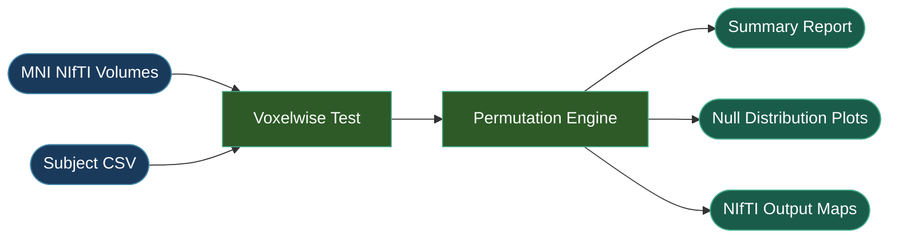

# Statistics

The statistics module performs cluster-based permutation testing on MNI-space NIfTI volumes produced by the simulation pipeline. It supports two analysis types: **group comparison** (responders vs non-responders) and **correlation** (voxelwise correlation with a continuous outcome measure, ACES-style).



## Group Comparison

Compare two groups (e.g., responders vs non-responders) using cluster-based permutation testing with voxelwise t-tests. Supports both unpaired (independent samples) and paired designs.

```python
from tit.stats import GroupComparisonConfig, run_group_comparison

# Load subjects from CSV (columns: subject_id, simulation_name, response)
subjects = GroupComparisonConfig.load_subjects("/data/my_project/subjects.csv")

config = GroupComparisonConfig(
    analysis_name="responder_comparison",
    subjects=subjects,
    test_type=GroupComparisonConfig.TestType.UNPAIRED,
    alternative=GroupComparisonConfig.Alternative.TWO_SIDED,
    n_permutations=5000,
    alpha=0.05,
    cluster_threshold=0.05,
    cluster_stat=GroupComparisonConfig.ClusterStat.MASS,
    tissue_type=GroupComparisonConfig.TissueType.GREY,
    group1_name="Responders",
    group2_name="Non-Responders",
)

result = run_group_comparison(config)
print(f"Significant clusters: {result.n_significant_clusters}")
print(f"Significant voxels:   {result.n_significant_voxels}")
print(f"Analysis time:        {result.analysis_time:.1f}s")
print(f"Output directory:     {result.output_dir}")
```

## Correlation

Test for voxelwise correlation between electric field magnitude and a continuous outcome measure (e.g., clinical effect size). Supports Pearson and Spearman correlation with optional subject-level weights.

```python
from tit.stats import CorrelationConfig, run_correlation

# Load subjects from CSV (columns: subject_id, simulation_name, effect_size; optional: weight)
subjects = CorrelationConfig.load_subjects("/data/my_project/correlation_subjects.csv")

config = CorrelationConfig(
    analysis_name="efield_outcome_correlation",
    subjects=subjects,
    correlation_type=CorrelationConfig.CorrelationType.PEARSON,
    n_permutations=5000,
    alpha=0.05,
    cluster_threshold=0.05,
    cluster_stat=CorrelationConfig.ClusterStat.MASS,
    tissue_type=CorrelationConfig.TissueType.GREY,
    use_weights=True,
    effect_metric="Clinical Improvement",
)

result = run_correlation(config)
print(f"Significant clusters: {result.n_significant_clusters}")
print(f"Significant voxels:   {result.n_significant_voxels}")
```

## Configuration

### Subject Definitions

Both analysis types use a nested `Subject` dataclass to define per-subject metadata. Subjects are typically loaded from CSV files via the `load_subjects` class method.

=== "Group Comparison"

    CSV columns: `subject_id`, `simulation_name`, `response` (0 or 1).

    ```python
    subjects = GroupComparisonConfig.load_subjects("/data/my_project/subjects.csv")
    ```

    | Field | Type | Description |
    |-------|------|-------------|
    | `subject_id` | `str` | Subject identifier (e.g., `"001"`) |
    | `simulation_name` | `str` | Name of the simulation to load |
    | `response` | `int` | Group assignment: `1` = group 1, `0` = group 2 |

=== "Correlation"

    CSV columns: `subject_id`, `simulation_name`, `effect_size`; optional: `weight`.

    ```python
    subjects = CorrelationConfig.load_subjects("/data/my_project/subjects.csv")
    ```

    | Field | Type | Default | Description |
    |-------|------|---------|-------------|
    | `subject_id` | `str` | | Subject identifier |
    | `simulation_name` | `str` | | Name of the simulation to load |
    | `effect_size` | `float` | | Continuous outcome measure |
    | `weight` | `float` | `1.0` | Subject-level weight |

### Enums

| Enum | Values | Used By |
|------|--------|---------|
| `GroupComparisonConfig.TestType` | `UNPAIRED`, `PAIRED` | Group comparison only |
| `GroupComparisonConfig.Alternative` | `TWO_SIDED`, `GREATER`, `LESS` | Group comparison only |
| `CorrelationConfig.CorrelationType` | `PEARSON`, `SPEARMAN` | Correlation only |
| `ClusterStat` | `MASS`, `SIZE` | Both (nested as `GroupComparisonConfig.ClusterStat` / `CorrelationConfig.ClusterStat`) |
| `TissueType` | `GREY`, `WHITE`, `ALL` | Both (nested as `GroupComparisonConfig.TissueType` / `CorrelationConfig.TissueType`) |

### Statistical Parameters

These parameters are shared by both `GroupComparisonConfig` and `CorrelationConfig`:

| Parameter | Type | Default | Description |
|-----------|------|---------|-------------|
| `analysis_name` | `str` | | Name for this analysis run |
| `subjects` | `list[Subject]` | | List of subject definitions |
| `cluster_threshold` | `float` | `0.05` | Uncorrected p-value threshold for cluster formation |
| `cluster_stat` | `ClusterStat` | `MASS` | Cluster statistic: `"mass"` (sum of t-values) or `"size"` (voxel count) |
| `n_permutations` | `int` | `1000` | Number of permutations for null distribution |
| `alpha` | `float` | `0.05` | Family-wise error rate for cluster significance |
| `n_jobs` | `int` | `-1` | Number of parallel jobs (`-1` = all CPUs) |
| `tissue_type` | `TissueType` | `GREY` | Tissue mask: `"grey"`, `"white"`, or `"all"` |
| `nifti_file_pattern` | `str \| None` | `None` | Custom NIfTI filename pattern (auto-resolved from `tissue_type` if `None`) |
| `atlas_files` | `list[str]` | `[]` | Atlas filenames for overlap analysis |

### NIfTI File Patterns

The `tissue_type` field determines which NIfTI files are loaded from each subject's simulation output:

| TissueType | Resolved Pattern |
|------------|-----------------|
| `GREY` | `grey_{simulation_name}_TI_MNI_MNI_TI_max.nii.gz` |
| `WHITE` | `white_{simulation_name}_TI_MNI_MNI_TI_max.nii.gz` |
| `ALL` | `{simulation_name}_TI_MNI_MNI_TI_max.nii.gz` |

Set `nifti_file_pattern` to override the auto-resolved pattern.

## Output

Results are saved to `derivatives/ti-toolbox/stats/<analysis_type>/<analysis_name>/` within the project directory. Both analysis types produce the following:

| File | Description |
|------|-------------|
| `significant_voxels_mask.nii.gz` | Binary mask of significant voxels |
| `pvalues_map.nii.gz` | Negative log10 p-value map |
| `permutation_null_distribution.pdf` | Null distribution with observed clusters |
| `cluster_size_mass_correlation.pdf` | Cluster size vs mass scatter plot |
| `analysis_summary.txt` | Text summary of results |
| `permutation_details.txt` | Per-permutation log |
| `*_analysis_*.log` | Timestamped run log |

Group comparison additionally produces:

| File | Description |
|------|-------------|
| `average_responders.nii.gz` | Mean field map for group 1 |
| `average_non_responders.nii.gz` | Mean field map for group 2 |
| `difference_map.nii.gz` | Group 1 minus group 2 difference map |

Correlation additionally produces:

| File | Description |
|------|-------------|
| `correlation_map.nii.gz` | Full voxelwise correlation map |
| `correlation_map_thresholded.nii.gz` | Correlation map masked to significant voxels |
| `t_statistics_map.nii.gz` | Voxelwise t-statistic map |
| `average_efield.nii.gz` | Mean electric field across all subjects |

## Result Dataclasses

### GroupComparisonResult

| Field | Type | Description |
|-------|------|-------------|
| `success` | `bool` | Whether the analysis completed |
| `output_dir` | `str` | Path to the output directory |
| `n_responders` | `int` | Number of group 1 subjects |
| `n_non_responders` | `int` | Number of group 2 subjects |
| `n_significant_voxels` | `int` | Count of significant voxels |
| `n_significant_clusters` | `int` | Count of significant clusters |
| `cluster_threshold` | `float` | Cluster statistic threshold from null distribution |
| `analysis_time` | `float` | Total runtime in seconds |
| `clusters` | `list` | Cluster details (size, MNI center) |
| `log_file` | `str` | Path to the analysis log |

### CorrelationResult

| Field | Type | Description |
|-------|------|-------------|
| `success` | `bool` | Whether the analysis completed |
| `output_dir` | `str` | Path to the output directory |
| `n_subjects` | `int` | Number of subjects |
| `n_significant_voxels` | `int` | Count of significant voxels |
| `n_significant_clusters` | `int` | Count of significant clusters |
| `cluster_threshold` | `float` | Cluster statistic threshold from null distribution |
| `analysis_time` | `float` | Total runtime in seconds |
| `clusters` | `list` | Cluster details (size, MNI center, mean/peak r) |
| `log_file` | `str` | Path to the analysis log |

## API Reference

::: tit.stats.config.GroupComparisonConfig
    options:
      show_root_heading: true
      members_order: source

::: tit.stats.config.GroupComparisonResult
    options:
      show_root_heading: true

::: tit.stats.config.CorrelationConfig
    options:
      show_root_heading: true
      members_order: source

::: tit.stats.config.CorrelationResult
    options:
      show_root_heading: true

::: tit.stats.permutation.run_group_comparison
    options:
      show_root_heading: true

::: tit.stats.permutation.run_correlation
    options:
      show_root_heading: true

::: tit.stats.engine.PermutationEngine
    options:
      show_root_heading: true
      members_order: source

::: tit.stats.engine.cluster_analysis
    options:
      show_root_heading: true

::: tit.stats.nifti.load_subject_nifti_ti_toolbox
    options:
      show_root_heading: true

::: tit.stats.nifti.load_group_data_ti_toolbox
    options:
      show_root_heading: true
