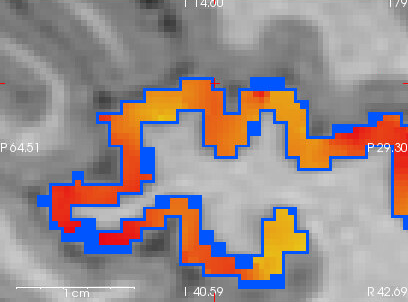
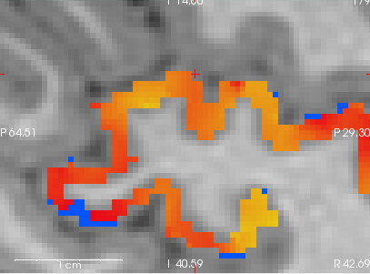

# Atlas Resampling in Cortical Region Analysis

## Understanding Atlas-Field Dimension Mismatches

When analyzing a field nifti within a specific cortical region, our software requires that the atlas and field files have matching dimensions. If you use custom .mgz atlas files that have different dimensions than your subject's field nifti, you may notice the following:

1. The original atlas may not perfectly align with your field data
2. A new "resampled" version of your atlas is automatically created
3. The analysis proceeds using this resampled atlas instead of your original

## What Happens During Resampling

When a dimension mismatch is detected:

- The software automatically resamples your atlas to match the field nifti dimensions
- This ensures proper voxel-to-voxel correspondence between the atlas and field data
- The original atlas remains unchanged, and a new resampled version is generated

## Visual Example

Below are two images showing the effect of atlas resampling:

| Original Atlas (Not Aligned) | Resampled Atlas (Aligned) |
|-----------------------------|---------------------------|
|  |  |

**Left:** The blue outline shows the original atlas, which does not perfectly align with the heat map of the cortical region (field data).

**Right:** The blue outline shows the resampled (aligned) atlas, which now matches the field data.

**Explanation:**  
In the left image, the blue atlas outline does not match the underlying heat map, indicating a dimension or alignment mismatch. In the right image, after resampling, the blue outline of the atlas is perfectly aligned with the heat map, ensuring accurate region analysis.

## Common Causes and Solutions

This dimension mismatch typically occurs when:

1. Using an atlas generated for a different subject
2. Using an atlas from a different imaging sequence or resolution
3. Using an atlas that was processed with different parameters

The best solution is to generate subject-specific atlases using the same preprocessing pipeline. Running `recon-all` on your subject data will generate correctly dimensioned atlases that won't require resampling.

## Important Note

The automatic resampling is a feature, not a bug. It ensures robustness by allowing analysis to proceed even when atlas and field dimensions don't match initially. The resampling process preserves the anatomical validity of your atlas while making it compatible with your field data.

If you need further assistance with atlas generation or have questions about the resampling process, please contact support. 