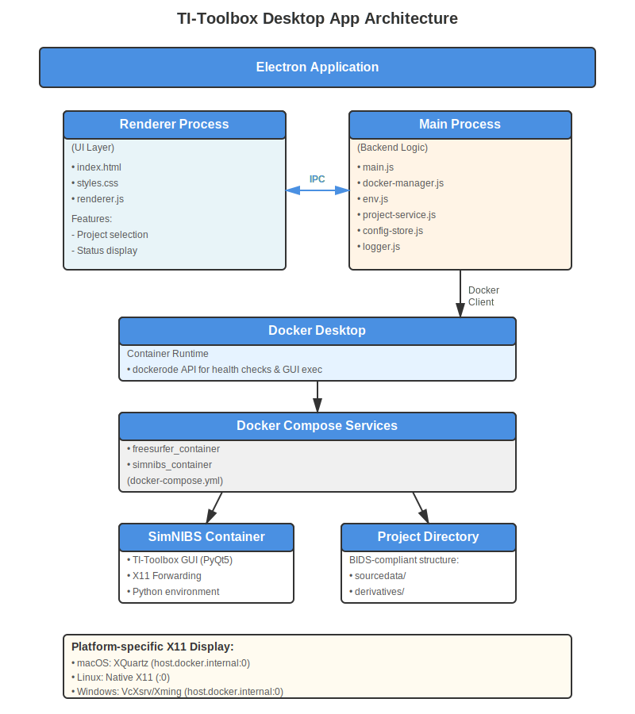

The TI-Toolbox Desktop Application is an Electron-based launcher that provides a user-friendly interface for running the Docker-based TI-Toolbox workflow across macOS, Windows, and Linux platforms.

## Architecture Overview



## Components

### Electron Application

The desktop app follows a standard Electron architecture with two main processes:

#### **Renderer Process** (Frontend)
The user interface layer built with HTML, CSS, and JavaScript:
- `index.html` - Main UI markup
- `styles.css` - Application styling
- `renderer.js` - UI logic and event handling

**Key Features:**
- Project directory selection and validation
- Docker status monitoring
- Launch and stop controls with progress feedback
- Real-time activity log display
- Platform-specific warnings and instructions

#### **Main Process** (Backend)
The Node.js backend that orchestrates all system operations:
- `main.js` - Application entry point and window management
- `docker-manager.js` - Docker lifecycle control and API integration
- `env.js` - Environment setup (DISPLAY, timezone, xhost permissions)
- `project-service.js` - BIDS project validation and initialization
- `config-store.js` - User preferences persistence
- `logger.js` - Structured logging with electron-log

**Communication:** The renderer and main processes communicate via Electron's IPC (Inter-Process Communication) mechanism, enabling secure and efficient message passing.

### Docker Integration

The app uses a dual approach for Docker integration:

1. **dockerode** - Docker Engine API client for:
   - Health checks (`docker version`, `docker.ping()`)
   - Container discovery and inspection
   - GUI process execution within containers
   - Real-time log streaming

2. **docker compose CLI** - For multi-container orchestration:
   - Building and starting the FreeSurfer and SimNIBS containers
   - Managing volumes and networks
   - Graceful shutdown and cleanup

The `docker-compose.yml` file is bundled with the application in `package/docker/`, ensuring the launcher works independently of the source repository.


## Launch Workflow

1. **User clicks "Launch TI-Toolbox"**
2. **Docker availability check** - Verifies Docker Desktop is running
3. **Project initialization** - Creates BIDS structure if new project
4. **Platform setup** - Configures X11 display (XQuartz/VcXsrv/native)
5. **Volume creation** - Sets up persistent Docker volumes
6. **Container startup** - Launches docker-compose services
7. **GUI execution** - Starts TI-Toolbox PyQt5 interface
8. **Active session** - User interacts with the GUI
9. **Cleanup** - Stops containers and reverts X11 permissions on exit

## Platform-Specific Configuration

### macOS
- **X Server:** XQuartz
- **Display:** `host.docker.internal:0`
- **Setup:** `xhost +localhost` for container access

### Linux
- **X Server:** Native X11
- **Display:** `:0` (or from `$DISPLAY`)
- **Setup:** `xhost +local:docker` for container access

### Windows
- **X Server:** VcXsrv or Xming
- **Display:** `host.docker.internal:0`
- **Path conversion:** Windows paths converted to Docker-compatible format

## IPC Events

**Renderer → Main:**
- `select-directory` - Opens directory picker
- `check-docker` - Verifies Docker availability
- `start-toolbox` - Launches the full stack
- `stop-toolbox` - Stops all containers
- `get-log-path` - Returns log file location
- `reveal-log-file` - Opens log in file manager

**Main → Renderer:**
- `launcher-progress` - Status updates (stage, message, timestamp)
- `launcher-log` - GUI process output stream

## Building the Application

The app uses `electron-builder` to create platform-specific distributables:

**macOS:** `.app` bundle, `.dmg` installer, `.zip` archive  
**Windows:** `.exe` installer (NSIS), portable `.exe`  
**Linux:** `.AppImage`, `.deb` package

Build commands:
```bash
npm run build:mac     # macOS only
npm run build:win     # Windows only
npm run build:linux   # Linux only
npm run build:all     # All platforms
```

## Development

Run in development mode with console access:
```bash
cd package
npm install
npm start
```

## Dependencies

**Runtime:**
- Docker Desktop (required)
- X Server (platform-specific: XQuartz, VcXsrv, or native)

**Development:**
- Node.js 18+
- npm 9+

## Security

- **X11 Permissions:** Temporarily granted for container access, reverted on exit
- **Docker Access:** Uses user's existing Docker installation, no elevated privileges
- **Code Signing:** macOS builds include entitlements for JIT compilation (required for Python)

## Performance

- **Startup Time:** ~3 seconds for container initialization
- **Memory Usage:** ~200MB (app) + Docker containers
- **Disk Space:** ~50MB (app) + ~5GB (Docker images)

## Troubleshooting

**Docker not found:**
Ensure Docker Desktop is installed and running.

**X Server issues:**
- macOS: Install XQuartz and enable "Allow connections from network clients"
- Windows: Install VcXsrv with "Disable access control" option
- Linux: Verify X11 is running and accessible

**Permission errors:**
Check that your user has access to the Docker daemon (usually requires membership in the `docker` group on Linux).

## See Also

- [Installation Guide](../installation/installation.md)
- [Quick Start](../../package/QUICK_START.md)
- [Architecture Details](../../package/ARCHITECTURE.md)

