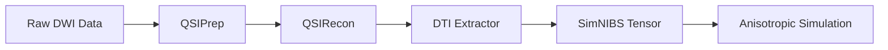

The TI-Toolbox integrates with QSIPrep and QSIRecon to process diffusion-weighted imaging (DWI) data for anisotropic conductivity simulations. This pipeline extracts diffusion tensors from preprocessed DWI data and converts them to the format required by SimNIBS.

## Overview

Anisotropic conductivity modeling uses diffusion tensor imaging (DTI) to account for the direction-dependent electrical conductivity of brain tissue, particularly white matter. The diffusion processing pipeline consists of three main stages:

1. **QSIPrep** - Preprocessing of raw DWI data
2. **QSIRecon** - Reconstruction and tensor estimation
3. **DTI Extraction** - Conversion to SimNIBS format



## Required Input Data

### BIDS Format Requirements

DWI data should be organized following BIDS conventions:

```
project_root/
├── sub-{subject_id}/
│   └── dwi/
│       ├── sub-{id}_dwi.nii.gz      # DWI 4D volume
│       ├── sub-{id}_dwi.bval        # b-values
│       └── sub-{id}_dwi.bvec        # b-vectors
└── derivatives/
    └── SimNIBS/
        └── sub-{id}/
            └── m2m_{id}/            # Must exist (run charm first)
```

### Data Requirements

| Requirement | Description | Status |
|-------------|-------------|--------|
| **DWI acquisition** | Multi-shell or single-shell diffusion data | **Required** |
| **SimNIBS head model** | m2m directory from charm | **Required** |
| **T1-weighted MRI** | Used for registration | **Required** |

## Stage 1: QSIPrep

**Module:** `tit.pre.qsi.run_qsiprep`
**Purpose:** Preprocess raw DWI data with distortion correction and quality control

### Features

- **Distortion Correction**: Susceptibility-induced distortion correction
- **Motion Correction**: Head motion and eddy current correction
- **Denoising**: MP-PCA denoising for improved SNR
- **Quality Control**: Automated QC reports

### Usage

```python
from tit.pre.qsi import run_qsiprep, QSIPrepConfig

config = QSIPrepConfig(
    output_resolution=2.0,      # Output resolution in mm
    denoise_method="patch2self", # Denoising method
    skip_bids_validation=False,
)

run_qsiprep(
    project_dir="/path/to/project",
    subject_ids=["101", "102"],
    config=config,
)
```

### Configuration Options

| Option | Description | Default |
|--------|-------------|---------|
| `output_resolution` | Output voxel size (mm) | 2.0 |
| `denoise_method` | Denoising algorithm | `"patch2self"` |
| `hmc_model` | Head motion correction model | `"eddy"` |
| `skip_bids_validation` | Skip BIDS validation | `False` |

### Output Structure

```
derivatives/
└── qsiprep/
    └── sub-101/
        ├── anat/
        │   ├── sub-101_space-ACPC_desc-preproc_T1w.nii.gz
        │   └── sub-101_from-ACPC_to-anat_mode-image_xfm.mat
        └── dwi/
            ├── sub-101_space-ACPC_desc-preproc_dwi.nii.gz
            ├── sub-101_space-ACPC_desc-preproc_dwi.bval
            └── sub-101_space-ACPC_desc-preproc_dwi.bvec
```

## Stage 2: QSIRecon

**Module:** `tit.pre.qsi.run_qsirecon`
**Purpose:** Reconstruct diffusion models and estimate tensors

### Features

- **Multiple Reconstruction Specs**: Support for various reconstruction pipelines
- **Tensor Estimation**: DTI/DKI model fitting
- **Connectivity Analysis**: Optional structural connectivity matrices

### Available Reconstruction Specs

| Spec | Description | DTI Output |
|------|-------------|------------|
| `dsi_studio_gqi` | DSI Studio GQI reconstruction | Yes (tensor components) |
| `dipy_dki` | DIPY Diffusion Kurtosis Imaging | Yes (DT + KT) |
| `mrtrix_multishell_msmt_ACT-fast` | MRtrix multi-shell CSD | No |
| `amico_noddi` | NODDI model fitting | No |

**Note:** For SimNIBS anisotropic simulations, use `dsi_studio_gqi` (recommended) or `dipy_dki`.

### Usage

```python
from tit.pre.qsi import run_qsirecon, QSIReconConfig, ReconSpec

config = QSIReconConfig(
    recon_spec=ReconSpec.DSI_STUDIO_GQI,  # Recommended for DTI
)

run_qsirecon(
    project_dir="/path/to/project",
    subject_ids=["101"],
    config=config,
)
```

### DSI Studio Output

DSI Studio produces individual tensor component files:

```
derivatives/
└── qsirecon/
    └── derivatives/
        └── qsirecon-DSIStudio/
            └── sub-101/
                └── dwi/
                    ├── sub-101_space-ACPC_model-tensor_param-txx_dwimap.nii.gz
                    ├── sub-101_space-ACPC_model-tensor_param-txy_dwimap.nii.gz
                    ├── sub-101_space-ACPC_model-tensor_param-txz_dwimap.nii.gz
                    ├── sub-101_space-ACPC_model-tensor_param-tyy_dwimap.nii.gz
                    ├── sub-101_space-ACPC_model-tensor_param-tyz_dwimap.nii.gz
                    └── sub-101_space-ACPC_model-tensor_param-tzz_dwimap.nii.gz
```

These six files represent the unique elements of the symmetric diffusion tensor:

```
    | Dxx  Dxy  Dxz |
D = | Dxy  Dyy  Dyz |
    | Dxz  Dyz  Dzz |
```

## Stage 3: DTI Extraction

**Module:** `tit.pre.qsi.extract_dti_tensor`
**Purpose:** Convert QSIRecon output to SimNIBS format

### Process Overview

The DTI extractor performs three key operations:

1. **Component Combination**: Combines 6 separate tensor files into a single 4D NIfTI
2. **Space Registration**: Resamples tensor from ACPC space to SimNIBS T1 space
3. **Format Conversion**: Ensures correct tensor ordering for SimNIBS

### Usage

```python
from tit.pre.qsi import extract_dti_tensor
import logging

logger = logging.getLogger(__name__)
logging.basicConfig(level=logging.INFO)

# Extract DTI tensor for a subject
result = extract_dti_tensor(
    project_dir="/path/to/project",
    subject_id="101",
    logger=logger,
    overwrite=False,  # Set to True to regenerate
)

print(f"Tensor saved to: {result}")
```

### Output Files

```
derivatives/
└── SimNIBS/
    └── sub-101/
        └── m2m_101/
            ├── DTI_ACPC_tensor.nii.gz      # Intermediate (ACPC space)
            └── DTI_coregT1_tensor.nii.gz   # Final (SimNIBS T1 space)
```

### SimNIBS Tensor Format

SimNIBS expects a 4D NIfTI file with shape `(X, Y, Z, 6)` containing the upper triangular elements of the diffusion tensor in this order:

```
Index 0: Dxx (diffusion along x-axis)
Index 1: Dxy (off-diagonal xy)
Index 2: Dxz (off-diagonal xz)
Index 3: Dyy (diffusion along y-axis)
Index 4: Dyz (off-diagonal yz)
Index 5: Dzz (diffusion along z-axis)
```

### Verification

After extraction, verify the tensor file is correctly formatted:

```python
import nibabel as nib

tensor_path = "/path/to/project/derivatives/SimNIBS/sub-101/m2m_101/DTI_coregT1_tensor.nii.gz"
t1_path = "/path/to/project/derivatives/SimNIBS/sub-101/m2m_101/T1.nii.gz"

tensor = nib.load(tensor_path)
t1 = nib.load(t1_path)

# Verify dimensions match
assert tensor.shape[:3] == t1.shape[:3], "Spatial dimensions must match T1"
assert tensor.shape[3] == 6, "Tensor must have 6 components"
print("Tensor format verified!")
```

## Complete Workflow Example

### Full Pipeline

```python
from tit.pre.qsi import (
    run_qsiprep, run_qsirecon, extract_dti_tensor,
    QSIPrepConfig, QSIReconConfig, ReconSpec
)
import logging

# Setup logging
logging.basicConfig(level=logging.INFO)
logger = logging.getLogger("dti_pipeline")

project_dir = "/path/to/project"
subject_id = "101"

# Stage 1: QSIPrep
logger.info("Running QSIPrep...")
run_qsiprep(
    project_dir=project_dir,
    subject_ids=[subject_id],
    config=QSIPrepConfig(output_resolution=2.0),
)

# Stage 2: QSIRecon with DSI Studio
logger.info("Running QSIRecon...")
run_qsirecon(
    project_dir=project_dir,
    subject_ids=[subject_id],
    config=QSIReconConfig(recon_spec=ReconSpec.DSI_STUDIO_GQI),
)

# Stage 3: Extract DTI tensor
logger.info("Extracting DTI tensor...")
tensor_path = extract_dti_tensor(
    project_dir=project_dir,
    subject_id=subject_id,
    logger=logger,
)

logger.info(f"Pipeline complete! Tensor saved to: {tensor_path}")
```

## Integration with Simulations

Once the DTI tensor is extracted, it's automatically available for anisotropic simulations:

### GUI Usage

1. Navigate to the **Simulator** tab
2. Select your subject
3. Under **Conductivity Model**, select **Anisotropic**
4. The simulator will automatically use `DTI_coregT1_tensor.nii.gz`

## Troubleshooting

### Common Issues

| Issue | Cause | Solution |
|-------|-------|----------|
| "No DTI tensor found" | QSIRecon not run with DTI spec | Run QSIRecon with `dsi_studio_gqi` |
| "m2m directory not found" | SimNIBS charm not run | Run charm preprocessing first |
| Tensor shape mismatch | Registration failed | Check T1 alignment, re-run extraction |
| Missing tensor components | Incomplete QSIRecon | Re-run QSIRecon, check logs |

## Resource Requirements

Highly varible as it depends on type of aquisition and power of processing machine at hand. See below documentation.

## References

- [QSIPrep Documentation](https://qsiprep.readthedocs.io/)
- [QSIRecon Documentation](https://qsirecon.readthedocs.io/)
- [SimNIBS dwi2cond](https://simnibs.github.io/simnibs/build/html/documentation/command_line/dwi2cond.html)
- [DSI Studio](https://dsi-studio.labsolver.org/)

## Related Documentation

- [Pre-Processing](pre-processing.md) - Structural MRI preprocessing
- [Simulator](simulator.md) - Running TI simulations with anisotropic conductivity
