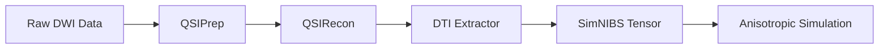

The TI-Toolbox integrates with [QSIPrep](https://qsiprep.readthedocs.io/) and [QSIRecon](https://qsirecon.readthedocs.io/) to process diffusion-weighted imaging (DWI) data for anisotropic conductivity simulations. This pipeline extracts diffusion tensors from preprocessed DWI data, registers them into SimNIBS head-model space, and pre-compensates for SimNIBS's internal FSL tensor rotation — producing a ready-to-use `DTI_coregT1_tensor.nii.gz` file.

!!! warning "Validation Status"
    This pipeline is **functional and producing stable, consistent results** in our testing. However, the full chain — from QSIRecon tensor output through cross-correlation registration and FSL convention pre-compensation — **warrants further validation** by domain experts in diffusion MRI and conductivity modeling. We welcome input from the community on registration accuracy, tensor reorientation correctness, and downstream simulation fidelity. If you have expertise in this area, please open an issue or reach out.

!!! warning "Apple Silicon (ARM) Compatibility"
    The QSIPrep and QSIRecon Docker containers are built for `linux/amd64`. On Apple Silicon Macs (M1/M2/M3/M4), Docker runs these under Rosetta 2 emulation via `--platform linux/amd64`. This works but has known issues: significantly slower performance, occasional segfaults during eddy current correction, and higher memory usage. If you encounter failures on Apple Silicon, try increasing Docker's memory allocation (32 GB+ recommended) or running on an Intel/AMD machine.

## Overview

Anisotropic conductivity modeling uses diffusion tensor imaging (DTI) to account for the direction-dependent electrical conductivity of brain tissue — white matter conducts current preferentially along fiber tracts. The diffusion processing pipeline consists of three stages:

1. **QSIPrep** — Preprocessing of raw DWI data (denoising, motion/eddy/distortion correction)
2. **QSIRecon** — Reconstruction and tensor estimation (DSI Studio GQI)
3. **DTI Extraction** — Registration to SimNIBS space and format conversion


```mermaid
graph LR
    A[Raw DWI Data] --> B[QSIPrep]
    B --> C[QSIRecon]
    C --> D[DTI Extractor]
    D --> E[SimNIBS Tensor]
    E --> F[Anisotropic Simulation]
```

### Why `dsi_studio_gqi`?

QSIRecon supports over 20 reconstruction workflows (MRtrix CSD, DIPY DKI, NODDI, MAP-MRI, and more). For the specific purpose of producing DTI tensors for SimNIBS anisotropic conductivity simulations, we ship **`dsi_studio_gqi`** as the default because:

- It produces the six tensor component maps (`txx`–`tzz`) that SimNIBS needs directly
- It works with both single-shell and multi-shell acquisitions
- It does not require FreeSurfer surfaces or atlas parcellations
- It has proven reliable across our test datasets

We use a **custom pipeline YAML** (`resources/qsirecon_pipelines/dsi_studio_gqi_scalar.yaml`) that removes the upstream connectivity node — this avoids a mandatory `--atlases` requirement and a reporting bug in QSIRecon >= 1.2.0. The custom pipeline retains GQI reconstruction, scalar export (tensor components), and optional tractography.

Other recon specs (e.g., `dipy_dki`, `mrtrix_multishell_msmt_*`) may also produce usable tensors, but they are not currently validated in our extraction pipeline. If you use a different spec, you will need to adapt the DTI extraction step accordingly.

## Required Input Data

### BIDS Format Requirements

DWI data should be organized following BIDS conventions:

```
project_root/
├── sub-{subject_id}/
│   └── dwi/
│       ├── sub-{id}_dwi.nii.gz      # DWI 4D volume
│       ├── sub-{id}_dwi.bval        # b-values
│       └── sub-{id}_dwi.bvec        # b-vectors
└── derivatives/
    └── SimNIBS/
        └── sub-{id}/
            └── m2m_{id}/            # Must exist (run charm first)
```

### Data Requirements

| Requirement            | Description                                | Status       |
| ---------------------- | ------------------------------------------ | ------------ |
| **DWI acquisition**    | Multi-shell or single-shell diffusion data | **Required** |
| **SimNIBS head model** | m2m directory from charm                   | **Required** |
| **T1-weighted MRI**    | Used for registration                      | **Required** |

## Stage 1: QSIPrep

**Module:** `tit.pre.qsi.run_qsiprep`
**Purpose:** Preprocess raw DWI data with distortion correction and quality control

### Features

- **Distortion Correction**: Susceptibility-induced distortion correction
- **Motion Correction**: Head motion and eddy current correction
- **Denoising**: MP-PCA denoising for improved SNR
- **Quality Control**: Automated QC reports

### Usage

```python
from tit.pre.qsi import run_qsiprep
import logging

logger = logging.getLogger("diffusion")

run_qsiprep(
    project_dir="/path/to/bids_project",
    subject_id="101",
    logger=logger,
    output_resolution=2.0,
    denoise_method="dwidenoise",
)
```

### Configuration Options

| Option                 | Description                                              | Default        |
| ---------------------- | -------------------------------------------------------- | -------------- |
| `output_resolution`    | Output voxel size (mm)                                   | 2.0            |
| `denoise_method`       | Denoising algorithm (`dwidenoise`, `patch2self`, `none`) | `"dwidenoise"` |
| `unringing_method`     | Gibbs ringing removal (`mrdegibbs`, `rpg`, `none`)       | `"mrdegibbs"`  |
| `skip_bids_validation` | Skip BIDS validation                                     | `True`         |

### Output Structure

```
derivatives/
└── qsiprep/
    └── sub-101/
        ├── anat/
        │   ├── sub-101_space-ACPC_desc-preproc_T1w.nii.gz
        │   └── sub-101_from-ACPC_to-anat_mode-image_xfm.mat
        └── dwi/
            ├── sub-101_space-ACPC_desc-preproc_dwi.nii.gz
            ├── sub-101_space-ACPC_desc-preproc_dwi.bval
            └── sub-101_space-ACPC_desc-preproc_dwi.bvec
```

## Stage 2: QSIRecon

**Module:** `tit.pre.qsi.run_qsirecon`
**Purpose:** Reconstruct diffusion models and estimate tensors

### Features

- **Multiple Reconstruction Specs**: Support for various reconstruction pipelines
- **Tensor Estimation**: DTI/DKI model fitting
- **Connectivity Analysis**: Optional structural connectivity matrices

### Available Reconstruction Specs

| Spec                              | Description                     | DTI Output              |
| --------------------------------- | ------------------------------- | ----------------------- |
| `dsi_studio_gqi`                  | DSI Studio GQI reconstruction   | Yes (tensor components) |
| `dipy_dki`                        | DIPY Diffusion Kurtosis Imaging | Yes (DT + KT)           |
| `mrtrix_multishell_msmt_ACT-fast` | MRtrix multi-shell CSD          | No                      |
| `amico_noddi`                     | NODDI model fitting             | No                      |

**Note:** For SimNIBS anisotropic simulations, use `dsi_studio_gqi` (recommended) or `dipy_dki`.

### Usage

```python
from tit.pre.qsi import run_qsirecon

run_qsirecon(
    project_dir="/path/to/bids_project",
    subject_id="101",
    logger=logger,
    recon_specs=["dsi_studio_gqi"],  # Default and recommended for DTI
)
```

### DSI Studio Output

DSI Studio produces individual tensor component files:

```
derivatives/
└── qsirecon/
    └── derivatives/
        └── qsirecon-DSIStudio/
            └── sub-101/
                └── dwi/
                    ├── sub-101_space-ACPC_model-tensor_param-txx_dwimap.nii.gz
                    ├── sub-101_space-ACPC_model-tensor_param-txy_dwimap.nii.gz
                    ├── sub-101_space-ACPC_model-tensor_param-txz_dwimap.nii.gz
                    ├── sub-101_space-ACPC_model-tensor_param-tyy_dwimap.nii.gz
                    ├── sub-101_space-ACPC_model-tensor_param-tyz_dwimap.nii.gz
                    └── sub-101_space-ACPC_model-tensor_param-tzz_dwimap.nii.gz
```

These six files represent the unique elements of the symmetric diffusion tensor:

```
    | Dxx  Dxy  Dxz |
D = | Dxy  Dyy  Dyz |
    | Dxz  Dyz  Dzz |
```

## Stage 3: DTI Extraction

**Module:** `tit.pre.qsi.extract_dti_tensor`
**Purpose:** Convert QSIRecon output to SimNIBS format

### Process Overview

The DTI extractor performs four key operations:

1. **Component Combination**: Loads 6 separate tensor files (`txx`–`tzz`) into a single 4D NIfTI `(X, Y, Z, 6)`
2. **Cross-Correlation Alignment**: Finds the translation between ACPC space (QSIPrep) and SimNIBS native space using 3D cross-correlation between the two T1 images — this resolves the ~50 mm coordinate offset without requiring FSL or ANTs
3. **Resampling**: Each tensor component is resampled onto the SimNIBS T1 grid (typically 0.5 mm isotropic) using trilinear interpolation
4. **FSL Convention Pre-Compensation**: Pre-rotates tensors so that SimNIBS's internal `correct_FSL` function produces correct world-space conductivity tensors (DSI Studio does not apply the implicit x-flip that FSL `dtifit` does)

### Usage

```python
from tit.pre.qsi import extract_dti_tensor

tensor_path = extract_dti_tensor(
    project_dir="/path/to/bids_project",
    subject_id="101",
    logger=logger,
)

print(f"Tensor saved to: {tensor_path}")
```

### Output Files

```
derivatives/
└── SimNIBS/
    └── sub-101/
        └── m2m_101/
            ├── DTI_ACPC_tensor.nii.gz      # Intermediate (ACPC space)
            └── DTI_coregT1_tensor.nii.gz   # Final (SimNIBS T1 space)
```

### SimNIBS Tensor Format

SimNIBS expects a 4D NIfTI file with shape `(X, Y, Z, 6)` containing the upper triangular elements of the diffusion tensor in this order:

```
Index 0: Dxx (diffusion along x-axis)
Index 1: Dxy (off-diagonal xy)
Index 2: Dxz (off-diagonal xz)
Index 3: Dyy (diffusion along y-axis)
Index 4: Dyz (off-diagonal yz)
Index 5: Dzz (diffusion along z-axis)
```

### QC Report

After extraction, an automated QC report is generated containing:

- **FA overlaid on T1**: Checks registration quality — white matter FA should align with T1 anatomy
- **Color-coded FA**: Verifies tensor orientations (red = left-right, green = anterior-posterior, blue = superior-inferior)
- **Tensor statistics**: FA mean/median/max, eigenvalue ranges, component statistics

A diagnostic tool is also available for deeper investigation:

```bash
# Inside the SimNIBS container
python -m tit.pre.qsi.debug_dti /mnt/<project> <subject_id>
```

## Integration with Simulations

Once the DTI tensor is extracted, it is automatically available for anisotropic simulations:

### GUI Usage

1. Navigate to the **Simulator** tab
2. Select your subject
3. Under **Conductivity Model**, select **Anisotropic**
4. The simulator will automatically detect and use `DTI_coregT1_tensor.nii.gz`

## Docker Execution Model

QSIPrep and QSIRecon run as **sibling Docker containers** spawned from within the SimNIBS container using the Docker-out-of-Docker (DooD) pattern. The SimNIBS container shares the Docker socket and uses `LOCAL_PROJECT_DIR` to resolve host paths for volume mounts. CPU and memory limits are inherited from the parent container.

## Resource Requirements

Highly variable depending on acquisition type and hardware:

- **Memory**: 16 GB minimum, 32 GB recommended (especially on Apple Silicon under emulation)
- **CPU**: Scales well with 4–8 cores; OMP threads default to 1 to avoid over-subscription
- **Disk**: QSIPrep work directories can require 10–20 GB per subject
- **Time**: QSIPrep typically takes 2–6 hours per subject; QSIRecon is faster (30–90 minutes)

## References

- [QSIPrep Documentation](https://qsiprep.readthedocs.io/)
- [QSIRecon Documentation](https://qsirecon.readthedocs.io/)
- [SimNIBS dwi2cond](https://simnibs.github.io/simnibs/build/html/documentation/command_line/dwi2cond.html)
- [DSI Studio](https://dsi-studio.labsolver.org/)
- Cieslak, M., Cook, P.A., He, X. et al. *QSIPrep: an integrative platform for preprocessing and reconstructing diffusion MRI data.* Nature Methods 18, 775–778 (2021). [doi:10.1038/s41592-021-01185-5](https://doi.org/10.1038/s41592-021-01185-5)

## Related Documentation

- [Pre-Processing](pre-processing.md) — Structural MRI preprocessing
- [QSIPrep & QSIRecon Reference](qsiprep-reference.md) — Quick reference for the diffusion pipeline
- [Simulator](simulator.md) — Running TI simulations with anisotropic conductivity
