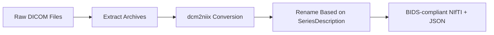
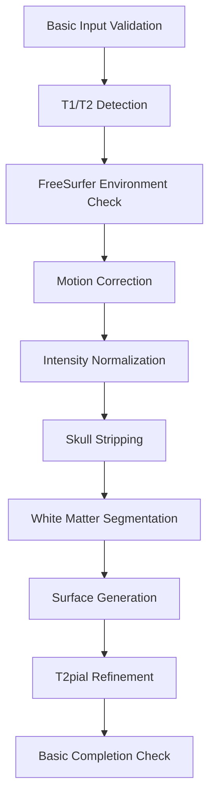
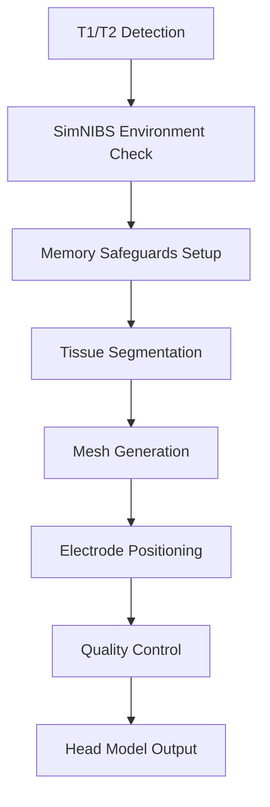
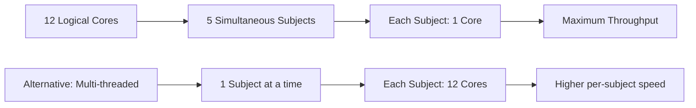

# Pre-processing Pipeline

The TI-Toolbox pre-processing pipeline prepares anatomical MRI data for TI stimulation analysis by converting DICOM files to BIDS-compliant NIfTI format, performing FreeSurfer cortical reconstruction, and creating SimNIBS head models. This comprehensive pipeline ensures that all subsequent analysis steps have access to high-quality, standardized neuroimaging data.

## Overview

The pre-processing pipeline consists of three main stages:

1. **DICOM to NIfTI Conversion** - Convert raw DICOM files to BIDS-compliant NIfTI format
2. **FreeSurfer recon-all** - Cortical reconstruction and segmentation
3. **SimNIBS charm** - Head model creation for electromagnetic simulations

## Required Input Data Structure

### BIDS Format Requirements

The toolbox expects data to be organized following the BIDS (Brain Imaging Data Structure) standard:

```
project_root/
├── sourcedata/
│   └── sub-{subject_id}/
│       ├── T1w/
│       │   ├── dicom/          # Raw T1w DICOM files
│       │   └── *.tgz           # Compressed DICOM archives (optional)
│       └── T2w/
│           ├── dicom/          # Raw T2w DICOM files
│           └── *.tgz           # Compressed DICOM archives (optional)
└── sub-{subject_id}/
    └── anat/                   # Converted NIfTI files (created by pipeline)
        ├── anat-T1w_acq-MPRAGE.nii.gz
        ├── anat-T1w_acq-MPRAGE.json
        ├── anat-T2w_acq-CUBE.nii.gz
        └── anat-T2w_acq-CUBE.json
```

### Data Requirements

| Requirement | Description | Status |
|-------------|-------------|---------|
| **T1-weighted MRI** | High-resolution anatomical image (typically MPRAGE) | **Required** |
| **T2-weighted MRI** | High-resolution anatomical image (typically CUBE/SPACE) | **Recommended** |
| **Image Resolution** | Minimum 1mm isotropic voxels | **Required** |
| **File Format** | DICOM or NIfTI | **Required** |
| **Subject ID** | Numeric identifier (e.g., 101, 102) | **Required** |

### Supported Input Formats

- **DICOM files** (`.dcm`, `.IMA`, `.dicom`)
- **Compressed DICOM archives** (`.tgz`)
- **NIfTI files** (`.nii`, `.nii.gz`) - if already converted

## Processing Stages

### Stage 1: DICOM to NIfTI Conversion

**Script:** `dicom2nifti.sh`  
**Purpose:** Convert raw DICOM files to BIDS-compliant NIfTI format

#### Features

- **Automatic T1w/T2w Detection**: Identifies scan types based on DICOM series descriptions
- **Compressed Archive Support**: Handles `.tgz` compressed DICOM archives
- **BIDS Compliance**: Generates proper BIDS naming conventions
- **Metadata Preservation**: Maintains scan parameters in JSON sidecars

#### Process Flow



#### Usage

```bash
# Convert DICOM files for a single subject
./dicom2nifti.sh /path/to/sub-101

# Quiet mode (no console output)
./dicom2nifti.sh /path/to/sub-101 --quiet
```

#### Generated Output Structure

```
sub-101/
└── anat/
    ├── anat-T1w_acq-MPRAGE.nii.gz    # T1-weighted image
    ├── anat-T1w_acq-MPRAGE.json      # T1 metadata
    ├── anat-T2w_acq-CUBE.nii.gz      # T2-weighted image
    └── anat-T2w_acq-CUBE.json        # T2 metadata
```

### Stage 2: FreeSurfer recon-all

**Script:** `recon-all.sh`  
**Purpose:** Cortical reconstruction, segmentation, and surface generation

#### Features

- **T1 + T2 Processing**: Utilizes both T1 and T2 images when available for improved pial surface reconstruction
- **Flexible Processing**: Continues processing even if some stages encounter issues
- **Basic Input Validation**: Simple checks for file existence and readability
- **Parallel Processing**: Configurable for single-threaded or multi-threaded execution
- **Resilient Execution**: Continues processing other subjects even if some fail
- **Flexible Output Validation**: Basic completion checks without strict file requirements

#### Process Flow



#### Completion Checking

The script performs basic completion checking:

- Looks for completion markers in `recon-all.log`
- Accepts various completion patterns
- Continues processing even if markers aren't found
- Maintains partial results for manual inspection

#### Usage

```bash
# Single subject processing
./recon-all.sh /path/to/sub-101

# With parallel processing optimization
./recon-all.sh /path/to/sub-101 --parallel

# Quiet mode
./recon-all.sh /path/to/sub-101 --quiet
```

#### Generated Output Structure

```
derivatives/
└── freesurfer/
    └── sub-101/
        ├── mri/           # Volumetric data
        ├── surf/          # Surface meshes
        ├── label/         # Anatomical labels
        └── scripts/
            └── recon-all.log
```

### Stage 3: SimNIBS charm (Head Model Creation)

**Script:** `charm.sh`  
**Purpose:** Create electromagnetic head models for TI simulation

#### Features

- **Multi-modal Input**: Supports T1-only or T1+T2 processing
- **Memory Safeguards**: PETSC optimization to prevent segmentation faults
- **Sequential Processing**: Runs one subject at a time to avoid memory conflicts
- **Automatic Overwrite**: Handles existing head models with `--forcerun`

#### Process Flow



#### Usage

```bash
# Create head model for single subject
./charm.sh /path/to/sub-101

# Quiet mode
./charm.sh /path/to/sub-101 --quiet
```

#### Generated Output Structure

```
derivatives/
└── SimNIBS/
    └── sub-101/
        └── m2m_101/
            ├── subject_volumes/
            ├── subject_meshes/
            ├── eeg_positions/
            └── charm_log.html
```

## Orchestration Script

### structural.sh - Pipeline Orchestrator

**Purpose:** Coordinates all pre-processing stages with flexible execution options

#### Command Line Interface

```bash
# Basic usage - all stages
./structural.sh /path/to/sub-101 /path/to/sub-102 recon-all --convert-dicom --create-m2m

# Recon-all only
./structural.sh /path/to/sub-101 recon-all --recon-only

# Parallel processing
./structural.sh /path/to/sub-101 /path/to/sub-102 recon-all --parallel

# Subject ID format
./structural.sh --subjects 101,102,103 recon-all --parallel
```

#### Processing Options

| Option | Description | Usage |
|--------|-------------|-------|
| `recon-all` | Run FreeSurfer reconstruction | Always required |
| `--convert-dicom` | Include DICOM conversion stage | Optional |
| `--create-m2m` | Include SimNIBS head model creation | Optional |
| `--parallel` | Enable parallel processing | Optional |
| `--recon-only` | Skip all non-recon steps | Optional |
| `--quiet` | Suppress console output | Optional |

## Parallelization Strategy

### Maximum Throughput Architecture

The pipeline implements a sophisticated parallelization strategy optimized for computational efficiency:

#### FreeSurfer Parallel Processing



#### Configuration Details

| Mode | Subjects Simultaneously | Cores per Subject | Use Case |
|------|------------------------|-------------------|----------|
| **Maximum Throughput** | N (= CPU cores) | 1 | Large cohort studies |
| **Single Subject** | 1 | All available | Individual processing |

#### Implementation

```bash
# Detect available cores
AVAILABLE_CORES=$(nproc)  # Linux
AVAILABLE_CORES=$(sysctl -n hw.logicalcpu)  # macOS

# Configure parallel execution
export OMP_NUM_THREADS=1
export ITK_GLOBAL_DEFAULT_NUMBER_OF_THREADS=1

# GNU Parallel execution
parallel --jobs $AVAILABLE_CORES --line-buffer recon-all.sh {} ::: "${SUBJECT_DIRS[@]}"
```

#### SimNIBS Sequential Processing

SimNIBS charm processing is **always sequential** to prevent PETSC memory conflicts:

- One subject processed at a time
- Full CPU cores available per subject
- Memory safeguards to prevent segmentation faults

## Complete Pipeline Execution

### Full Pipeline Example

```bash
# Process multiple subjects with full pipeline
./structural.sh \
    /mnt/study_data/sub-101 \
    /mnt/study_data/sub-102 \
    /mnt/study_data/sub-103 \
    recon-all \
    --parallel \
    --convert-dicom \
    --create-m2m
```

### Stage-by-Stage Execution

```bash
# Stage 1: DICOM conversion only
./dicom2nifti.sh /mnt/study_data/sub-101

# Stage 2: FreeSurfer reconstruction only
./recon-all.sh /mnt/study_data/sub-101 --parallel

# Stage 3: SimNIBS head model only  
./charm.sh /mnt/study_data/sub-101
```

## Output Directory Structure

### Complete Processing Output

```
project_root/
├── sourcedata/                     # Original DICOM data
│   └── sub-101/
│       ├── T1w/dicom/
│       └── T2w/dicom/
├── sub-101/                        # BIDS data
│   └── anat/
│       ├── anat-T1w_acq-MPRAGE.nii.gz
│       └── anat-T2w_acq-CUBE.nii.gz
└── derivatives/                    # Processed outputs
    ├── freesurfer/                 # FreeSurfer outputs
    │   └── sub-101/
    │       ├── mri/
    │       ├── surf/
    │       └── scripts/
    ├── SimNIBS/                    # SimNIBS outputs
    │   └── sub-101/
    │       └── m2m_101/
    └── logs/                       # Processing logs
        └── sub-101/
            ├── dicom2nifti_20250625_120000.log
            ├── recon-all_20250625_130000.log
            └── charm_20250625_140000.log
```

## Logging and Monitoring

### Log File Organization

```
derivatives/logs/sub-{subject_id}/
├── dicom2nifti_{timestamp}.log     # DICOM conversion logs
├── recon-all_{timestamp}.log       # FreeSurfer processing logs
└── charm_{timestamp}.log           # SimNIBS processing logs
```

### Log Content Examples

#### Successful Processing
```
[2025-06-25 13:45:23] [recon-all] [INFO] Starting FreeSurfer recon-all for subject: sub-101
[2025-06-25 13:45:24] [recon-all] [INFO] Found T1 image: /mnt/study/sub-101/anat/anat-T1w_acq-MPRAGE.nii.gz
[2025-06-25 13:45:24] [recon-all] [INFO] Found T2 image: /mnt/study/sub-101/anat/anat-T2w_acq-CUBE.nii.gz
[2025-06-25 13:45:24] [recon-all] [INFO] T2 image will be used for improved pial surface reconstruction
[2025-06-25 15:23:45] [recon-all] [INFO] Verification results: Essential files found: 9/9
[2025-06-25 15:23:45] [recon-all] [INFO] FreeSurfer completion verification PASSED
```

#### Error Detection
```
[2025-06-25 14:15:32] [recon-all] [ERROR] Command failed with critical system error: recon-all -subject sub-103...
[2025-06-25 14:15:32] [recon-all] [ERROR] System error details: Illegal instruction
[2025-06-25 14:15:32] [recon-all] [ERROR] FreeSurfer recon-all verification failed for subject: sub-103
```

### Monitoring Progress

Monitor processing progress in real-time:

```bash
# Monitor all logs for a subject
tail -f /mnt/project/derivatives/logs/sub-101/*.log

# Monitor specific stage
tail -f /mnt/project/derivatives/logs/sub-101/recon-all_*.log

# Check processing status across subjects
ls -la /mnt/project/derivatives/freesurfer/*/mri/aseg.mgz
```

## Troubleshooting

### Common Issues

| Issue | Symptoms | Solution |
|-------|----------|----------|
| **Missing T1 Image** | "No T1 image found" error | Ensure DICOM conversion completed successfully |
| **Illegal Instruction** | FreeSurfer crashes early | Check Docker CPU compatibility, try different base image |
| **PETSC Segmentation Fault** | SimNIBS charm crashes | Ensure sequential processing, check memory limits |
| **Partial FreeSurfer Output** | Some files missing | Check log files, results may still be usable |
| **Missing T2 Image** | Warning in logs | Processing continues with T1 only |

### Processing Behavior

The pipeline now implements a more flexible approach:

1. **Partial Results**: Keeps partial results instead of deleting them
2. **Continued Processing**: Continues with other subjects even if some fail
3. **T2 Handling**: Gracefully falls back to T1-only if T2 is missing/unreadable
4. **Basic Validation**: Simple existence checks replace strict file validation
5. **Error Reporting**: Provides warnings instead of errors for non-critical issues

### System Requirements

| Component | Minimum | Recommended |
|-----------|---------|-------------|
| **CPU Cores** | 4 | 8+ |
| **RAM** | 8 GB | 16+ GB |
| **Disk Space** | 10 GB per subject | 20+ GB per subject |
| **Docker Memory** | 6 GB | 12+ GB |

### Performance Optimization

1. **Parallel Processing**: Use `--parallel` flag for multiple subjects
2. **Memory Management**: Ensure adequate Docker memory allocation
3. **Disk I/O**: Use fast storage (SSD) for improved performance
4. **CPU Utilization**: Match number of parallel jobs to available cores
5. **Failure Handling**: Pipeline continues even if some subjects fail

## Integration with Analysis Pipeline

The pre-processing pipeline generates all necessary inputs for downstream TI analysis:

- **FreeSurfer surfaces** → `ex-search` electrode optimization
- **SimNIBS head models** → `simulator` electromagnetic field computation
- **BIDS anatomical data** → `analyzer` ROI analysis and visualization

See the [Ex-Search](ex-search.md) and [Simulator](simulator.md) documentation for details on using pre-processed data in TI analysis workflows. 