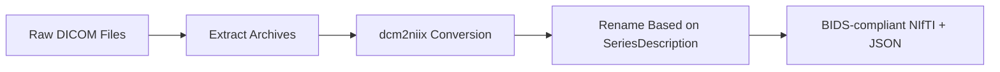
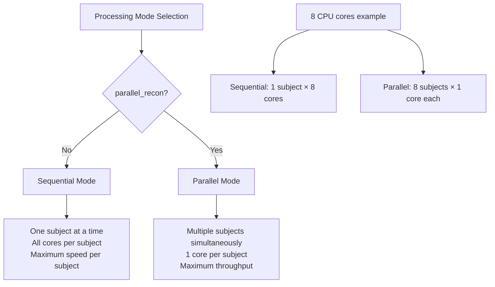

The TI-Toolbox pre-processing pipeline prepares anatomical MRI data for TI simulations by converting DICOM files to BIDS-compliant NIfTI format, performing FreeSurfer cortical reconstruction, and creating SimNIBS head models. This comprehensive pipeline ensures that all subsequent steps have access to high-quality, standardized neuroimaging data.

## Overview

The pre-processing pipeline consists of three main stages:

1. **DICOM to NIfTI Conversion** - Convert raw DICOM files to BIDS-compliant NIfTI format
2. **FreeSurfer recon-all** - Cortical reconstruction and segmentation
3. **SimNIBS charm** - Head model creation for electromagnetic simulations

## Required Input Data Structure

### BIDS Format Requirements

The toolbox expects data to be organized following the BIDS (Brain Imaging Data Structure) standard:

```
project_root/
└── sourcedata/
    └── sub-{subject_id}/
        ├── T1w/
        │   ├── dicom/          # Raw T1w DICOM files
        │   └── *.tgz           # Compressed DICOM archives (optional)
        └── T2w/
            ├── dicom/          # Raw T2w DICOM files
            └── *.tgz           # Compressed DICOM archives (optional)
```

### Data Requirements

| Requirement | Description | Status |
|-------------|-------------|---------|
| **T1-weighted MRI** | High-resolution anatomical image (typically MPRAGE) | **Required** |
| **T2-weighted MRI** | High-resolution anatomical image (typically CUBE/SPACE) | **Recommended** |


### Supported Input Formats

- **DICOM files** (`.dcm`, `.dicom`)
- **Compressed DICOM archives** (`.tgz`)
- **NIfTI files** (`.nii`, `.nii.gz`) - if already converted

## Processing Stages

### Stage 1: DICOM to NIfTI Conversion

**Module:** `tit.pre.dicom2nifti.run_dicom_to_nifti`  
**Purpose:** Convert raw DICOM files to BIDS-compliant NIfTI format

#### Features

- **Automatic T1w/T2w Detection**: Identifies scan types based on DICOM series descriptions
- **Compressed Archive Support**: Handles `.tgz` compressed DICOM archives
- **BIDS Compliance**: Generates proper BIDS naming conventions
- **Metadata Preservation**: Maintains scan parameters in JSON sidecars

#### Process Flow



#### Usage

```python
from tit.pre.dicom2nifti import run_dicom_to_nifti
from tit.pre.common import build_logger

logger = build_logger("dicom2nifti", subject_id="101", project_dir="/path/to/project")
run_dicom_to_nifti("/path/to/project", "101", logger=logger)
```


### Stage 2: FreeSurfer recon-all

**Module:** `tit.pre.recon_all.run_recon_all`  
**Purpose:** Cortical reconstruction, segmentation, and surface generation

#### Features

- **T1 + T2 Processing**: Utilizes both T1 and T2 images when available for improved pial surface reconstruction
- **Parallel Processing**: Configurable for single-threaded or multi-threaded execution


#### Usage

```python
from tit.pre.recon_all import run_recon_all
from tit.pre.common import build_logger

logger = build_logger("recon-all", subject_id="101", project_dir="/path/to/project")
run_recon_all("/path/to/project", "101", logger=logger, parallel=True)
```

**Note:** The `parallel=True` flag enables FreeSurfer's internal parallelization (multiple cores for one subject). The pipeline-level `parallel_recon=True` enables multiple subjects simultaneously, each using a single core.

#### Generated Output Structure

```
derivatives/
└── freesurfer/
    └── sub-101/
        ├── mri/           # Volumetric data
        ├── surf/          # Surface meshes
        ├── label/         # Anatomical labels
        └── scripts/
```

### Stage 3: SimNIBS charm (Head Model Creation)

**Module:** `tit.pre.charm.run_charm`  
**Purpose:** Create head models for TI simulation

#### Features

- **Input**: Supports T1-only or T1+T2 processing
- **Sequential Processing**: Runs one subject at a time 


#### Usage

```python
from tit.pre.charm import run_charm
from tit.pre.common import build_logger

logger = build_logger("charm", subject_id="101", project_dir="/path/to/project")
run_charm("/path/to/project", "101", logger=logger)
```

#### Generated Output Structure

```
derivatives/
└── SimNIBS/
    └── sub-101/
        └── m2m_101/

```

## Orchestration Script

### Python Pipeline Orchestrator

**Purpose:** Coordinates all pre-processing stages with flexible execution options

#### Python API

```python
from tit.pre.structural import run_pipeline

run_pipeline(
    "/path/to/project",
    ["101", "102"],
    convert_dicom=True,
    run_recon=True,
    create_m2m=True,
    parallel_recon=True,
)
```

#### Processing Options

| Option | Description | Usage |
|--------|-------------|-------|
| `run_recon` | Run FreeSurfer reconstruction | Optional |
| `convert_dicom` | Include DICOM conversion stage | Optional |
| `create_m2m` | Include SimNIBS head model creation | Optional |
| `parallel_recon` | Enable parallel processing mode (multiple subjects, 1 core each) | Optional |


#### Processing Mode Selection

**Default (Sequential Mode):**
```python
# Best for: Small datasets (1-3 subjects), maximum per-subject speed
run_pipeline("/path/to/project", ["101", "102"], convert_dicom=True, run_recon=True)
```

**Parallel Mode:**
```python
# Best for: Large datasets (4+ subjects), maximum throughput
run_pipeline(
    "/path/to/project",
    ["101", "102", "103", "104"],
    convert_dicom=True,
    run_recon=True,
    parallel_recon=True,
)
```

## Parallelization Strategy

### Two-Mode Processing Architecture

The pipeline implements a simple and efficient two-mode parallelization strategy:

#### Processing Modes



#### Mode Comparison

| Mode | Command | Subjects Running | Cores per Subject | Best For |
|------|---------|------------------|-------------------|----------|
| **Sequential** (Default) | `run_pipeline(..., parallel_recon=False)` | 1 at a time | All available | Small datasets, fastest per-subject |
| **Parallel** | `run_pipeline(..., parallel_recon=True)` | Multiple | 1 each | Large datasets, maximum throughput |


#### SimNIBS Processing

SimNIBS charm processing is **always sequential** regardless of mode:

- One subject processed at a time to prevent PETSC memory conflicts
- Full CPU cores available per subject
- Memory safeguards to prevent segmentation faults

## CLI Execution Example

```python
# Stage 1: DICOM conversion only
run_dicom_to_nifti("/mnt/study_data", "101", logger=logger)

# Stage 2: FreeSurfer reconstruction only
# Sequential mode (all cores for this subject)
run_recon_all("/mnt/study_data", "101", logger=logger, parallel=True)

# Parallel mode (1 core for this subject)
run_recon_all("/mnt/study_data", "101", logger=logger, parallel=False)

# Stage 3: SimNIBS head model only
run_charm("/mnt/study_data", "101", logger=logger)
```

## Output Directory Structure

### Complete Processing Output

```
project_root/
├── sourcedata/                     # Original DICOM data
│   └── sub-101/
│       ├── T1w/dicom/
│       └── T2w/dicom/
├── sub-101/                        # BIDS data
│   └── anat/
│       ├── anat-T1w_acq-MPRAGE.nii.gz
│       └── anat-T2w_acq-CUBE.nii.gz
└── derivatives/                    # Processed outputs
    ├── freesurfer/                 # FreeSurfer outputs
    │   └── sub-101/
    │       ├── mri/
    │       ├── surf/
    │       └── scripts/
    └── SimNIBS/                    # SimNIBS outputs
        └── sub-101/
            └── m2m_101/
```

## Logging and Monitoring

### Log File Organization

```
derivatives/ti-toolbox/logs/sub-{subject_id}/
├── dicom2nifti_{timestamp}.log     # DICOM conversion logs
├── recon-all_{timestamp}.log       # FreeSurfer processing logs
└── charm_{timestamp}.log           # SimNIBS processing logs
```

### Log Content Examples

#### Successful Processing
```
[2025-06-25 13:45:23] [recon-all] [INFO] Starting FreeSurfer recon-all for subject: sub-101
[2025-06-25 13:45:24] [recon-all] [INFO] Found T1 image: /mnt/study/sub-101/anat/anat-T1w_acq-MPRAGE.nii.gz
[2025-06-25 13:45:24] [recon-all] [INFO] Found T2 image: /mnt/study/sub-101/anat/anat-T2w_acq-CUBE.nii.gz
[2025-06-25 13:45:24] [recon-all] [INFO] T2 image will be used for improved pial surface reconstruction
[2025-06-25 15:23:45] [recon-all] [INFO] Verification results: Essential files found: 9/9
[2025-06-25 15:23:45] [recon-all] [INFO] FreeSurfer completion verification PASSED
```

#### Error Detection
```
[2025-06-25 14:15:32] [recon-all] [ERROR] Command failed with critical system error: recon-all -subject sub-103...
[2025-06-25 14:15:32] [recon-all] [ERROR] System error details: Illegal instruction
[2025-06-25 14:15:32] [recon-all] [ERROR] FreeSurfer recon-all verification failed for subject: sub-103
```

### Monitoring Progress

Monitor processing progress in real-time:

```bash
# Monitor all logs for a subject
tail -f /mnt/project/derivatives/logs/sub-101/*.log

# Monitor specific stage
tail -f /mnt/project/derivatives/logs/sub-101/recon-all_*.log

# Check processing status across subjects
ls -la /mnt/project/derivatives/freesurfer/*/mri/aseg.mgz
```


### Performance Optimization

1. **Parallel Processing**: Use `--parallel` flag for multiple subjects
2. **Memory Management**: Ensure adequate Docker memory allocation
3. **Disk I/O**: Use fast storage (SSD) for improved performance
4. **CPU Utilization**: Consider leaving a couple of cores free

## Integration with Analysis Pipeline

The pre-processing pipeline generates all necessary inputs for downstream TI analysis:

- **FreeSurfer surfaces** → `ex-search` electrode optimization
- **SimNIBS head models** → `simulator` electromagnetic field computation
- **BIDS anatomical data** → `analyzer` ROI analysis and visualization

See the [Ex-Search](ex-search.md) and [Simulator](simulator.md) documentation for details on using pre-processed data in TI analysis workflows.

## Related Pipelines

### Diffusion Processing

For anisotropic conductivity simulations, diffusion-weighted imaging (DWI) data can be processed using the integrated QSIPrep/QSIRecon pipeline. This produces DTI tensors that account for white matter fiber orientation in field calculations.

See the [Diffusion Processing](diffusion-processing.md) documentation for:
- QSIPrep preprocessing of raw DWI data
- QSIRecon tensor reconstruction
- DTI extraction for SimNIBS integration 
