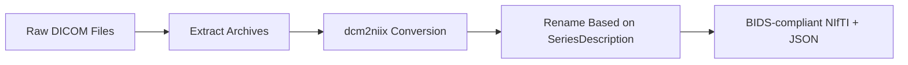
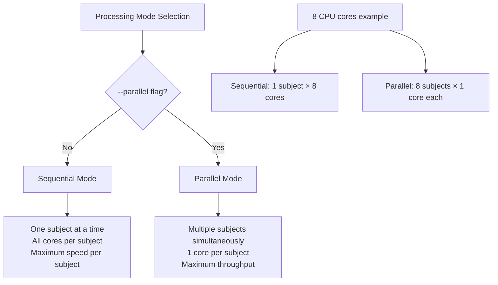

The TI-Toolbox pre-processing pipeline prepares anatomical MRI data for TI simulations by converting DICOM files to BIDS-compliant NIfTI format, performing FreeSurfer cortical reconstruction, and creating SimNIBS head models. This comprehensive pipeline ensures that all subsequent steps have access to high-quality, standardized neuroimaging data.

## Overview

The pre-processing pipeline consists of three main stages:

1. **DICOM to NIfTI Conversion** - Convert raw DICOM files to BIDS-compliant NIfTI format
2. **FreeSurfer recon-all** - Cortical reconstruction and segmentation
3. **SimNIBS charm** - Head model creation for electromagnetic simulations

## Required Input Data Structure

### BIDS Format Requirements

The toolbox expects data to be organized following the BIDS (Brain Imaging Data Structure) standard:

```
project_root/
└── sourcedata/
    └── sub-{subject_id}/
        ├── T1w/
        │   ├── dicom/          # Raw T1w DICOM files
        │   └── *.tgz           # Compressed DICOM archives (optional)
        └── T2w/
            ├── dicom/          # Raw T2w DICOM files
            └── *.tgz           # Compressed DICOM archives (optional)
```

### Data Requirements

| Requirement | Description | Status |
|-------------|-------------|---------|
| **T1-weighted MRI** | High-resolution anatomical image (typically MPRAGE) | **Required** |
| **T2-weighted MRI** | High-resolution anatomical image (typically CUBE/SPACE) | **Recommended** |


### Supported Input Formats

- **DICOM files** (`.dcm`, `.dicom`)
- **Compressed DICOM archives** (`.tgz`)
- **NIfTI files** (`.nii`, `.nii.gz`) - if already converted

## Processing Stages

### Stage 1: DICOM to NIfTI Conversion

**Script:** `dicom2nifti.sh`  
**Purpose:** Convert raw DICOM files to BIDS-compliant NIfTI format

#### Features

- **Automatic T1w/T2w Detection**: Identifies scan types based on DICOM series descriptions
- **Compressed Archive Support**: Handles `.tgz` compressed DICOM archives
- **BIDS Compliance**: Generates proper BIDS naming conventions
- **Metadata Preservation**: Maintains scan parameters in JSON sidecars

#### Process Flow



#### Usage

```bash
# Convert DICOM files for a single subject
./dicom2nifti.sh /path/to/sub-101

# Quiet mode (no console output)
./dicom2nifti.sh /path/to/sub-101 --quiet
```


### Stage 2: FreeSurfer recon-all

**Script:** `recon-all.sh`  
**Purpose:** Cortical reconstruction, segmentation, and surface generation

#### Features

- **T1 + T2 Processing**: Utilizes both T1 and T2 images when available for improved pial surface reconstruction
- **Parallel Processing**: Configurable for single-threaded or multi-threaded execution


#### Usage

```bash
# Single subject processing (1 core)
./recon-all.sh /path/to/sub-101

# With parallel processing (all available cores for this subject)
./recon-all.sh /path/to/sub-101 --parallel

```

**Note:** The `--parallel` flag in `recon-all.sh` enables FreeSurfer's internal parallelization (multiple cores for one subject). This is different from the `--parallel` flag in `structural.sh` which enables processing multiple subjects simultaneously.

#### Generated Output Structure

```
derivatives/
└── freesurfer/
    └── sub-101/
        ├── mri/           # Volumetric data
        ├── surf/          # Surface meshes
        ├── label/         # Anatomical labels
        └── scripts/
```

### Stage 3: SimNIBS charm (Head Model Creation)

**Script:** `charm.sh`  
**Purpose:** Create head models for TI simulation

#### Features

- **Input**: Supports T1-only or T1+T2 processing
- **Sequential Processing**: Runs one subject at a time 


#### Usage

```bash
# Create head model for single subject
./charm.sh /path/to/sub-101
```

#### Generated Output Structure

```
derivatives/
└── SimNIBS/
    └── sub-101/
        └── m2m_101/

```

## Orchestration Script

### structural.sh - Pipeline Orchestrator

**Purpose:** Coordinates all pre-processing stages with flexible execution options

#### Command Line Interface

```bash
# Sequential mode (default) - one subject at a time, all cores per subject
./structural.sh /path/to/sub-101 /path/to/sub-102 recon-all --convert-dicom --create-m2m

# Parallel mode - multiple subjects simultaneously, 1 core per subject
./structural.sh /path/to/sub-101 /path/to/sub-102 recon-all --parallel --convert-dicom --create-m2m

# Recon-all only
./structural.sh /path/to/sub-101 recon-all --recon-only

# Subject ID format
./structural.sh --subjects 101,102,103 recon-all --parallel
```

#### Processing Options

| Option | Description | Usage |
|--------|-------------|-------|
| `recon-all` | Run FreeSurfer reconstruction | Always required |
| `--convert-dicom` | Include DICOM conversion stage | Optional |
| `--create-m2m` | Include SimNIBS head model creation | Optional |
| `--parallel` | Enable parallel processing mode (multiple subjects, 1 core each) | Optional |
| `--recon-only` | Skip all non-recon steps | Optional |


#### Processing Mode Selection

**Default (Sequential Mode):**
```bash
# Best for: Small datasets (1-3 subjects), maximum per-subject speed
./structural.sh /path/sub-101 /path/sub-102 recon-all --convert-dicom
```

**Parallel Mode:**
```bash
# Best for: Large datasets (4+ subjects), maximum throughput
./structural.sh /path/sub-101 /path/sub-102 /path/sub-103 /path/sub-104 recon-all --parallel --convert-dicom
```

## Parallelization Strategy

### Two-Mode Processing Architecture

The pipeline implements a simple and efficient two-mode parallelization strategy:

#### Processing Modes



#### Mode Comparison

| Mode | Command | Subjects Running | Cores per Subject | Best For |
|------|---------|------------------|-------------------|----------|
| **Sequential** (Default) | `./structural.sh sub-101 sub-102 recon-all` | 1 at a time | All available | Small datasets, fastest per-subject |
| **Parallel** | `./structural.sh sub-101 sub-102 recon-all --parallel` | Multiple | 1 each | Large datasets, maximum throughput |


#### SimNIBS Processing

SimNIBS charm processing is **always sequential** regardless of mode:

- One subject processed at a time to prevent PETSC memory conflicts
- Full CPU cores available per subject
- Memory safeguards to prevent segmentation faults

## CLI Execution Example

```bash
# Stage 1: DICOM conversion only
./dicom2nifti.sh /mnt/study_data/sub-101

# Stage 2: FreeSurfer reconstruction only
# Sequential mode (all cores for this subject)
./recon-all.sh /mnt/study_data/sub-101 --parallel

# Parallel mode (1 core for this subject)
./recon-all.sh /mnt/study_data/sub-101

# Stage 3: SimNIBS head model only  
./charm.sh /mnt/study_data/sub-101
```

## Output Directory Structure

### Complete Processing Output

```
project_root/
├── sourcedata/                     # Original DICOM data
│   └── sub-101/
│       ├── T1w/dicom/
│       └── T2w/dicom/
├── sub-101/                        # BIDS data
│   └── anat/
│       ├── anat-T1w_acq-MPRAGE.nii.gz
│       └── anat-T2w_acq-CUBE.nii.gz
└── derivatives/                    # Processed outputs
    ├── freesurfer/                 # FreeSurfer outputs
    │   └── sub-101/
    │       ├── mri/
    │       ├── surf/
    │       └── scripts/
    └── SimNIBS/                    # SimNIBS outputs
        └── sub-101/
            └── m2m_101/
```

## Logging and Monitoring

### Log File Organization

```
derivatives/ti-toolbox/logs/sub-{subject_id}/
├── dicom2nifti_{timestamp}.log     # DICOM conversion logs
├── recon-all_{timestamp}.log       # FreeSurfer processing logs
└── charm_{timestamp}.log           # SimNIBS processing logs
```

### Log Content Examples

#### Successful Processing
```
[2025-06-25 13:45:23] [recon-all] [INFO] Starting FreeSurfer recon-all for subject: sub-101
[2025-06-25 13:45:24] [recon-all] [INFO] Found T1 image: /mnt/study/sub-101/anat/anat-T1w_acq-MPRAGE.nii.gz
[2025-06-25 13:45:24] [recon-all] [INFO] Found T2 image: /mnt/study/sub-101/anat/anat-T2w_acq-CUBE.nii.gz
[2025-06-25 13:45:24] [recon-all] [INFO] T2 image will be used for improved pial surface reconstruction
[2025-06-25 15:23:45] [recon-all] [INFO] Verification results: Essential files found: 9/9
[2025-06-25 15:23:45] [recon-all] [INFO] FreeSurfer completion verification PASSED
```

#### Error Detection
```
[2025-06-25 14:15:32] [recon-all] [ERROR] Command failed with critical system error: recon-all -subject sub-103...
[2025-06-25 14:15:32] [recon-all] [ERROR] System error details: Illegal instruction
[2025-06-25 14:15:32] [recon-all] [ERROR] FreeSurfer recon-all verification failed for subject: sub-103
```

### Monitoring Progress

Monitor processing progress in real-time:

```bash
# Monitor all logs for a subject
tail -f /mnt/project/derivatives/logs/sub-101/*.log

# Monitor specific stage
tail -f /mnt/project/derivatives/logs/sub-101/recon-all_*.log

# Check processing status across subjects
ls -la /mnt/project/derivatives/freesurfer/*/mri/aseg.mgz
```


### Performance Optimization

1. **Parallel Processing**: Use `--parallel` flag for multiple subjects
2. **Memory Management**: Ensure adequate Docker memory allocation
3. **Disk I/O**: Use fast storage (SSD) for improved performance
4. **CPU Utilization**: Consider leaving a couple of cores free

## Integration with Analysis Pipeline

The pre-processing pipeline generates all necessary inputs for downstream TI analysis:

- **FreeSurfer surfaces** → `ex-search` electrode optimization
- **SimNIBS head models** → `simulator` electromagnetic field computation
- **BIDS anatomical data** → `analyzer` ROI analysis and visualization

See the [Ex-Search](ex-search.md) and [Simulator](simulator.md) documentation for details on using pre-processed data in TI analysis workflows. 
