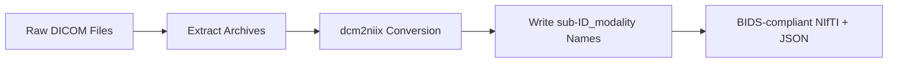
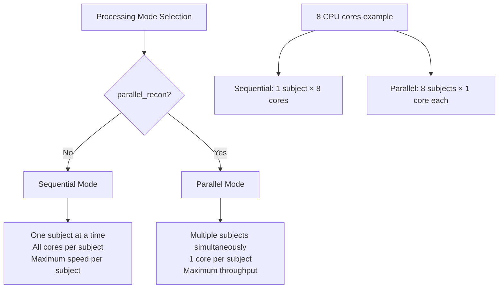

The TI-Toolbox pre-processing pipeline prepares anatomical MRI data for TI simulations by converting DICOM files to BIDS-compliant NIfTI format and creating SimNIBS head models. FreeSurfer `recon-all`, diffusion processing, tissue analysis, and subcortical segmentations are optional add-on stages for workflows that need those outputs.

## Overview

The pre-processing pipeline consists of several stages (each individually toggleable):

1. **DICOM to NIfTI Conversion** - Convert raw DICOM files to BIDS-compliant NIfTI format
2. **SimNIBS charm** - Head model creation for electromagnetic simulations (also generates atlas `.annot` files via `subject_atlas`)
3. **FreeSurfer recon-all** - Optional cortical reconstruction and segmentation
4. **Tissue Analysis** - Optional tissue segmentation quality checks
5. **QSIPrep / QSIRecon** - Optional diffusion-weighted imaging preprocessing and reconstruction
6. **DTI Tensor Extraction** - Optional extraction of DTI tensors for SimNIBS anisotropic conductivity
7. **Subcortical Segmentations** - Optional thalamic nuclei and hippocampal subfield segmentations via `run_subcortical_segmentations()`

## Required Input Data Structure

### BIDS Format Requirements

The toolbox expects data to be organized following the BIDS (Brain Imaging Data Structure) standard:

```
project_root/
└── sourcedata/
    └── sub-{subject_id}/
        ├── T1w/
        │   ├── dicom/          # Raw T1w .dcm/.dicom files (recursive)
        │   └── *.zip|*.tar|*.tar.gz|*.tgz  # Optional T1w DICOM archives
        └── T2w/
            ├── dicom/          # Raw T2w .dcm/.dicom files (recursive)
            └── *.zip|*.tar|*.tar.gz|*.tgz  # Optional T2w DICOM archives
```

### Data Requirements

| Requirement | Description | Status |
|-------------|-------------|---------|
| **T1-weighted MRI** | High-resolution anatomical image (typically MPRAGE) | **Required** |
| **T2-weighted MRI** | High-resolution anatomical image (typically CUBE/SPACE) | **Recommended** |


### Supported Input Formats

- **DICOM files** (`.dcm`, `.dicom`) under `sourcedata/sub-{subject_id}/{T1w,T2w}/dicom/`; nested folders are searched recursively
- **Compressed DICOM archives** (`.zip`, `.tar`, `.tar.gz`, `.tgz`) placed directly in a modality folder or its `dicom/` folder
- **NIfTI files** (`.nii`, `.nii.gz`) - if already converted

## MNI/template and atlas guidance

- **Template/MNI simulations** require a valid SimNIBS head model (`m2m`) and MNI transforms from CHARM/create_m2m. FreeSurfer `recon-all` is optional for basic simulations.
- **Atlas-dependent cortical workflows** (surface labels, FreeSurfer-derived annotations, or analyses that explicitly read FreeSurfer outputs) require `recon-all` and the relevant atlas/annotation generation.
- **Volume-atlas or MNI ROI workflows** depend on adequate anatomical field of view and registration quality. If CHARM reports cropped anatomy or poor registration, re-run preprocessing with full-head T1w/T2w coverage or adjust acquisition/FOV before relying on MNI/template ROIs.
- When both CHARM/create_m2m and `recon-all` are enabled, check the GUI log/status output for the exact execution order used by your selected options.

## Processing Stages

### Stage 1: DICOM to NIfTI Conversion

**Module:** `tit.pre.dicom2nifti.run_dicom_to_nifti`  
**Purpose:** Convert raw DICOM files to BIDS-compliant NIfTI format

#### Features

- **Folder-based T1w/T2w Layout**: Converts files from the documented `T1w/dicom/` and `T2w/dicom/` folders
- **Compressed Archive Support**: Safely extracts `.zip`, `.tar`, `.tar.gz`, and `.tgz` DICOM archives before conversion
- **BIDS Compliance**: Generates proper BIDS naming conventions
- **Metadata Preservation**: Maintains scan parameters in JSON sidecars

#### Process Flow


```mermaid
graph LR
    A[Raw DICOM Files] --> B[Extract Archives]
    B --> C[dcm2niix Conversion]
    C --> D[Write sub-ID_modality Names]
    D --> E[BIDS-compliant NIfTI + JSON]
```

### Stage 2: SimNIBS charm (Head Model Creation)

**Module:** `tit.pre.charm.run_charm`
**Purpose:** Create head models for TI simulation

#### Features

- **Input**: Supports T1-only or T1+T2 processing
- **Subject Atlas**: The pipeline runs `subject_atlas` after CHARM to generate atlas `.annot` files
- **Sequential Processing**: Runs one subject at a time to avoid PETSC/resource conflicts

#### Generated Output Structure

```
derivatives/
└── SimNIBS/
    └── sub-101/
        └── m2m_101/

```

### Stage 3: FreeSurfer recon-all (Optional)

**Module:** `tit.pre.recon_all.run_recon_all`
**Purpose:** Cortical reconstruction, segmentation, and surface generation for workflows that need FreeSurfer outputs

#### Features

- **T1 + T2 Processing**: Utilizes both T1 and T2 images when available for improved pial surface reconstruction
- **Optional**: Not required for basic CHARM head-model creation; run it for analyses or segmentations that require FreeSurfer surfaces/labels
- **Parallel Processing**: Configurable as single-subject internal FreeSurfer parallelism or multi-subject throughput mode

**Note:** In sequential mode, FreeSurfer can use its internal parallelization for one subject. The pipeline-level `parallel_recon=True` uses Python `ThreadPoolExecutor` to run multiple subjects simultaneously, each with one FreeSurfer core.

#### Generated Output Structure

```
derivatives/
└── freesurfer/
    └── sub-101/
        ├── mri/           # Volumetric data
        ├── surf/          # Surface meshes
        ├── label/         # Anatomical labels
        └── scripts/
```

## Orchestration Script

### Python Pipeline Orchestrator

**Purpose:** Coordinates all pre-processing stages with flexible execution options

#### Processing Options

| Option | Description | Usage |
|--------|-------------|-------|
| `convert_dicom` | Include DICOM conversion stage | Optional |
| `create_m2m` | Include SimNIBS head model creation (also runs `subject_atlas` for `.annot` files) | Optional |
| `run_recon` | Run FreeSurfer reconstruction | Optional |
| `parallel_recon` | Enable ThreadPoolExecutor multi-subject recon-all mode (multiple subjects, 1 core each) | Optional |
| `run_tissue_analysis` | Run tissue segmentation analysis | Optional |
| `run_qsiprep` | Run QSIPrep DWI preprocessing via Docker | Optional |
| `run_qsirecon` | Run QSIRecon reconstruction via Docker | Optional |
| `extract_dti` | Extract DTI tensors for SimNIBS anisotropic conductivity | Optional |
| `run_subcortical_segmentations` | Run thalamic nuclei and hippocampal subfield segmentations | Optional |


## Parallelization Strategy

### Two-Mode Processing Architecture

The pipeline implements a simple two-mode strategy for FreeSurfer `recon-all`. It uses Python `ThreadPoolExecutor` for multi-subject mode; no external parallel launcher is required.

#### Processing Modes


```mermaid
graph TD
    A[Processing Mode Selection] --> B{parallel_recon?}
    B -->|No| C[Sequential Mode]
    B -->|Yes| D[Parallel Mode]
    
    C --> E[One subject at a time<br/>All cores per subject<br/>Maximum speed per subject]
    D --> F[Multiple subjects simultaneously<br/>1 core per subject<br/>Maximum throughput]
    
    G[8 CPU cores example] --> H[Sequential: 1 subject × 8 cores]
    G --> I[Parallel: 8 subjects × 1 core each]
```

#### Mode Comparison

| Mode | Command | Subjects Running | Cores per Subject | Best For |
|------|---------|------------------|-------------------|----------|
| **Sequential** (Default) | `run_pipeline(..., parallel_recon=False)` | 1 at a time | All available | Small datasets, fastest per-subject |
| **Parallel** | `run_pipeline(..., parallel_recon=True)` | Multiple | 1 each | Large datasets, maximum throughput |


#### SimNIBS Processing

SimNIBS charm processing is **always sequential** regardless of mode:

- One subject processed at a time to prevent PETSC memory conflicts
- Full CPU cores available per subject
- Memory safeguards to prevent segmentation faults

## Output Directory Structure

### Complete Processing Output

```
project_root/
├── sourcedata/                     # Original DICOM data
│   └── sub-101/
│       ├── T1w/dicom/
│       └── T2w/dicom/
├── sub-101/                        # BIDS data
│   └── anat/
│       ├── anat-T1w_acq-MPRAGE.nii.gz
│       └── anat-T2w_acq-CUBE.nii.gz
└── derivatives/                    # Processed outputs
    ├── SimNIBS/                    # SimNIBS outputs
    │   └── sub-101/
    │       └── m2m_101/
    ├── freesurfer/                 # Optional FreeSurfer outputs
    │   └── sub-101/
    │       ├── mri/
    │       ├── surf/
    │       └── scripts/
    └── ti-toolbox/
        └── logs/sub-101/           # Preprocessing logs
```

## Logging and Monitoring

### Log File Organization

```
derivatives/ti-toolbox/logs/sub-{subject_id}/
└── preprocess_{timestamp}.log      # Orchestration and stage logs (DICOM, CHARM, recon-all, QSI, etc.)
```

### Log Content Examples

#### Successful Processing
```
[2025-06-25 13:45:23] [recon-all] [INFO] Starting FreeSurfer recon-all for subject: sub-101
[2025-06-25 13:45:24] [recon-all] [INFO] Found T1 image: /mnt/study/sub-101/anat/anat-T1w_acq-MPRAGE.nii.gz
[2025-06-25 13:45:24] [recon-all] [INFO] Found T2 image: /mnt/study/sub-101/anat/anat-T2w_acq-CUBE.nii.gz
[2025-06-25 13:45:24] [recon-all] [INFO] T2 image will be used for improved pial surface reconstruction
[2025-06-25 15:23:45] [recon-all] [INFO] Verification results: Essential files found: 9/9
[2025-06-25 15:23:45] [recon-all] [INFO] FreeSurfer completion verification PASSED
```

#### Error Detection
```
[2025-06-25 14:15:32] [recon-all] [ERROR] Command failed with critical system error: recon-all -subject sub-103...
[2025-06-25 14:15:32] [recon-all] [ERROR] System error details: Illegal instruction
[2025-06-25 14:15:32] [recon-all] [ERROR] FreeSurfer recon-all verification failed for subject: sub-103
```

### Monitoring Progress

Monitor processing progress in real-time:

```bash
# Monitor all logs for a subject
tail -f /mnt/project/derivatives/ti-toolbox/logs/sub-101/*.log

# Monitor specific stage
tail -f /mnt/project/derivatives/ti-toolbox/logs/sub-101/preprocess_*.log

# Check processing status across subjects
ls -la /mnt/project/derivatives/freesurfer/*/mri/aseg.mgz
```


### Performance Optimization

1. **Parallel Processing**: Use `parallel_recon=True` / the GUI parallel checkbox for multi-subject recon-all throughput
2. **Memory Management**: Ensure adequate Docker memory allocation
3. **Disk I/O**: Use fast storage (SSD) for improved performance
4. **CPU Utilization**: Consider leaving a couple of cores free

## Related Pipelines

### Diffusion Processing

For anisotropic conductivity simulations, diffusion-weighted imaging (DWI) data can be processed using the integrated QSIPrep/QSIRecon pipeline. This produces DTI tensors that account for white matter fiber orientation in field calculations.

See the [Diffusion Processing](diffusion-processing.md) documentation for:
- QSIPrep preprocessing of raw DWI data
- QSIRecon tensor reconstruction
- DTI extraction for SimNIBS integration 
