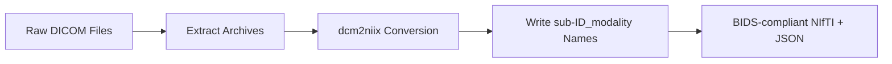
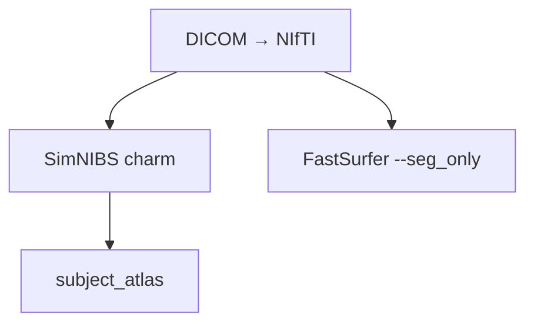

The TI-Toolbox pre-processing pipeline prepares anatomical MRI data for TI simulations by converting DICOM files to BIDS-compliant NIfTI format and creating SimNIBS head models. FastSurfer segmentation, diffusion processing, tissue analysis are optional add-on stages for workflows that need those outputs.


<em>Pre-processing (&#8984;1): pick the subjects, tick the stages, and the plan on the right says what will run for each one.</em>

## Overview

The pre-processing pipeline consists of several stages (each individually toggleable):

1. **DICOM to NIfTI Conversion** - Convert raw DICOM files to BIDS-compliant NIfTI format
2. **SimNIBS charm** - Head model creation for electromagnetic simulations (also generates atlas `.annot` files via `subject_atlas`)
3. **FastSurfer segmentation** - Optional fast cortical/subcortical segmentation, runs in parallel with charm
4. **Tissue Analysis** - Optional tissue segmentation quality checks
5. **QSIPrep / QSIRecon** - Optional diffusion-weighted imaging preprocessing and reconstruction
6. **DTI Tensor Extraction** - Optional extraction of DTI tensors for SimNIBS anisotropic conductivity

## Required Input Data Structure

### BIDS Format Requirements

The toolbox expects data to be organized following the BIDS (Brain Imaging Data Structure) standard:

```
project_root/
└── sourcedata/
    └── sub-{subject_id}/
        ├── T1w/
        │   ├── dicom/          # Raw T1w .dcm/.dicom files (searched recursively)
        │   └── *.zip|*.tar|*.tar.gz|*.tgz  # Optional T1w DICOM archives (extracted to extracted_archives/)
        ├── T2w/                # Optional, same layout
        ├── ct/                 # Optional CT (→ anat/sub-{id}_ct.nii.gz, a local non-BIDS extension)
        └── dwi/                # Optional diffusion DICOMs (→ dwi/ with .bval/.bvec)
```

Each modality folder is searched recursively, so DICOM files placed directly in `T1w/` also work; the `dicom/` subfolder is the recommended layout. Converted files are named `sub-{id}_T1w.nii.gz`, `sub-{id}_T2w.nii.gz`, etc.

### Data Requirements

| Requirement | Description | Status |
|-------------|-------------|---------|
| **T1-weighted MRI** | High-resolution anatomical image (typically MPRAGE) | **Required** |
| **T2-weighted MRI** | High-resolution anatomical image (typically CUBE/SPACE) | **Recommended** |


### Supported Input Formats

- **DICOM files** (`.dcm`, `.dicom`) under `sourcedata/sub-{subject_id}/{T1w,T2w}/dicom/`; nested folders are searched recursively
- **Compressed DICOM archives** (`.zip`, `.tar`, `.tar.gz`, `.tgz`) placed directly in a modality folder or its `dicom/` folder
- **NIfTI files** (`.nii`, `.nii.gz`) - if already converted

## MNI/template and atlas guidance

- **Template/MNI simulations** require a valid SimNIBS head model (`m2m`) and MNI transforms from CHARM/create_m2m. FastSurfer is optional for basic simulations.
- **Volume-atlas or MNI ROI workflows** depend on adequate anatomical field of view and registration quality. If CHARM reports cropped anatomy or poor registration, re-run preprocessing with full-head T1w/T2w coverage or adjust acquisition/FOV before relying on MNI/template ROIs.
- CHARM's own `segmentation/labeling.nii.gz` already provides whole-thalamus / whole-hippocampus / whole-amygdala labels independent of FastSurfer — see "What changed from FreeSurfer" below for what is and isn't available from FastSurfer's own output.

## Processing Stages

### Stage 1: DICOM to NIfTI Conversion

**Module:** `tit.pre.dicom2nifti.run_dicom_to_nifti`  
**Purpose:** Convert raw DICOM files to BIDS-compliant NIfTI format

#### Features

- **Folder-based T1w/T2w Layout**: Converts files from the documented `T1w/dicom/` and `T2w/dicom/` folders
- **Compressed Archive Support**: Safely extracts `.zip`, `.tar`, `.tar.gz`, and `.tgz` DICOM archives before conversion
- **BIDS Compliance**: Generates proper BIDS naming conventions
- **Metadata Preservation**: Maintains scan parameters in JSON sidecars

#### Process Flow


```mermaid
graph LR
    A[Raw DICOM Files] --> B[Extract Archives]
    B --> C[dcm2niix Conversion]
    C --> D[Write sub-ID_modality Names]
    D --> E[BIDS-compliant NIfTI + JSON]
```

### Stage 2: SimNIBS charm (Head Model Creation)

**Module:** `tit.pre.charm.run_charm`
**Purpose:** Create head models for TI simulation

#### Features

- **Input**: Supports T1-only or T1+T2 processing
- **Subject Atlas**: The pipeline runs `subject_atlas` after CHARM to generate atlas `.annot` files
- **Sequential Processing**: Runs one subject at a time to avoid PETSC/resource conflicts

#### Generated Output Structure

```
derivatives/
└── SimNIBS/
    └── sub-101/
        └── m2m_101/

```

### Stage 3: FastSurfer segmentation (Optional)

**Module:** `tit.pre.fastsurfer.run_fastsurfer`
**Purpose:** Fast cortical/subcortical parcellation for analyses that want a FreeSurfer-style
DKT atlas, without the multi-hour `recon-all` run FastSurfer replaces.

FastSurfer runs `--seg_only` mode — segmentation only, no surface reconstruction — invoked as:

```bash
run_fastsurfer.sh --seg_only --no_cereb --no_hypothal --no_cc \
  --sid sub-<id> --sd <project>/derivatives/fastsurfer \
  --t1 <project>/sub-<id>/anat/sub-<id>_T1w.nii.gz \
  --device auto --threads <n> --py <fastsurfer-python>
```

#### Features

- **Input**: the raw BIDS T1w, not charm's re-conformed copy — this keeps the stage
  independent of charm, so both run in parallel after DICOM conversion (they don't lock the
  same output directory).
- **Independent of charm**: FastSurfer and CHARM run as parallel stages, not sequential ones
  — neither waits on the other.
- **Hardware-aware execution**: FastSurfer selects CUDA, native macOS MPS, or CPU from what its
  Python environment can actually use. `TIT_FASTSURFER_DEVICE` overrides `auto`; unavailable
  explicit devices fail with an actionable error. Thread counts remain bounded by the job budget. FastSurfer jobs reserve 8 GB of memory
  by default, following the upstream minimum; explicit resource overrides remain available.
- **Docker versus native**: the bundled Linux image has CPU-only PyTorch, including on Apple
  Silicon. For native acceleration, install FastSurfer with its recommended pinned environment
  and set `TIT_FASTSURFER_PYTHON` to that environment’s Python. Apple MPS is available only to
  native macOS execution; it does not pass through Docker Desktop. Follow the
  [FastSurfer installation guide](https://github.com/Deep-MI/FastSurfer/blob/dev/doc/overview/INSTALL.md#package)
  for hardware-specific dependencies. Do not replace the shared SimNIBS environment’s packages
  with FastSurfer’s dependency set.
- **Idempotent**: an existing output short-circuits a re-run; the derived NIfTI/label
  sidecar files are still backfilled if missing, so an older run is brought up to the
  current output layout.

#### Generated Output Structure

```
derivatives/
└── fastsurfer/
    └── sub-101/
        └── mri/
            ├── aparc.DKTatlas+aseg.deep.mgz       # the parcellation itself (FastSurfer's native format)
            ├── aparc.DKTatlas+aseg.deep.nii.gz     # NIfTI copy — readers that can't open MGH (the viewer, /api/files/raw)
            └── aparc.DKTatlas+aseg.deep_labels.txt # the mri_segstats --sum-equivalent sidecar the atlas manager caches on
```

#### Accuracy and timing

Measured on `sub-ernie` (n = 1 — treat as directional, not a population estimate):

| Metric | Value |
|---|---|
| Subcortical Dice vs. real `recon-all` | 0.922 |
| Cortical DKT Dice vs. real `recon-all` | 0.914 |
| Largest centroid shift (pallidum) | 3–4 mm |
| Largest single cortical region shift | 3.1 mm |
| Native arm64 CPU runtime | ~5 minutes |
| Emulated amd64 runtime (Apple Silicon under Docker Desktop) | not yet measured |

The centroid shift is small relative to a typical 10–15 mm ROI sphere but material for a
5 mm one — **for small deep targets, prefer a ≥10 mm ROI sphere, or use a cortical surface
atlas instead of a small subcortical sphere.** These numbers back the trade-off, not a policy
enforced by the toolbox itself.

#### What changed from FreeSurfer

FastSurfer `--seg_only` remains the default segmentation option. Enable **FreeSurfer**
in Pre-processing when you need full **recon-all**, **Thalamic nuclei**, or
**Hippocampal/amygdala subregions**. Select recon-all together with subregions for a new
subject, or run subregions alone after a completed FreeSurfer reconstruction. FastSurfer's
segmentation-only output does not satisfy that prerequisite. A FreeSurfer license is required.

FreeSurfer runs in a temporary worker and stores results in `derivatives/freesurfer/sub-<id>`.
The worker is removed when it finishes; project results remain. The first run downloads the
optional image. Subsequent runs reuse the cached image. Thread settings respect the job budget.

The T1-only subregion implementation uses FreeSurfer's
[Python subregion tools](https://surfer.nmr.mgh.harvard.edu/fswiki/SubregionSegmentation),
which upstream describes as beta and which can differ from the older MATLAB implementation.
CHARM still provides whole-thalamus, whole-hippocampus and whole-amygdala labels independently.

## Orchestration Script

### Python Pipeline Orchestrator

**Purpose:** Coordinates all pre-processing stages with flexible execution options

#### Processing Options

| Option | Description | Usage |
|--------|-------------|-------|
| `convert_dicom` | Include DICOM conversion stage | Optional |
| `create_m2m` | Include SimNIBS head model creation (also runs `subject_atlas` for `.annot` files) | Optional |
| `run_fastsurfer` | Run FastSurfer `--seg_only` segmentation | Optional |
| `run_freesurfer` | Enable optional FreeSurfer execution | Optional |
| `freesurfer_recon_all` | Run full reconstruction (default true when FreeSurfer is enabled) | Optional |
| `freesurfer_subregions` | `thalamus` and/or `hippo-amygdala` | Optional |
| `freesurfer_threads` | Maximum FreeSurfer threads | Optional |
| `fastsurfer_threads` | Thread count for FastSurfer (default 2) | Optional |
| `run_tissue_analysis` | Run tissue segmentation analysis | Optional |
| `run_qsiprep` | Run QSIPrep DWI preprocessing via Docker | Optional |
| `run_qsirecon` | Run QSIRecon reconstruction via Docker | Optional |
| `extract_dti` | Extract DTI tensors for SimNIBS anisotropic conductivity | Optional |
| `skip_existing_outputs` | Skip selected steps when their expected output already exists | Optional |
| `replace_existing_outputs` | Delete selected existing outputs and rerun those steps | Optional |

> **Config field rename:** `run_recon`/`parallel_recon`/`parallel_cores`/
> `run_subcortical_segmentations` are replaced by `run_fastsurfer`/`fastsurfer_threads`. An
> old JSON config sending `run_recon` still works — it is read as a deprecated alias for
> `run_fastsurfer` (with a logged warning); the other three legacy keys are dropped with a
> warning. Use the explicit FreeSurfer fields above for new reconstruction jobs.

When running preprocessing from the desktop application, TI-Toolbox checks for existing outputs before
starting the selected preprocessing steps. If DICOM, CHARM, FastSurfer,
QSIPrep, QSIRecon, or DTI tensor outputs already exist, the GUI asks whether
to cancel, skip the existing outputs, or replace them and rerun. In scripts,
leave both existing-output options disabled to fail fast, set
`skip_existing_outputs=True` to preserve existing results, or set
`replace_existing_outputs=True` for an intentional rerun.

## Parallelization Strategy

CHARM and FastSurfer are independent stages with no edge between them in the pipeline's
dependency graph — both start as soon as the DICOM/NIfTI conversion stage is done, and the
scheduler runs them concurrently (subject to its own memory budget). Each still runs
**sequentially across subjects within its own stage**:

- **SimNIBS charm** — always one subject at a time, to avoid PETSC memory conflicts, with
  full CPU cores available per subject.
- **FastSurfer** — one subject at a time per its job slot; the *job*-level scheduler (not an
  internal thread pool) is what allows multiple subjects' pre-processing jobs to run
  side-by-side, budgeted by each job's declared cost (2 CPUs / 6 GB per FastSurfer run,
  matched to its measured ~4.8 GiB peak RSS at the default 2-thread setting).


```mermaid
graph TD
    A[DICOM → NIfTI] --> B[SimNIBS charm]
    A --> C[FastSurfer --seg_only]
    B --> D[subject_atlas]
```

## Output Directory Structure

### Complete Processing Output

```
project_root/
├── sourcedata/                     # Original DICOM data
│   └── sub-101/
│       ├── T1w/dicom/
│       └── T2w/dicom/
├── sub-101/                        # BIDS data
│   └── anat/
│       ├── sub-101_T1w.nii.gz
│       └── sub-101_T2w.nii.gz
└── derivatives/                    # Processed outputs
    ├── SimNIBS/                    # SimNIBS outputs
    │   └── sub-101/
    │       └── m2m_101/
    ├── fastsurfer/                 # Optional FastSurfer outputs
    │   └── sub-101/
    │       └── mri/
    │           ├── aparc.DKTatlas+aseg.deep.mgz
    │           ├── aparc.DKTatlas+aseg.deep.nii.gz
    │           └── aparc.DKTatlas+aseg.deep_labels.txt
    ├── freesurfer/                 # Optional FreeSurfer reconstruction and subregions
    │   └── sub-101/
    │       ├── mri/
    │       ├── surf/
    │       └── scripts/
    └── ti-toolbox/
        └── logs/sub-101/           # Preprocessing logs
```

## Logging and Monitoring

### Log File Organization

```
derivatives/ti-toolbox/logs/sub-{subject_id}/
└── preprocess_{timestamp}.log      # Orchestration and stage logs (DICOM, CHARM, FastSurfer, QSI, etc.)
```

### Log Content Examples

#### Successful Processing
```
[2025-06-25 13:45:23] [fastsurfer] [INFO] Starting FastSurfer --seg_only for subject: sub-101
[2025-06-25 13:45:24] [fastsurfer] [INFO] Found T1 image: /mnt/study/sub-101/anat/sub-101_T1w.nii.gz
[2025-06-25 13:45:24] [fastsurfer] [INFO] Running run_fastsurfer.sh --seg_only --no_cereb --no_hypothal --no_cc
[2025-06-25 13:50:12] [fastsurfer] [INFO] Verification results: aparc.DKTatlas+aseg.deep.mgz found
[2025-06-25 13:50:12] [fastsurfer] [INFO] FastSurfer completion verification PASSED
```

#### Error Detection
```
[2025-06-25 14:15:32] [fastsurfer] [ERROR] Command failed with critical system error: run_fastsurfer.sh --sid sub-103...
[2025-06-25 14:15:32] [fastsurfer] [ERROR] FastSurfer verification failed for subject: sub-103
```

### Monitoring Progress

Monitor processing progress in real-time:

```bash
# Monitor all logs for a subject
tail -f /mnt/project/derivatives/ti-toolbox/logs/sub-101/*.log

# Monitor specific stage
tail -f /mnt/project/derivatives/ti-toolbox/logs/sub-101/preprocess_*.log

# Check processing status across subjects
ls -la /mnt/project/derivatives/fastsurfer/*/mri/aparc.DKTatlas+aseg.deep.mgz
```


### Performance Optimization

1. **Parallel Stages**: CHARM and FastSurfer already run concurrently per subject — no extra flag needed
2. **Memory Management**: Ensure adequate Docker memory allocation (16GB+ recommended, 32GB+ for large leadfields — see [Dependencies]({{ site.baseurl }}/installation/dependencies/))
3. **Disk I/O**: Use fast storage (SSD) for improved performance
4. **CPU Utilization**: Consider leaving a couple of cores free

## Related Pipelines

### Diffusion Processing

For anisotropic conductivity simulations, diffusion-weighted imaging (DWI) data can be processed using the integrated QSIPrep/QSIRecon pipeline. This produces DTI tensors that account for white matter fiber orientation in field calculations.

See the [Diffusion Processing]({{ site.baseurl }}/wiki/diffusion-processing/) documentation for:
- QSIPrep preprocessing of raw DWI data
- QSIRecon tensor reconstruction
- DTI extraction for SimNIBS integration
