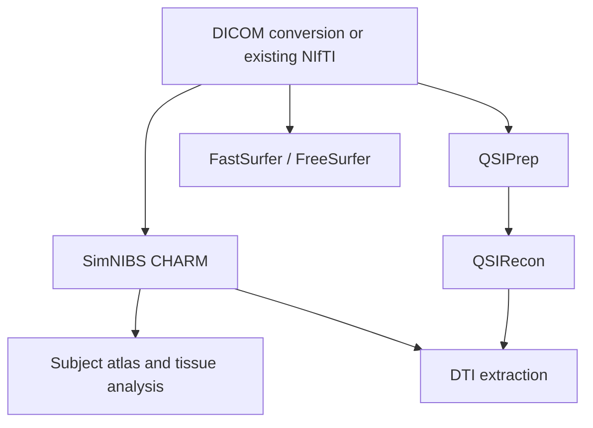

Pre-processing prepares subject data for simulation and analysis. Select subjects and the stages
you need; the plan shows their dependencies and existing outputs before you run them.


## Workflow


```mermaid
graph TD
    A[DICOM conversion or existing NIfTI] --> B[SimNIBS CHARM]
    A --> C[FastSurfer / FreeSurfer]
    A --> D[QSIPrep]
    B --> E[Subject atlas and tissue analysis]
    D --> F[QSIRecon]
    F --> G[DTI extraction]
    B --> G
```

CHARM creates the head model required for simulations. Reconstruction, segmentation and diffusion
processing are optional, depending on the outputs your workflow needs. Independent stages can
run when their dependencies and the job scheduler's resource budget allow.

| Stage | Purpose | Guide |
|---|---|---|
| DICOM → NIfTI | Convert source scans and preserve metadata | Input layout below |
| SimNIBS CHARM | Create the head mesh and subject atlas | Head models below |
| FastSurfer / FreeSurfer | Segmentation, reconstruction and subregions | [FastSurfer / FreeSurfer]({{ site.baseurl }}/wiki/fastsurfer/) |
| Tissue analyzer | Inspect tissue segmentation quality | Select after head-model creation |
| QSIPrep / QSIRecon | Process diffusion data and prepare conductivity tensors | [QSIPrep / QSIRecon]({{ site.baseurl }}/wiki/diffusion-processing/) |

## Required Input Data Structure

### BIDS Format Requirements

The toolbox expects data to be organized following the BIDS (Brain Imaging Data Structure) standard:

```
project_root/
└── sourcedata/
    └── sub-{subject_id}/
        ├── T1w/
        │   ├── dicom/          # Raw T1w .dcm/.dicom files (searched recursively)
        │   └── *.zip|*.tar|*.tar.gz|*.tgz  # Optional T1w DICOM archives (extracted to extracted_archives/)
        ├── T2w/                # Optional, same layout
        ├── ct/                 # Optional CT (→ anat/sub-{id}_ct.nii.gz, a local non-BIDS extension)
        └── dwi/                # Optional diffusion DICOMs (→ dwi/ with .bval/.bvec)
```

Each modality folder is searched recursively, so DICOM files placed directly in `T1w/` also work; the `dicom/` subfolder is the recommended layout. Converted files are named `sub-{id}_T1w.nii.gz`, `sub-{id}_T2w.nii.gz`, etc.

### Data Requirements

| Requirement | Description | Status |
|-------------|-------------|---------|
| **T1-weighted MRI** | High-resolution anatomical image (typically MPRAGE) | **Required** |
| **T2-weighted MRI** | High-resolution anatomical image (typically CUBE/SPACE) | **Recommended** |


### Supported Input Formats

- **DICOM files** (`.dcm`, `.dicom`) under `sourcedata/sub-{subject_id}/{T1w,T2w}/dicom/`; nested folders are searched recursively
- **Compressed DICOM archives** (`.zip`, `.tar`, `.tar.gz`, `.tgz`) placed directly in a modality folder or its `dicom/` folder
- **NIfTI files** (`.nii`, `.nii.gz`) - if already converted

## Head models and atlas alignment

CHARM accepts T1w alone or T1w with T2w. The pipeline runs `subject_atlas` after CHARM to generate
atlas annotations. Head models are stored in `derivatives/SimNIBS/sub-<id>/m2m_<id>/`.

MNI/template and volume-atlas targets depend on the head model's transforms and registration
quality. If CHARM reports cropped anatomy or poor registration, inspect the input coverage before
using those targets. CHARM supplies whole-thalamus, whole-hippocampus and whole-amygdala labels;
the surfer guide explains the separate reconstruction and finer subregion options.

## Run and monitor

Review the plan, then start the selected stages. When outputs already exist, choose whether to
skip them or replace and rerun. Use [Jobs]({{ site.baseurl }}/wiki/jobs/) for live progress, logs,
cancellation and failures; the Overview shows which outputs are present for each subject.

For programmatic execution, use the [scripting guide]({{ site.baseurl }}/wiki/scripting/).
Tool-specific inputs and output layouts live in the two subguides above.

## Pre-processing settings

Open **Settings → Pre-processing** for user-wide defaults. Changes apply to new jobs across
projects, not work already running. Automatic thread allocation uses the available CPUs minus
one, with a minimum of one. Each control shows the available capacity; container limits and the
job scheduler still constrain execution.

- **FastSurfer / FreeSurfer:** thread controls, Apple GPU enablement and FreeSurfer operations.
  See the [surfer guide]({{ site.baseurl }}/wiki/fastsurfer/) for setup and permissions.
- **QSIPrep / QSIRecon:** CPU threads, OpenMP threads and memory limits. **Configure QSIPrep**
  and **Configure QSIRecon** open the same saved processing choices as the run page; saving either
  dialog remembers them across projects. See the [diffusion guide]({{ site.baseurl }}/wiki/diffusion-processing/)
  for what those processing choices do.
- **SimNIBS CHARM:** threads and an Advanced section for anatomical denoising, final segmentation
  resolution and scalp triangle size. Default values follow the installed settings. Scalp triangle
  size controls the scalp surface, not every volume element. Resolution changes affect the head
  model and computation time; configure them before generating a new model.

See the [CHARM configuration reference](https://simnibs.github.io/simnibs/build/html/documentation/command_line/charm.html)
for the upstream options.
